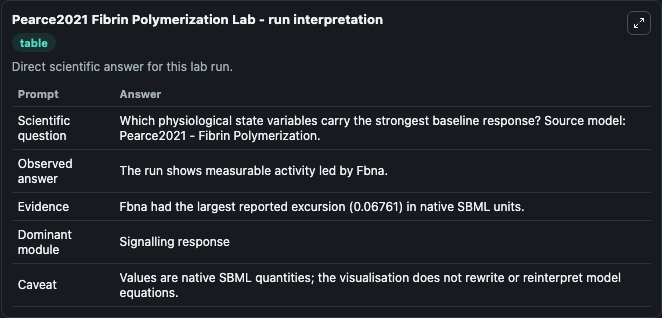
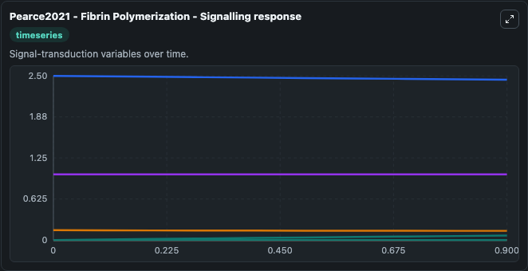
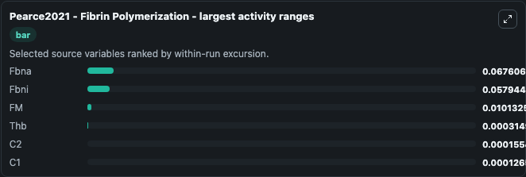
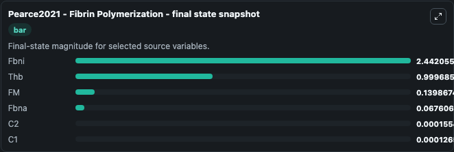
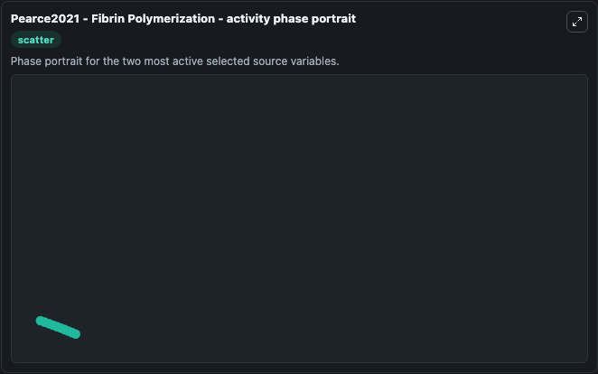

# Pearce2021 Fibrin Polymerization

This Biosimulant lab wraps `Pearce2021 Fibrin Polymerization` as a runnable systems biology model with a companion visualization module.
Here is an ode model for in vitro fibrin matrix polymerization reproducing interactions among fibrinogen, fibrin and other proteins involved in the homeostatic phase of wound healing. It can be used to explore the configured dynamics and compare scenario outcomes across configurations.

## What You'll See

The lab asks: Which physiological state variables carry the strongest baseline response? Source model: Pearce2021 - Fibrin Polymerization. It runs for 1.0 time units with a communication step of 0.1. The run uses the model defaults declared by the curated SBML wrapper. The generated visualizations focus on Fbni, Thb, FM, Fbna, C2, and C1, combining trajectory, endpoint-comparison, and summary-table views from one completed dark-mode run.

In this captured run, **Fbna** moved from 0 to 0.0676 across 1.0 simulation windows.


### Output Visualizations



*Summary table for Pearce2021 Fibrin Polymerization, reporting the scientific question, observed answer, dominant module, and caveat.*



*Trajectories of Fbna, Fbni, FM, Thb, C2, and C1 across the 1.0 simulation. In this run **Fbna** climbed from 0 to 0.0676 and **Fbni** fell from 2.500 to 2.442 — the largest movements among the focused observables.*



*Largest-excursion ranking of the focused observables — the absolute movement magnitude during the run. Top 3: **Fbna** = 0.0676, **Fbni** = 0.0579, **FM** = 0.0101, with 3 more observables below.*



*Endpoint snapshot of the focused observables — final values from the captured run. Top 3 by value: **Fbni** = 2.442, **Thb** = 0.9997, **FM** = 0.1399, with 3 more observables below.*



*Visualization card from the Pearce2021 Fibrin Polymerization dark-mode run.*


## Model Context

- Core model: `models/core`
- Visualization model: `models/visualisation`
- Standard: `other`
- Upstream source: `biomodels_ebi:BIOMD0000001054`
- License: `CC0`

## Inputs

| Input | Maps To | Default | Notes |
|---|---|---|---|
| Initial Fbni | `systemsbiology_sbml_pearce2021_fibrin_polymerization_biomd0000001054_model.initial_fbni` | | Source state initial condition exposed as a model-specific control because no explicit intervention parameter is identifiable. Maps to SBML symbol `Fbni`. |
| Initial Model State Thb | `systemsbiology_sbml_pearce2021_fibrin_polymerization_biomd0000001054_model.initial_model_state_thb` | | Source state initial condition exposed as a model-specific control because no explicit intervention parameter is identifiable. Maps to SBML symbol `Thb`. |
| Initial Model State Fm | `systemsbiology_sbml_pearce2021_fibrin_polymerization_biomd0000001054_model.initial_model_state_fm` | | Source state initial condition exposed as a model-specific control because no explicit intervention parameter is identifiable. Maps to SBML symbol `FM`. |
| Initial Fbna | `systemsbiology_sbml_pearce2021_fibrin_polymerization_biomd0000001054_model.initial_fbna` | | Source state initial condition exposed as a model-specific control because no explicit intervention parameter is identifiable. Maps to SBML symbol `Fbna`. |
| Initial Model State C2 | `systemsbiology_sbml_pearce2021_fibrin_polymerization_biomd0000001054_model.initial_model_state_c2` | | Source state initial condition exposed as a model-specific control because no explicit intervention parameter is identifiable. Maps to SBML symbol `C2`. |
| Initial Model State C1 | `systemsbiology_sbml_pearce2021_fibrin_polymerization_biomd0000001054_model.initial_model_state_c1` | | Source state initial condition exposed as a model-specific control because no explicit intervention parameter is identifiable. Maps to SBML symbol `C1`. |

## Outputs

| Output | Maps To | Role |
|---|---|---|
| `state` | `systemsbiology_sbml_pearce2021_fibrin_polymerization_biomd0000001054_model.state` | Available to the visualization model and downstream workflows. |
| `summary` | `systemsbiology_sbml_pearce2021_fibrin_polymerization_biomd0000001054_model.summary` | Available to the visualization model and downstream workflows. |
| `species_labels` | `systemsbiology_sbml_pearce2021_fibrin_polymerization_biomd0000001054_model.species_labels` | Available to the visualization model and downstream workflows. |
| `fbni` | `systemsbiology_sbml_pearce2021_fibrin_polymerization_biomd0000001054_model.fbni` | Available to the visualization model and downstream workflows. |
| `thb` | `systemsbiology_sbml_pearce2021_fibrin_polymerization_biomd0000001054_model.thb` | Available to the visualization model and downstream workflows. |
| `model_state_fm` | `systemsbiology_sbml_pearce2021_fibrin_polymerization_biomd0000001054_model.model_state_fm` | Available to the visualization model and downstream workflows. |
| `fbna` | `systemsbiology_sbml_pearce2021_fibrin_polymerization_biomd0000001054_model.fbna` | Available to the visualization model and downstream workflows. |
| `model_state_c2` | `systemsbiology_sbml_pearce2021_fibrin_polymerization_biomd0000001054_model.model_state_c2` | Available to the visualization model and downstream workflows. |
| `model_state_c1` | `systemsbiology_sbml_pearce2021_fibrin_polymerization_biomd0000001054_model.model_state_c1` | Available to the visualization model and downstream workflows. |

## Runtime

- Duration: `1.0`
- Communication step: `0.1`

## Running Locally

```bash
biosimulant labs serve
```
