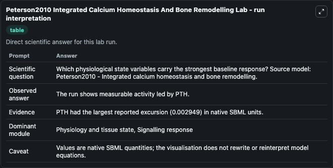
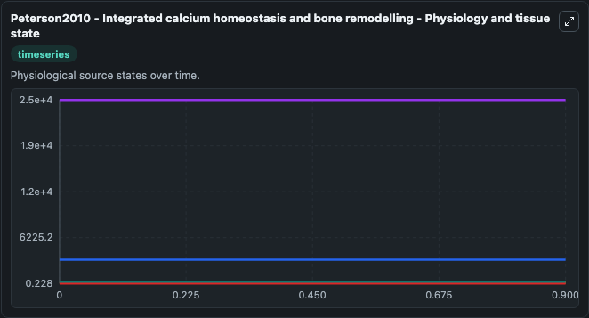
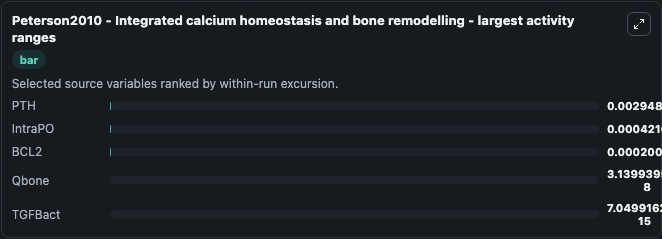
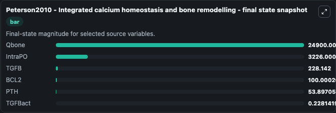
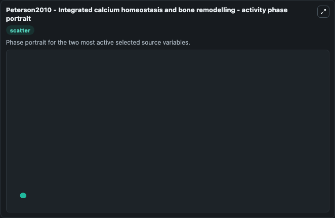

# Peterson2010 Integrated Calcium Homeostasis And Bone Remodelling

This Biosimulant lab wraps `Peterson2010 Integrated Calcium Homeostasis And Bone Remodelling` as a runnable systems biology model with a companion visualization module.
 Peterson2010 - integrate. It can be used to explore the configured dynamics and compare scenario outcomes across configurations.

## What You'll See

The lab asks: Which physiological state variables carry the strongest baseline response? Source model: Peterson2010 - Integrated calcium homeostasis and bone remodelling. It runs for 1.0 time units with a communication step of 0.1. The run uses the model defaults declared by the curated SBML wrapper. The generated visualizations focus on TGFBact, TGFB, Qbone, IntraPO, BCL2, and PTH, combining trajectory, endpoint-comparison, and summary-table views from one completed dark-mode run.

In this captured run, **PTH** moved from 53.900 to 53.897 across 1.0 simulation windows.


### Output Visualizations



*Summary table for Peterson2010 Integrated Calcium Homeostasis And Bone Remodelling, reporting the scientific question, observed answer, dominant module, and caveat.*



*Trajectories of PTH, IntraPO, BCL2, Qbone, TGFBact, and TGFB across the 1.0 simulation. In this run **IntraPO** climbed from 3226.0 to 3226.0 and **PTH** fell from 53.900 to 53.897 — the largest movements among the focused observables.*



*Largest-excursion ranking of the focused observables — the absolute movement magnitude during the run. Top 3: **PTH** = 0.00295, **IntraPO** = 0.000422, **BCL2** = 0.000201, with 2 more observables below.*



*Trajectories of PTH, IntraPO, BCL2, Qbone, TGFBact, and TGFB across the 1.0 simulation. In this run **IntraPO** climbed from 3226.0 to 3226.0 and **PTH** fell from 53.900 to 53.897 — the largest movements among the focused observables.*



*Visualization card from the Peterson2010 Integrated Calcium Homeostasis And Bone Remodelling dark-mode run.*


## Model Context

- Core model: `models/core`
- Visualization model: `models/visualisation`
- Standard: `other`
- Upstream source: `biomodels_ebi:BIOMD0000000613`
- License: `CC0`

## Inputs

| Input | Maps To | Default | Notes |
|---|---|---|---|
| Teri Dose Mcg | `systemsbiology_sbml_peterson2010_integrated_calcium_homeostasis_and_biomd0000000613_model.teri_dose_mcg` | | Source parameter exposed because its SBML label indicates a boundary, stimulus, dose, ligand, protocol, substrate, or environmental control. Maps to SBML symbol `teri_dose_mcg`. |
| Teri Number Of Doses | `systemsbiology_sbml_peterson2010_integrated_calcium_homeostasis_and_biomd0000000613_model.teri_number_of_doses` | | Source parameter exposed because its SBML label indicates a boundary, stimulus, dose, ligand, protocol, substrate, or environmental control. Maps to SBML symbol `teri_number_of_doses`. |

## Outputs

| Output | Maps To | Role |
|---|---|---|
| `state` | `systemsbiology_sbml_peterson2010_integrated_calcium_homeostasis_and_biomd0000000613_model.state` | Available to the visualization model and downstream workflows. |
| `summary` | `systemsbiology_sbml_peterson2010_integrated_calcium_homeostasis_and_biomd0000000613_model.summary` | Available to the visualization model and downstream workflows. |
| `species_labels` | `systemsbiology_sbml_peterson2010_integrated_calcium_homeostasis_and_biomd0000000613_model.species_labels` | Available to the visualization model and downstream workflows. |
| `tgf_bact` | `systemsbiology_sbml_peterson2010_integrated_calcium_homeostasis_and_biomd0000000613_model.tgf_bact` | Available to the visualization model and downstream workflows. |
| `tgfb` | `systemsbiology_sbml_peterson2010_integrated_calcium_homeostasis_and_biomd0000000613_model.tgfb` | Available to the visualization model and downstream workflows. |
| `qbone` | `systemsbiology_sbml_peterson2010_integrated_calcium_homeostasis_and_biomd0000000613_model.qbone` | Available to the visualization model and downstream workflows. |
| `intra_po` | `systemsbiology_sbml_peterson2010_integrated_calcium_homeostasis_and_biomd0000000613_model.intra_po` | Available to the visualization model and downstream workflows. |
| `bcl2` | `systemsbiology_sbml_peterson2010_integrated_calcium_homeostasis_and_biomd0000000613_model.bcl2` | Available to the visualization model and downstream workflows. |
| `pth` | `systemsbiology_sbml_peterson2010_integrated_calcium_homeostasis_and_biomd0000000613_model.pth` | Available to the visualization model and downstream workflows. |

## Runtime

- Duration: `1.0`
- Communication step: `0.1`

## Running Locally

```bash
biosimulant labs serve
```
