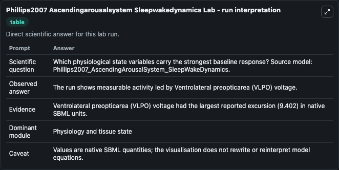
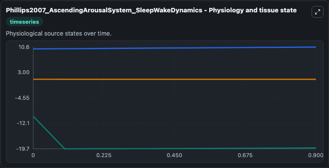
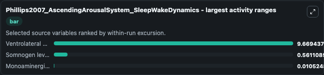
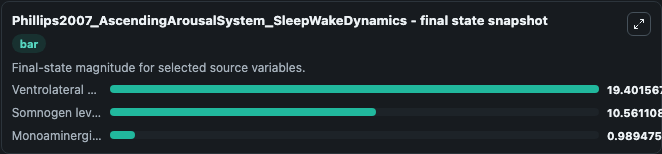
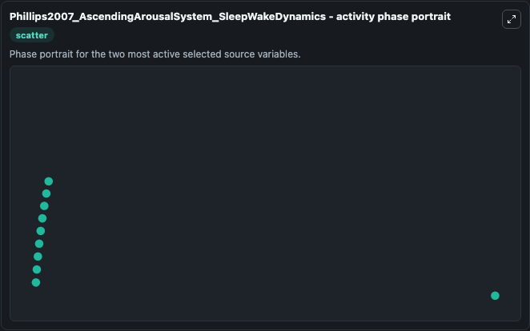

# Phillips2007 Ascendingarousalsystem Sleepwakedynamics

This Biosimulant lab wraps `Phillips2007 Ascendingarousalsystem Sleepwakedynamics` as a runnable systems biology model with a companion visualization module.
This a model from the article: A quantitative model of sleep-wake dynamics based on the physiology of thebrainstem ascending arousal system. It can be used to explore the configured dynamics and compare scenario outcomes across configurations.

## What You'll See

The lab asks: Which physiological state variables carry the strongest baseline response? Source model: Phillips2007_AscendingArousalSystem_SleepWakeDynamics. It runs for 1.0 time units with a communication step of 0.1. The run uses the model defaults declared by the curated SBML wrapper. The generated visualizations focus on Somnogen level H, Ventrolateral preopticarea (VLPO) voltage, and Monoaminergic (MA) voltage, combining trajectory, endpoint-comparison, and summary-table views from one completed dark-mode run.

In this captured run, **Ventrolateral preopticarea (VLPO) voltage** moved from -10.000 to -19.402 across 1.0 simulation windows.


### Output Visualizations



*Summary table for Phillips2007 Ascendingarousalsystem Sleepwakedynamics, reporting the scientific question, observed answer, dominant module, and caveat.*



*Trajectories of Ventrolateral preopticarea (VLPO) voltage, Somnogen level H, and Monoaminergic (MA) voltage across the 1.0 simulation. In this run **Somnogen level H** climbed from 10.000 to 10.561 and **Ventrolateral preopticarea (VLPO) voltage** fell from -10.000 to -19.402 — the largest movements among the focused observables.*



*Largest-excursion ranking of the focused observables — the absolute movement magnitude during the run. Top 3: **Ventrolateral preopticarea (VLPO) voltage** = 9.669, **Somnogen level H** = 0.5611, **Monoaminergic (MA) voltage** = 0.0105.*



*Endpoint snapshot of the focused observables — final values from the captured run. Top 3 by value: **Ventrolateral preopticarea (VLPO) voltage** = 19.402, **Somnogen level H** = 10.561, **Monoaminergic (MA) voltage** = 0.9895.*



*Visualization card from the Phillips2007 Ascendingarousalsystem Sleepwakedynamics dark-mode run.*


## Model Context

- Core model: `models/core`
- Visualization model: `models/visualisation`
- Standard: `other`
- Upstream source: `biomodels_ebi:BIOMD0000000917`
- License: `CC0`

## Inputs

| Input | Maps To | Default | Notes |
|---|---|---|---|
| Initial Somnogen Level H | `systemsbiology_sbml_phillips2007_ascendingarousalsystem_sleepwakedyn_biomd0000000917_model.initial_somnogen_level_h` | | Source state initial condition exposed as a model-specific control because no explicit intervention parameter is identifiable. Maps to SBML symbol `Somnogen_level_H`. |
| Initial Ventrolateral Preopticarea Vlpo Voltage | `systemsbiology_sbml_phillips2007_ascendingarousalsystem_sleepwakedyn_biomd0000000917_model.initial_ventrolateral_preopticarea_vlpo_voltage` | | Source state initial condition exposed as a model-specific control because no explicit intervention parameter is identifiable. Maps to SBML symbol `Ventrolateral_preopticarea__VLPO__voltage`. |
| Initial Monoaminergic Ma Voltage | `systemsbiology_sbml_phillips2007_ascendingarousalsystem_sleepwakedyn_biomd0000000917_model.initial_monoaminergic_ma_voltage` | | Source state initial condition exposed as a model-specific control because no explicit intervention parameter is identifiable. Maps to SBML symbol `Monoaminergic__MA__voltage`. |

## Outputs

| Output | Maps To | Role |
|---|---|---|
| `state` | `systemsbiology_sbml_phillips2007_ascendingarousalsystem_sleepwakedyn_biomd0000000917_model.state` | Available to the visualization model and downstream workflows. |
| `summary` | `systemsbiology_sbml_phillips2007_ascendingarousalsystem_sleepwakedyn_biomd0000000917_model.summary` | Available to the visualization model and downstream workflows. |
| `species_labels` | `systemsbiology_sbml_phillips2007_ascendingarousalsystem_sleepwakedyn_biomd0000000917_model.species_labels` | Available to the visualization model and downstream workflows. |
| `somnogen_level_h` | `systemsbiology_sbml_phillips2007_ascendingarousalsystem_sleepwakedyn_biomd0000000917_model.somnogen_level_h` | Available to the visualization model and downstream workflows. |
| `ventrolateral_preopticarea_vlpo_voltage` | `systemsbiology_sbml_phillips2007_ascendingarousalsystem_sleepwakedyn_biomd0000000917_model.ventrolateral_preopticarea_vlpo_voltage` | Available to the visualization model and downstream workflows. |
| `monoaminergic_ma_voltage` | `systemsbiology_sbml_phillips2007_ascendingarousalsystem_sleepwakedyn_biomd0000000917_model.monoaminergic_ma_voltage` | Available to the visualization model and downstream workflows. |

## Runtime

- Duration: `1.0`
- Communication step: `0.1`

## Running Locally

```bash
biosimulant labs serve
```
