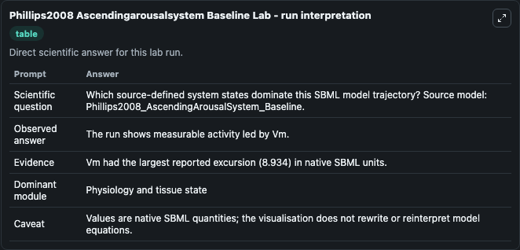
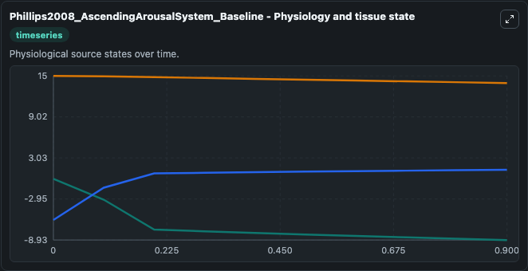
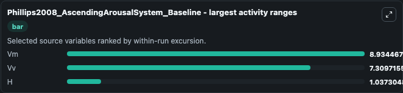
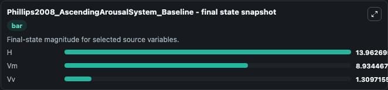
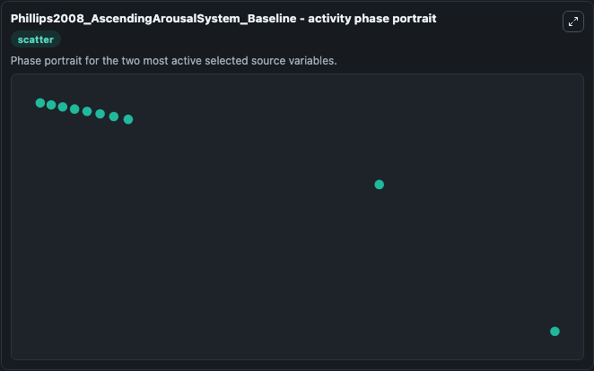

# Phillips2008 Ascendingarousalsystem Baseline

This Biosimulant lab wraps `Phillips2008 Ascendingarousalsystem Baseline` as a runnable systems biology model with a companion visualization module.
This a model from the article: Sleep deprivation in a quantitative physiologically based model of the ascendingarousal system. It can be used to explore the configured dynamics and compare scenario outcomes across configurations.

## What You'll See

The lab asks: Which source-defined system states dominate this SBML model trajectory? Source model: Phillips2008_AscendingArousalSystem_Baseline. It runs for 1.0 time units with a communication step of 0.1. The run uses the model defaults declared by the curated SBML wrapper. The generated visualizations focus on Vv, Vm, and H, combining trajectory, endpoint-comparison, and summary-table views from one completed dark-mode run.

In this captured run, **Vm** moved from 0 to -8.934 across 1.0 simulation windows.


### Output Visualizations



*Summary table for Phillips2008 Ascendingarousalsystem Baseline, reporting the scientific question, observed answer, dominant module, and caveat.*



*Trajectories of Vm, Vv, and H across the 1.0 simulation. In this run **Vv** climbed from -6.000 to 1.310 and **Vm** fell from 0 to -8.934 — the largest movements among the focused observables.*



*Largest-excursion ranking of the focused observables — the absolute movement magnitude during the run. Top 3: **Vm** = 8.934, **Vv** = 7.310, **H** = 1.037.*



*Endpoint snapshot of the focused observables — final values from the captured run. Top 3 by value: **H** = 13.963, **Vm** = 8.934, **Vv** = 1.310.*



*Visualization card from the Phillips2008 Ascendingarousalsystem Baseline dark-mode run.*


## Model Context

- Core model: `models/core`
- Visualization model: `models/visualisation`
- Standard: `other`
- Upstream source: `biomodels_ebi:MODEL1006230110`
- License: `CC0`

## Inputs

| Input | Maps To | Default | Notes |
|---|---|---|---|
| Initial Model State Vv | `systemsbiology_sbml_phillips2008_ascendingarousalsystem_baseline_model1006230110_model.initial_model_state_vv` | | Source state initial condition exposed as a model-specific control because no explicit intervention parameter is identifiable. Maps to SBML symbol `Vv`. |
| Initial Model State Vm | `systemsbiology_sbml_phillips2008_ascendingarousalsystem_baseline_model1006230110_model.initial_model_state_vm` | | Source state initial condition exposed as a model-specific control because no explicit intervention parameter is identifiable. Maps to SBML symbol `Vm`. |
| Initial Model State H | `systemsbiology_sbml_phillips2008_ascendingarousalsystem_baseline_model1006230110_model.initial_model_state_h` | | Source state initial condition exposed as a model-specific control because no explicit intervention parameter is identifiable. Maps to SBML symbol `H`. |

## Outputs

| Output | Maps To | Role |
|---|---|---|
| `state` | `systemsbiology_sbml_phillips2008_ascendingarousalsystem_baseline_model1006230110_model.state` | Available to the visualization model and downstream workflows. |
| `summary` | `systemsbiology_sbml_phillips2008_ascendingarousalsystem_baseline_model1006230110_model.summary` | Available to the visualization model and downstream workflows. |
| `species_labels` | `systemsbiology_sbml_phillips2008_ascendingarousalsystem_baseline_model1006230110_model.species_labels` | Available to the visualization model and downstream workflows. |
| `model_state_vv` | `systemsbiology_sbml_phillips2008_ascendingarousalsystem_baseline_model1006230110_model.model_state_vv` | Available to the visualization model and downstream workflows. |
| `model_state_vm` | `systemsbiology_sbml_phillips2008_ascendingarousalsystem_baseline_model1006230110_model.model_state_vm` | Available to the visualization model and downstream workflows. |
| `model_state_h` | `systemsbiology_sbml_phillips2008_ascendingarousalsystem_baseline_model1006230110_model.model_state_h` | Available to the visualization model and downstream workflows. |

## Runtime

- Duration: `1.0`
- Communication step: `0.1`

## Running Locally

```bash
biosimulant labs serve
```
