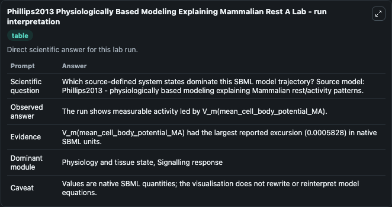
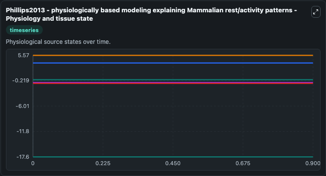
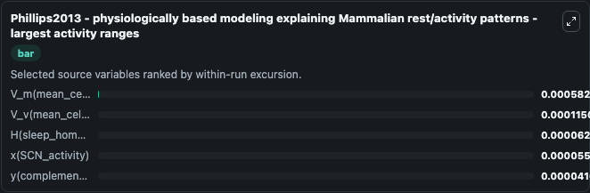
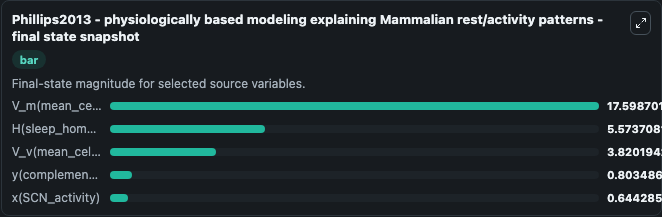
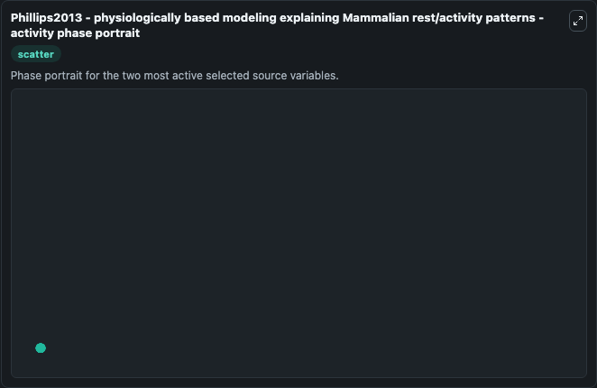

# Phillips2013 Physiologically Based Modeling Explaining Mammalian Rest A

This Biosimulant lab wraps `Phillips2013 Physiologically Based Modeling Explaining Mammalian Rest A` as a runnable systems biology model with a companion visualization module.
The model provides a framework for understanding rest/activity patterns effected by the circadian rhythm and relating them to underlying diverse phenotypes. It can be used to explore the configured dynamics and compare scenario outcomes across configurations.

## What You'll See

The lab asks: Which source-defined system states dominate this SBML model trajectory? Source model: Phillips2013 - physiologically based modeling explaining Mammalian rest/activity patterns. It runs for 1.0 time units with a communication step of 0.1. The run uses the model defaults declared by the curated SBML wrapper. The generated visualizations focus on H(sleep_homeostatic_drive), V_m(mean_cell_body_potential_MA), V_v(mean_cell_body_potential_VLPO), y(complement_of_x), x(SCN_activity), and n(fraction_of_photoreceptors_that_are_activated), combining trajectory, endpoint-comparison, and summary-table views from one completed dark-mode run.

In this captured run, **V_m(mean_cell_body_potential_MA)** moved from -17.598 to -17.599 across 1.0 simulation windows.


### Output Visualizations



*Summary table for Phillips2013 Physiologically Based Modeling Explaining Mammalian Rest A, reporting the scientific question, observed answer, dominant module, and caveat.*



*Trajectories of V_m(mean_cell_body_potential_MA), V_v(mean_cell_body_potential_VLPO), H(sleep_homeostatic_drive), x(SCN_activity), y(complement_of_x), and n(fraction_of_photoreceptors_that_are_activated) across the 1.0 simulation. In this run **V_v(mean_cell_body_potential_VLPO)** climbed from 3.820 to 3.820 and **V_m(mean_cell_body_potential_MA)** fell from -17.598 to -17.599 — the largest movements among the focused observables.*



*Largest-excursion ranking of the focused observables — the absolute movement magnitude during the run. Top 3: **V_m(mean_cell_body_potential_MA)** = 0.000583, **V_v(mean_cell_body_potential_VLPO)** = 0.000115, **H(sleep_homeostatic_drive)** = 6.28e-05, with 2 more observables below.*



*Endpoint snapshot of the focused observables — final values from the captured run. Top 3 by value: **V_m(mean_cell_body_potential_MA)** = 17.599, **H(sleep_homeostatic_drive)** = 5.574, **V_v(mean_cell_body_potential_VLPO)** = 3.820, with 2 more observables below.*



*Visualization card from the Phillips2013 Physiologically Based Modeling Explaining Mammalian Rest A dark-mode run.*


## Model Context

- Core model: `models/core`
- Visualization model: `models/visualisation`
- Standard: `other`
- Upstream source: `biomodels_ebi:BIOMD0000001072`
- License: `CC0`

## Inputs

| Input | Maps To | Default | Notes |
|---|---|---|---|
| Initial H Sleep Homeostatic Drive | `systemsbiology_sbml_phillips2013_physiologically_based_modeling_expl_biomd0000001072_model.initial_h_sleep_homeostatic_drive` | | Source state initial condition exposed as a model-specific control because no explicit intervention parameter is identifiable. Maps to SBML symbol `H`. |
| Initial V M Mean Cell Body Potential Ma | `systemsbiology_sbml_phillips2013_physiologically_based_modeling_expl_biomd0000001072_model.initial_v_m_mean_cell_body_potential_ma` | | Source state initial condition exposed as a model-specific control because no explicit intervention parameter is identifiable. Maps to SBML symbol `V_m`. |
| Initial V V Mean Cell Body Potential Vlpo | `systemsbiology_sbml_phillips2013_physiologically_based_modeling_expl_biomd0000001072_model.initial_v_v_mean_cell_body_potential_vlpo` | | Source state initial condition exposed as a model-specific control because no explicit intervention parameter is identifiable. Maps to SBML symbol `V_v`. |
| Initial Y Complement Of X | `systemsbiology_sbml_phillips2013_physiologically_based_modeling_expl_biomd0000001072_model.initial_y_complement_of_x` | | Source state initial condition exposed as a model-specific control because no explicit intervention parameter is identifiable. Maps to SBML symbol `Y`. |
| Initial X Scn Activity | `systemsbiology_sbml_phillips2013_physiologically_based_modeling_expl_biomd0000001072_model.initial_x_scn_activity` | | Source state initial condition exposed as a model-specific control because no explicit intervention parameter is identifiable. Maps to SBML symbol `X`. |
| Initial N Fraction Of Photoreceptors That Are Activated | `systemsbiology_sbml_phillips2013_physiologically_based_modeling_expl_biomd0000001072_model.initial_n_fraction_of_photoreceptors_that_are_activated` | | Source state initial condition exposed as a model-specific control because no explicit intervention parameter is identifiable. Maps to SBML symbol `n`. |

## Outputs

| Output | Maps To | Role |
|---|---|---|
| `state` | `systemsbiology_sbml_phillips2013_physiologically_based_modeling_expl_biomd0000001072_model.state` | Available to the visualization model and downstream workflows. |
| `summary` | `systemsbiology_sbml_phillips2013_physiologically_based_modeling_expl_biomd0000001072_model.summary` | Available to the visualization model and downstream workflows. |
| `species_labels` | `systemsbiology_sbml_phillips2013_physiologically_based_modeling_expl_biomd0000001072_model.species_labels` | Available to the visualization model and downstream workflows. |
| `h_sleep_homeostatic_drive` | `systemsbiology_sbml_phillips2013_physiologically_based_modeling_expl_biomd0000001072_model.h_sleep_homeostatic_drive` | Available to the visualization model and downstream workflows. |
| `v_m_mean_cell_body_potential_ma` | `systemsbiology_sbml_phillips2013_physiologically_based_modeling_expl_biomd0000001072_model.v_m_mean_cell_body_potential_ma` | Available to the visualization model and downstream workflows. |
| `v_v_mean_cell_body_potential_vlpo` | `systemsbiology_sbml_phillips2013_physiologically_based_modeling_expl_biomd0000001072_model.v_v_mean_cell_body_potential_vlpo` | Available to the visualization model and downstream workflows. |
| `y_complement_of_x` | `systemsbiology_sbml_phillips2013_physiologically_based_modeling_expl_biomd0000001072_model.y_complement_of_x` | Available to the visualization model and downstream workflows. |
| `x_scn_activity` | `systemsbiology_sbml_phillips2013_physiologically_based_modeling_expl_biomd0000001072_model.x_scn_activity` | Available to the visualization model and downstream workflows. |
| `n_fraction_of_photoreceptors_that_are_activated` | `systemsbiology_sbml_phillips2013_physiologically_based_modeling_expl_biomd0000001072_model.n_fraction_of_photoreceptors_that_are_activated` | Available to the visualization model and downstream workflows. |

## Runtime

- Duration: `1.0`
- Communication step: `0.1`

## Running Locally

```bash
biosimulant labs serve
```
