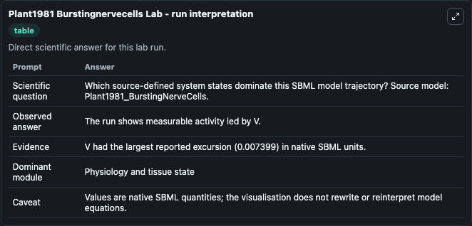
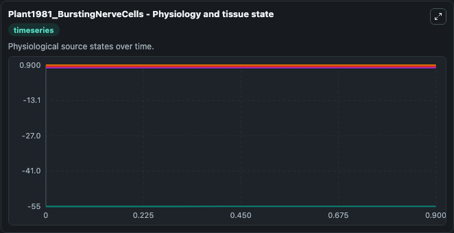
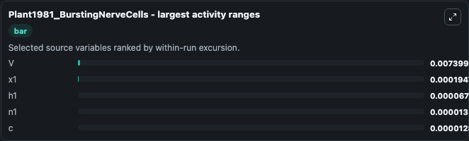
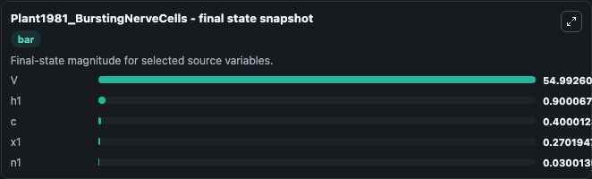
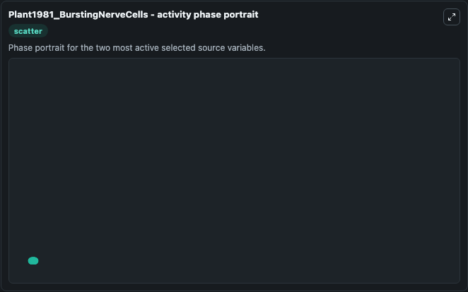

# Plant1981 Burstingnervecells

This Biosimulant lab wraps `Plant1981 Burstingnervecells` as a runnable systems biology model with a companion visualization module.
This a model from the article: Bifurcation and resonance in a model for bursting nerve cells. It can be used to explore the configured dynamics and compare scenario outcomes across configurations.

## What You'll See

The lab asks: Which source-defined system states dominate this SBML model trajectory? Source model: Plant1981_BurstingNerveCells. It runs for 1.0 time units with a communication step of 0.1. The run uses the model defaults declared by the curated SBML wrapper. The generated visualizations focus on V, h1, x1, n1, and c, combining trajectory, endpoint-comparison, and summary-table views from one completed dark-mode run.

In this captured run, **V** moved from -55.000 to -54.993 across 1.0 simulation windows.


### Output Visualizations



*Summary table for Plant1981 Burstingnervecells, reporting the scientific question, observed answer, dominant module, and caveat.*



*Trajectories of V, x1, h1, n1, and c across the 1.0 simulation. In this run **V** climbed from -55.000 to -54.993 — the largest movements among the focused observables.*



*Largest-excursion ranking of the focused observables — the absolute movement magnitude during the run. Top 3: **V** = 0.0074, **x1** = 0.000195, **h1** = 6.74e-05, with 2 more observables below.*



*Endpoint snapshot of the focused observables — final values from the captured run. Top 3 by value: **V** = 54.993, **h1** = 0.9001, **c** = 0.4000, with 2 more observables below.*



*Visualization card from the Plant1981 Burstingnervecells dark-mode run.*


## Model Context

- Core model: `models/core`
- Visualization model: `models/visualisation`
- Standard: `other`
- Upstream source: `biomodels_ebi:BIOMD0000000304`
- License: `CC0`

## Inputs

| Input | Maps To | Default | Notes |
|---|---|---|---|
| Initial Model State V | `systemsbiology_sbml_plant1981_burstingnervecells_biomd0000000304_model.initial_model_state_v` | | Source state initial condition exposed as a model-specific control because no explicit intervention parameter is identifiable. Maps to SBML symbol `V_membrane`. |
| Initial Model State H1 | `systemsbiology_sbml_plant1981_burstingnervecells_biomd0000000304_model.initial_model_state_h1` | | Source state initial condition exposed as a model-specific control because no explicit intervention parameter is identifiable. Maps to SBML symbol `h1`. |
| Initial Model State X1 | `systemsbiology_sbml_plant1981_burstingnervecells_biomd0000000304_model.initial_model_state_x1` | | Source state initial condition exposed as a model-specific control because no explicit intervention parameter is identifiable. Maps to SBML symbol `x1`. |
| Initial Model State N1 | `systemsbiology_sbml_plant1981_burstingnervecells_biomd0000000304_model.initial_model_state_n1` | | Source state initial condition exposed as a model-specific control because no explicit intervention parameter is identifiable. Maps to SBML symbol `n1`. |
| Initial Model State C | `systemsbiology_sbml_plant1981_burstingnervecells_biomd0000000304_model.initial_model_state_c` | | Source state initial condition exposed as a model-specific control because no explicit intervention parameter is identifiable. Maps to SBML symbol `c`. |

## Outputs

| Output | Maps To | Role |
|---|---|---|
| `state` | `systemsbiology_sbml_plant1981_burstingnervecells_biomd0000000304_model.state` | Available to the visualization model and downstream workflows. |
| `summary` | `systemsbiology_sbml_plant1981_burstingnervecells_biomd0000000304_model.summary` | Available to the visualization model and downstream workflows. |
| `species_labels` | `systemsbiology_sbml_plant1981_burstingnervecells_biomd0000000304_model.species_labels` | Available to the visualization model and downstream workflows. |
| `model_state_v` | `systemsbiology_sbml_plant1981_burstingnervecells_biomd0000000304_model.model_state_v` | Available to the visualization model and downstream workflows. |
| `model_state_h1` | `systemsbiology_sbml_plant1981_burstingnervecells_biomd0000000304_model.model_state_h1` | Available to the visualization model and downstream workflows. |
| `model_state_x1` | `systemsbiology_sbml_plant1981_burstingnervecells_biomd0000000304_model.model_state_x1` | Available to the visualization model and downstream workflows. |
| `model_state_n1` | `systemsbiology_sbml_plant1981_burstingnervecells_biomd0000000304_model.model_state_n1` | Available to the visualization model and downstream workflows. |
| `model_state_c` | `systemsbiology_sbml_plant1981_burstingnervecells_biomd0000000304_model.model_state_c` | Available to the visualization model and downstream workflows. |

## Runtime

- Duration: `1.0`
- Communication step: `0.1`

## Running Locally

```bash
biosimulant labs serve
```
