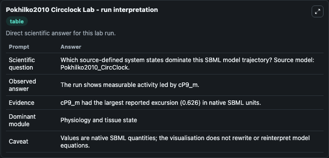
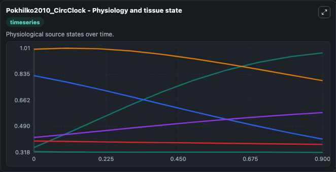
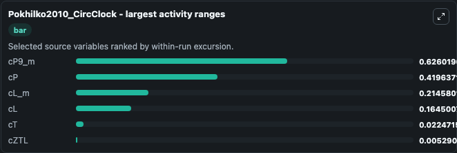
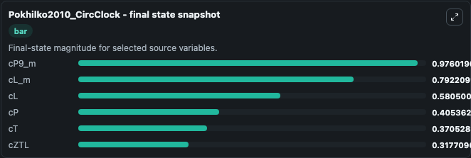
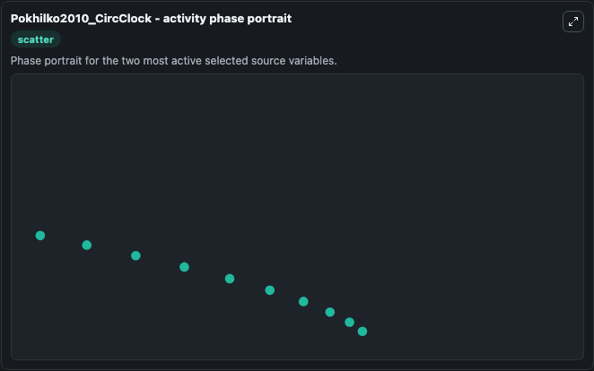

# Pokhilko2010 Circclock

This Biosimulant lab wraps `Pokhilko2010 Circclock` as a runnable systems biology model with a companion visualization module.
This a model from the article: Data assimilation constrains new connections and components in a complex, eukaryotic circadian clock model. It can be used to explore the configured dynamics and compare scenario outcomes across configurations.

## What You'll See

The lab asks: Which source-defined system states dominate this SBML model trajectory? Source model: Pokhilko2010_CircClock. It runs for 1.0 time units with a communication step of 0.1. The run uses the model defaults declared by the curated SBML wrapper. The generated visualizations focus on cL_m, cP, cL, cT, cP9_m, and cZTL, combining trajectory, endpoint-comparison, and summary-table views from one completed dark-mode run.

In this captured run, **cP9_m** moved from 0.3500 to 0.9760 across 1.0 simulation windows.


### Output Visualizations



*Summary table for Pokhilko2010 Circclock, reporting the scientific question, observed answer, dominant module, and caveat.*



*Trajectories of cP9_m, cP, cL_m, cL, cT, and cZTL across the 1.0 simulation. In this run **cP9_m** climbed from 0.3500 to 0.9760 and **cP** fell from 0.8250 to 0.4054 — the largest movements among the focused observables.*



*Largest-excursion ranking of the focused observables — the absolute movement magnitude during the run. Top 3: **cP9_m** = 0.6260, **cP** = 0.4196, **cL_m** = 0.2146, with 3 more observables below.*



*Endpoint snapshot of the focused observables — final values from the captured run. Top 3 by value: **cP9_m** = 0.9760, **cL_m** = 0.7922, **cL** = 0.5805, with 3 more observables below.*



*Visualization card from the Pokhilko2010 Circclock dark-mode run.*


## Model Context

- Core model: `models/core`
- Visualization model: `models/visualisation`
- Standard: `other`
- Upstream source: `biomodels_ebi:BIOMD0000000273`
- License: `CC0`

## Inputs

| Input | Maps To | Default | Notes |
|---|---|---|---|
| Initial C L M | `systemsbiology_sbml_pokhilko2010_circclock_biomd0000000273_model.initial_c_l_m` | | Source state initial condition exposed as a model-specific control because no explicit intervention parameter is identifiable. Maps to SBML symbol `cL_m`. |
| Initial Model State C P | `systemsbiology_sbml_pokhilko2010_circclock_biomd0000000273_model.initial_model_state_c_p` | | Source state initial condition exposed as a model-specific control because no explicit intervention parameter is identifiable. Maps to SBML symbol `cP`. |
| Initial Model State C L | `systemsbiology_sbml_pokhilko2010_circclock_biomd0000000273_model.initial_model_state_c_l` | | Source state initial condition exposed as a model-specific control because no explicit intervention parameter is identifiable. Maps to SBML symbol `cL`. |
| Initial Model State C T | `systemsbiology_sbml_pokhilko2010_circclock_biomd0000000273_model.initial_model_state_c_t` | | Source state initial condition exposed as a model-specific control because no explicit intervention parameter is identifiable. Maps to SBML symbol `cT`. |
| Initial C P9 M | `systemsbiology_sbml_pokhilko2010_circclock_biomd0000000273_model.initial_c_p9_m` | | Source state initial condition exposed as a model-specific control because no explicit intervention parameter is identifiable. Maps to SBML symbol `cP9_m`. |
| Initial C Ztl | `systemsbiology_sbml_pokhilko2010_circclock_biomd0000000273_model.initial_c_ztl` | | Source state initial condition exposed as a model-specific control because no explicit intervention parameter is identifiable. Maps to SBML symbol `cZTL`. |

## Outputs

| Output | Maps To | Role |
|---|---|---|
| `state` | `systemsbiology_sbml_pokhilko2010_circclock_biomd0000000273_model.state` | Available to the visualization model and downstream workflows. |
| `summary` | `systemsbiology_sbml_pokhilko2010_circclock_biomd0000000273_model.summary` | Available to the visualization model and downstream workflows. |
| `species_labels` | `systemsbiology_sbml_pokhilko2010_circclock_biomd0000000273_model.species_labels` | Available to the visualization model and downstream workflows. |
| `c_l_m` | `systemsbiology_sbml_pokhilko2010_circclock_biomd0000000273_model.c_l_m` | Available to the visualization model and downstream workflows. |
| `c_p` | `systemsbiology_sbml_pokhilko2010_circclock_biomd0000000273_model.c_p` | Available to the visualization model and downstream workflows. |
| `c_l` | `systemsbiology_sbml_pokhilko2010_circclock_biomd0000000273_model.c_l` | Available to the visualization model and downstream workflows. |
| `c_t` | `systemsbiology_sbml_pokhilko2010_circclock_biomd0000000273_model.c_t` | Available to the visualization model and downstream workflows. |
| `c_p9_m` | `systemsbiology_sbml_pokhilko2010_circclock_biomd0000000273_model.c_p9_m` | Available to the visualization model and downstream workflows. |
| `c_ztl` | `systemsbiology_sbml_pokhilko2010_circclock_biomd0000000273_model.c_ztl` | Available to the visualization model and downstream workflows. |

## Runtime

- Duration: `1.0`
- Communication step: `0.1`

## Running Locally

```bash
biosimulant labs serve
```
