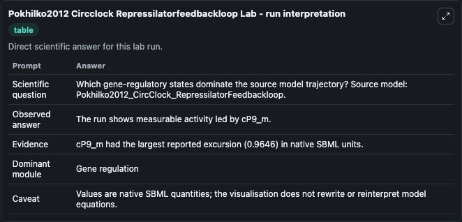
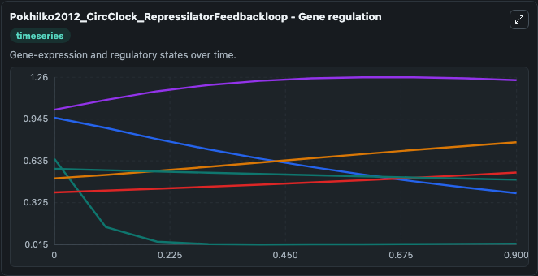
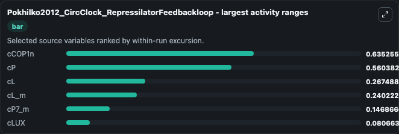
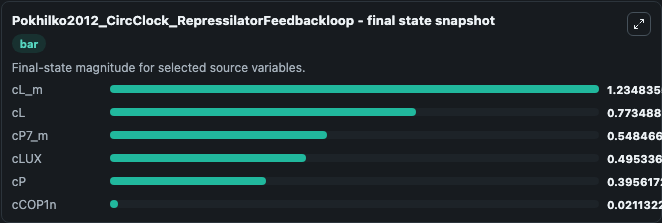
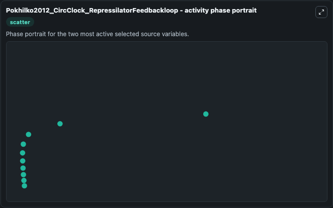

# Pokhilko2012 Circclock Repressilatorfeedbackloop

This Biosimulant lab wraps `Pokhilko2012 Circclock Repressilatorfeedbackloop` as a runnable systems biology model with a companion visualization module.
This model is from the article: The clock gene circuit in Arabidopsis includes a repressilator with additional feedback loops Pokhilko A, Fernández AP, Edwards KD, Southern MM, Halliday KJ, Millar AJ. It can be used to explore the configured dynamics and compare scenario outcomes across configurations.

## What You'll See

The lab asks: Which gene-regulatory states dominate the source model trajectory? Source model: Pokhilko2012_CircClock_RepressilatorFeedbackloop. It runs for 1.0 time units with a communication step of 0.1. The run uses the model defaults declared by the curated SBML wrapper. The generated visualizations focus on cL_m, cP, cCOP1n, cLUX, cL, and cP7_m, combining trajectory, endpoint-comparison, and summary-table views from one completed dark-mode run.

In this captured run, **cCOP1n** moved from 0.6500 to 0.0211 across 1.0 simulation windows.


### Output Visualizations



*Summary table for Pokhilko2012 Circclock Repressilatorfeedbackloop, reporting the scientific question, observed answer, dominant module, and caveat.*



*Trajectories of cCOP1n, cP, cL, cL_m, cP7_m, and cLUX across the 1.0 simulation. In this run **cL** climbed from 0.5060 to 0.7735 and **cCOP1n** fell from 0.6500 to 0.0211 — the largest movements among the focused observables.*



*Largest-excursion ranking of the focused observables — the absolute movement magnitude during the run. Top 3: **cCOP1n** = 0.6353, **cP** = 0.5604, **cL** = 0.2675, with 3 more observables below.*



*Endpoint snapshot of the focused observables — final values from the captured run. Top 3 by value: **cL_m** = 1.235, **cL** = 0.7735, **cP7_m** = 0.5485, with 3 more observables below.*



*Visualization card from the Pokhilko2012 Circclock Repressilatorfeedbackloop dark-mode run.*


## Model Context

- Core model: `models/core`
- Visualization model: `models/visualisation`
- Standard: `other`
- Upstream source: `biomodels_ebi:BIOMD0000000412`
- License: `CC0`

## Inputs

| Input | Maps To | Default | Notes |
|---|---|---|---|
| Light Amplitude | `systemsbiology_sbml_pokhilko2012_circclock_repressilatorfeedbackloop_biomd0000000412_model.light_amplitude` | | Source parameter exposed because its SBML label indicates a boundary, stimulus, dose, ligand, protocol, substrate, or environmental control. Maps to SBML symbol `lightAmplitude`. |
| Light Offset | `systemsbiology_sbml_pokhilko2012_circclock_repressilatorfeedbackloop_biomd0000000412_model.light_offset` | | Source parameter exposed because its SBML label indicates a boundary, stimulus, dose, ligand, protocol, substrate, or environmental control. Maps to SBML symbol `lightOffset`. |
| Twilight Period | `systemsbiology_sbml_pokhilko2012_circclock_repressilatorfeedbackloop_biomd0000000412_model.twilight_period` | | Source parameter exposed because its SBML label indicates a boundary, stimulus, dose, ligand, protocol, substrate, or environmental control. Maps to SBML symbol `twilightPeriod`. |

## Outputs

| Output | Maps To | Role |
|---|---|---|
| `state` | `systemsbiology_sbml_pokhilko2012_circclock_repressilatorfeedbackloop_biomd0000000412_model.state` | Available to the visualization model and downstream workflows. |
| `summary` | `systemsbiology_sbml_pokhilko2012_circclock_repressilatorfeedbackloop_biomd0000000412_model.summary` | Available to the visualization model and downstream workflows. |
| `species_labels` | `systemsbiology_sbml_pokhilko2012_circclock_repressilatorfeedbackloop_biomd0000000412_model.species_labels` | Available to the visualization model and downstream workflows. |
| `c_l_m` | `systemsbiology_sbml_pokhilko2012_circclock_repressilatorfeedbackloop_biomd0000000412_model.c_l_m` | Available to the visualization model and downstream workflows. |
| `c_p` | `systemsbiology_sbml_pokhilko2012_circclock_repressilatorfeedbackloop_biomd0000000412_model.c_p` | Available to the visualization model and downstream workflows. |
| `c_cop1n` | `systemsbiology_sbml_pokhilko2012_circclock_repressilatorfeedbackloop_biomd0000000412_model.c_cop1n` | Available to the visualization model and downstream workflows. |
| `c_lux` | `systemsbiology_sbml_pokhilko2012_circclock_repressilatorfeedbackloop_biomd0000000412_model.c_lux` | Available to the visualization model and downstream workflows. |
| `c_l` | `systemsbiology_sbml_pokhilko2012_circclock_repressilatorfeedbackloop_biomd0000000412_model.c_l` | Available to the visualization model and downstream workflows. |
| `c_p7_m` | `systemsbiology_sbml_pokhilko2012_circclock_repressilatorfeedbackloop_biomd0000000412_model.c_p7_m` | Available to the visualization model and downstream workflows. |

## Runtime

- Duration: `1.0`
- Communication step: `0.1`

## Running Locally

```bash
biosimulant labs serve
```
