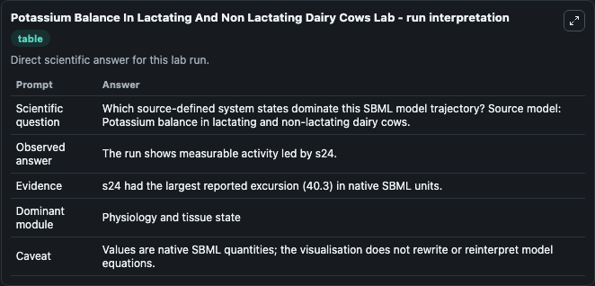
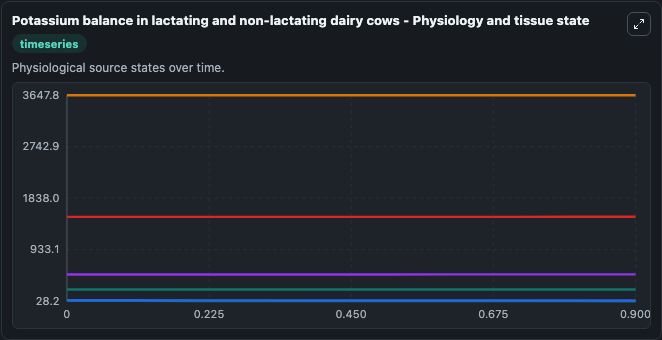
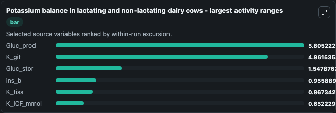
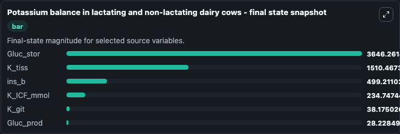
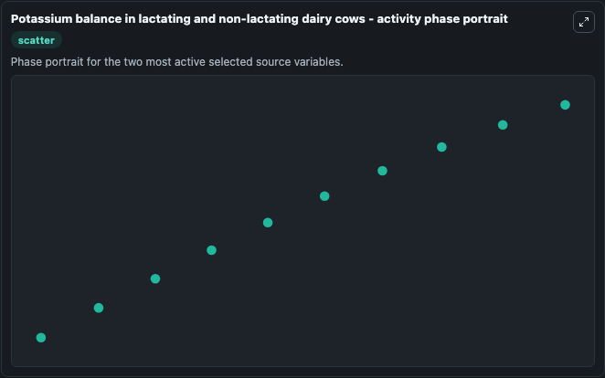

# Potassium Balance In Lactating And Non Lactating Dairy Cows

This Biosimulant lab wraps `Potassium Balance In Lactating And Non Lactating Dairy Cows` as a runnable systems biology model with a companion visualization module.
M. It can be used to explore the configured dynamics and compare scenario outcomes across configurations.

## What You'll See

The lab asks: Which source-defined system states dominate this SBML model trajectory? Source model: Potassium balance in lactating and non-lactating dairy cows. It runs for 1.0 time units with a communication step of 0.1. The run uses the model defaults declared by the curated SBML wrapper. The generated visualizations focus on Gluc_stor, K_tiss, K_git, Gluc_prod, K_ICF_mmol, and ins_b, combining trajectory, endpoint-comparison, and summary-table views from one completed dark-mode run.

In this captured run, **Gluc_prod** moved from 34.034 to 28.228 across 1.0 simulation windows.


### Output Visualizations



*Summary table for Potassium Balance In Lactating And Non Lactating Dairy Cows, reporting the scientific question, observed answer, dominant module, and caveat.*



*Trajectories of Gluc_prod, K_git, Gluc_stor, ins_b, K_tiss, and K_ICF_mmol across the 1.0 simulation. In this run **ins_b** climbed from 498.3 to 499.2 and **Gluc_prod** fell from 34.034 to 28.228 — the largest movements among the focused observables.*



*Trajectories of Gluc_prod, K_git, Gluc_stor, ins_b, K_tiss, and K_ICF_mmol across the 1.0 simulation. In this run **ins_b** climbed from 498.3 to 499.2 and **Gluc_prod** fell from 34.034 to 28.228 — the largest movements among the focused observables.*



*Endpoint snapshot of the focused observables — final values from the captured run. Top 3 by value: **Gluc_stor** = 3646.3, **K_tiss** = 1510.5, **ins_b** = 499.2, with 3 more observables below.*



*Trajectories of Gluc_prod, K_git, Gluc_stor, ins_b, K_tiss, and K_ICF_mmol across the 1.0 simulation. In this run **ins_b** climbed from 498.3 to 499.2 and **Gluc_prod** fell from 34.034 to 28.228 — the largest movements among the focused observables.*


## Model Context

- Core model: `models/core`
- Visualization model: `models/visualisation`
- Standard: `other`
- Upstream source: `biomodels_ebi:BIOMD0000000849`
- License: `CC0`

## Inputs

| Input | Maps To | Default | Notes |
|---|---|---|---|
| Src Glucfeed | `systemsbiology_sbml_potassium_balance_in_lactating_and_non_lactating_biomd0000000849_model.src_glucfeed` | | Source parameter exposed because its SBML label indicates a boundary, stimulus, dose, ligand, protocol, substrate, or environmental control. Maps to SBML symbol `p46`. |

## Outputs

| Output | Maps To | Role |
|---|---|---|
| `state` | `systemsbiology_sbml_potassium_balance_in_lactating_and_non_lactating_biomd0000000849_model.state` | Available to the visualization model and downstream workflows. |
| `summary` | `systemsbiology_sbml_potassium_balance_in_lactating_and_non_lactating_biomd0000000849_model.summary` | Available to the visualization model and downstream workflows. |
| `species_labels` | `systemsbiology_sbml_potassium_balance_in_lactating_and_non_lactating_biomd0000000849_model.species_labels` | Available to the visualization model and downstream workflows. |
| `gluc_stor` | `systemsbiology_sbml_potassium_balance_in_lactating_and_non_lactating_biomd0000000849_model.gluc_stor` | Available to the visualization model and downstream workflows. |
| `k_tiss` | `systemsbiology_sbml_potassium_balance_in_lactating_and_non_lactating_biomd0000000849_model.k_tiss` | Available to the visualization model and downstream workflows. |
| `k_git` | `systemsbiology_sbml_potassium_balance_in_lactating_and_non_lactating_biomd0000000849_model.k_git` | Available to the visualization model and downstream workflows. |
| `gluc_prod` | `systemsbiology_sbml_potassium_balance_in_lactating_and_non_lactating_biomd0000000849_model.gluc_prod` | Available to the visualization model and downstream workflows. |
| `k_icf_mmol` | `systemsbiology_sbml_potassium_balance_in_lactating_and_non_lactating_biomd0000000849_model.k_icf_mmol` | Available to the visualization model and downstream workflows. |
| `ins_b` | `systemsbiology_sbml_potassium_balance_in_lactating_and_non_lactating_biomd0000000849_model.ins_b` | Available to the visualization model and downstream workflows. |

## Runtime

- Duration: `1.0`
- Communication step: `0.1`

## Running Locally

```bash
biosimulant labs serve
```
