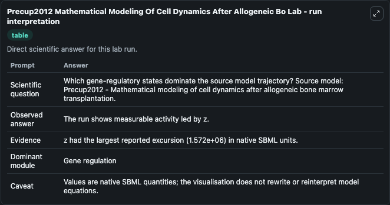
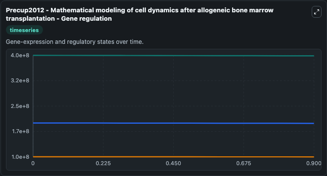
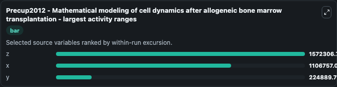
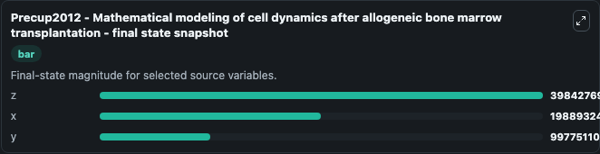
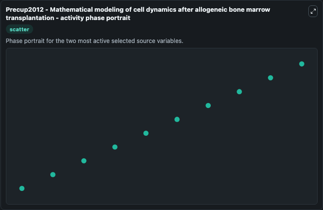

# Precup2012 Mathematical Modeling Of Cell Dynamics After Allogeneic Bo

This Biosimulant lab wraps `Precup2012 Mathematical Modeling Of Cell Dynamics After Allogeneic Bo` as a runnable systems biology model with a companion visualization module.
This is a basic mathematical model describing the dynamics of three cell lines (normal host cells, leukemic host cells and donor cells) after allogeneic stem cell transplantation. It can be used to explore the configured dynamics and compare scenario outcomes across configurations.

## What You'll See

The lab asks: Which gene-regulatory states dominate the source model trajectory? Source model: Precup2012 - Mathematical modeling of cell dynamics after allogeneic bone marrow transplantation. It runs for 1.0 time units with a communication step of 0.1. The run uses the model defaults declared by the curated SBML wrapper. The generated visualizations focus on z, x, and y, combining trajectory, endpoint-comparison, and summary-table views from one completed dark-mode run.

In this captured run, **z** moved from 4e+08 to 3.98e+08 across 1.0 simulation windows.


### Output Visualizations



*Summary table for Precup2012 Mathematical Modeling Of Cell Dynamics After Allogeneic Bo, reporting the scientific question, observed answer, dominant module, and caveat.*



*Trajectories of z, x, and y across the 1.0 simulation. In this run **z** fell from 4e+08 to 3.98e+08 — the largest movements among the focused observables.*



*Largest-excursion ranking of the focused observables — the absolute movement magnitude during the run. Top 3: **z** = 1.57e+06, **x** = 1.11e+06, **y** = 2.25e+05.*



*Endpoint snapshot of the focused observables — final values from the captured run. Top 3 by value: **z** = 3.98e+08, **x** = 1.99e+08, **y** = 9.98e+07.*



*Visualization card from the Precup2012 Mathematical Modeling Of Cell Dynamics After Allogeneic Bo dark-mode run.*


## Model Context

- Core model: `models/core`
- Visualization model: `models/visualisation`
- Standard: `other`
- Upstream source: `biomodels_ebi:BIOMD0000000800`
- License: `CC0`

## Inputs

| Input | Maps To | Default | Notes |
|---|---|---|---|
| Initial Model State Z | `systemsbiology_sbml_precup2012_mathematical_modeling_of_cell_dynamic_biomd0000000800_model.initial_model_state_z` | | Source state initial condition exposed as a model-specific control because no explicit intervention parameter is identifiable. Maps to SBML symbol `z`. |
| Initial Model State X | `systemsbiology_sbml_precup2012_mathematical_modeling_of_cell_dynamic_biomd0000000800_model.initial_model_state_x` | | Source state initial condition exposed as a model-specific control because no explicit intervention parameter is identifiable. Maps to SBML symbol `x`. |
| Initial Model State Y | `systemsbiology_sbml_precup2012_mathematical_modeling_of_cell_dynamic_biomd0000000800_model.initial_model_state_y` | | Source state initial condition exposed as a model-specific control because no explicit intervention parameter is identifiable. Maps to SBML symbol `y`. |

## Outputs

| Output | Maps To | Role |
|---|---|---|
| `state` | `systemsbiology_sbml_precup2012_mathematical_modeling_of_cell_dynamic_biomd0000000800_model.state` | Available to the visualization model and downstream workflows. |
| `summary` | `systemsbiology_sbml_precup2012_mathematical_modeling_of_cell_dynamic_biomd0000000800_model.summary` | Available to the visualization model and downstream workflows. |
| `species_labels` | `systemsbiology_sbml_precup2012_mathematical_modeling_of_cell_dynamic_biomd0000000800_model.species_labels` | Available to the visualization model and downstream workflows. |
| `model_state_z` | `systemsbiology_sbml_precup2012_mathematical_modeling_of_cell_dynamic_biomd0000000800_model.model_state_z` | Available to the visualization model and downstream workflows. |
| `model_state_x` | `systemsbiology_sbml_precup2012_mathematical_modeling_of_cell_dynamic_biomd0000000800_model.model_state_x` | Available to the visualization model and downstream workflows. |
| `model_state_y` | `systemsbiology_sbml_precup2012_mathematical_modeling_of_cell_dynamic_biomd0000000800_model.model_state_y` | Available to the visualization model and downstream workflows. |

## Runtime

- Duration: `1.0`
- Communication step: `0.1`

## Running Locally

```bash
biosimulant labs serve
```
