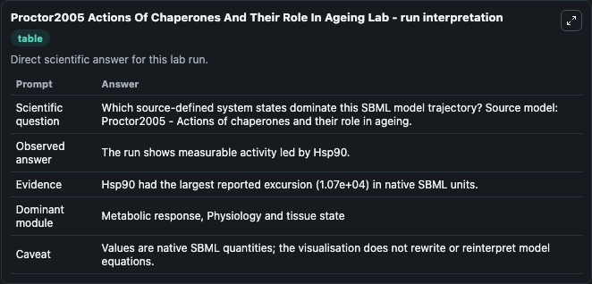
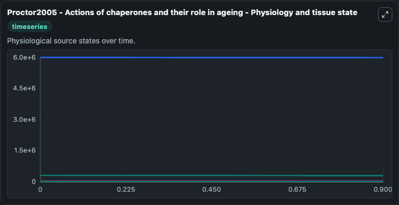
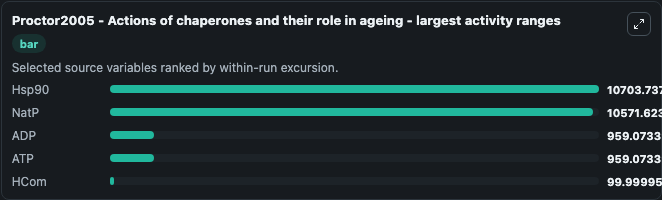
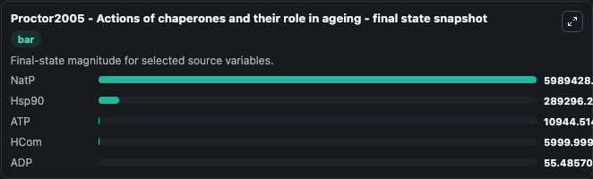
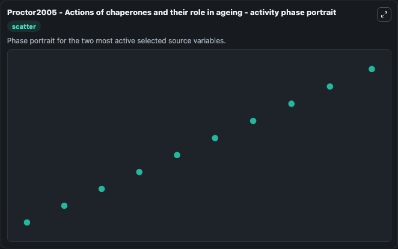

# Proctor2005 Actions Of Chaperones And Their Role In Ageing

This Biosimulant lab wraps `Proctor2005 Actions Of Chaperones And Their Role In Ageing` as a runnable systems biology model with a companion visualization module.
Proctor2005 - Actions of chaperones and theirrole in ageing This model is described in the article: Modelling the actions of chaperones and their role in ageing. It can be used to explore the configured dynamics and compare scenario outcomes across configurations.

## What You'll See

The lab asks: Which source-defined system states dominate this SBML model trajectory? Source model: Proctor2005 - Actions of chaperones and their role in ageing. It runs for 1.0 time units with a communication step of 0.1. The run uses the model defaults declared by the curated SBML wrapper. The generated visualizations focus on NatP, ATP, ADP, source, Hsp90, and HCom, combining trajectory, endpoint-comparison, and summary-table views from one completed dark-mode run.

In this captured run, **Hsp90** moved from 3e+05 to 2.89e+05 across 1.0 simulation windows.


### Output Visualizations



*Summary table for Proctor2005 Actions Of Chaperones And Their Role In Ageing, reporting the scientific question, observed answer, dominant module, and caveat.*



*Trajectories of Hsp90, NatP, ADP, ATP, HCom, and source across the 1.0 simulation. In this run **ATP** climbed from 1e+04 to 1.09e+04 and **Hsp90** fell from 3e+05 to 2.89e+05 — the largest movements among the focused observables.*



*Largest-excursion ranking of the focused observables — the absolute movement magnitude during the run. Top 3: **Hsp90** = 1.07e+04, **NatP** = 1.06e+04, **ADP** = 959.1, with 2 more observables below.*



*Endpoint snapshot of the focused observables — final values from the captured run. Top 3 by value: **NatP** = 5.99e+06, **Hsp90** = 2.89e+05, **ATP** = 1.09e+04, with 2 more observables below.*



*Visualization card from the Proctor2005 Actions Of Chaperones And Their Role In Ageing dark-mode run.*


## Model Context

- Core model: `models/core`
- Visualization model: `models/visualisation`
- Standard: `other`
- Upstream source: `biomodels_ebi:BIOMD0000000091`
- License: `CC0`

## Inputs

| Input | Maps To | Default | Notes |
|---|---|---|---|
| Initial Nat P | `systemsbiology_sbml_proctor2005_actions_of_chaperones_and_their_role_biomd0000000091_model.initial_nat_p` | | Source state initial condition exposed as a model-specific control because no explicit intervention parameter is identifiable. Maps to SBML symbol `NatP`. |
| Initial Model State ATP | `systemsbiology_sbml_proctor2005_actions_of_chaperones_and_their_role_biomd0000000091_model.initial_model_state_atp` | | Source state initial condition exposed as a model-specific control because no explicit intervention parameter is identifiable. Maps to SBML symbol `ATP`. |
| Initial Model State ADP | `systemsbiology_sbml_proctor2005_actions_of_chaperones_and_their_role_biomd0000000091_model.initial_model_state_adp` | | Source state initial condition exposed as a model-specific control because no explicit intervention parameter is identifiable. Maps to SBML symbol `ADP`. |
| Initial Source | `systemsbiology_sbml_proctor2005_actions_of_chaperones_and_their_role_biomd0000000091_model.initial_source` | | Source state initial condition exposed as a model-specific control because no explicit intervention parameter is identifiable. Maps to SBML symbol `source`. |
| Initial Hsp90 | `systemsbiology_sbml_proctor2005_actions_of_chaperones_and_their_role_biomd0000000091_model.initial_hsp90` | | Source state initial condition exposed as a model-specific control because no explicit intervention parameter is identifiable. Maps to SBML symbol `Hsp90`. |
| Initial H Com | `systemsbiology_sbml_proctor2005_actions_of_chaperones_and_their_role_biomd0000000091_model.initial_h_com` | | Source state initial condition exposed as a model-specific control because no explicit intervention parameter is identifiable. Maps to SBML symbol `HCom`. |

## Outputs

| Output | Maps To | Role |
|---|---|---|
| `state` | `systemsbiology_sbml_proctor2005_actions_of_chaperones_and_their_role_biomd0000000091_model.state` | Available to the visualization model and downstream workflows. |
| `summary` | `systemsbiology_sbml_proctor2005_actions_of_chaperones_and_their_role_biomd0000000091_model.summary` | Available to the visualization model and downstream workflows. |
| `species_labels` | `systemsbiology_sbml_proctor2005_actions_of_chaperones_and_their_role_biomd0000000091_model.species_labels` | Available to the visualization model and downstream workflows. |
| `nat_p` | `systemsbiology_sbml_proctor2005_actions_of_chaperones_and_their_role_biomd0000000091_model.nat_p` | Available to the visualization model and downstream workflows. |
| `atp` | `systemsbiology_sbml_proctor2005_actions_of_chaperones_and_their_role_biomd0000000091_model.atp` | Available to the visualization model and downstream workflows. |
| `adp` | `systemsbiology_sbml_proctor2005_actions_of_chaperones_and_their_role_biomd0000000091_model.adp` | Available to the visualization model and downstream workflows. |
| `source` | `systemsbiology_sbml_proctor2005_actions_of_chaperones_and_their_role_biomd0000000091_model.source` | Available to the visualization model and downstream workflows. |
| `hsp90` | `systemsbiology_sbml_proctor2005_actions_of_chaperones_and_their_role_biomd0000000091_model.hsp90` | Available to the visualization model and downstream workflows. |
| `h_com` | `systemsbiology_sbml_proctor2005_actions_of_chaperones_and_their_role_biomd0000000091_model.h_com` | Available to the visualization model and downstream workflows. |

## Runtime

- Duration: `1.0`
- Communication step: `0.1`

## Running Locally

```bash
biosimulant labs serve
```
