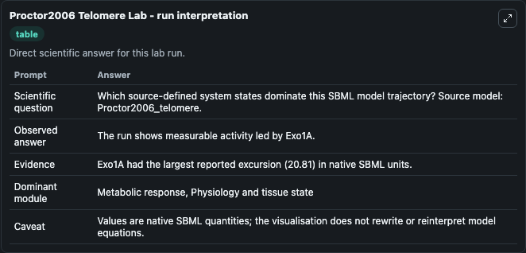
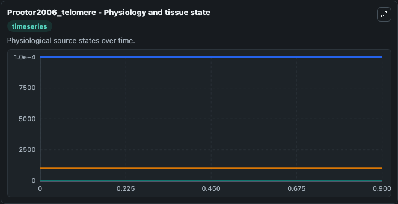
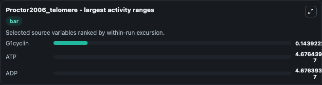
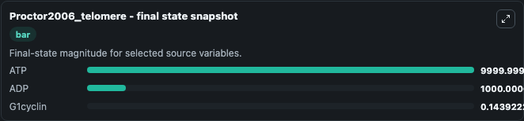
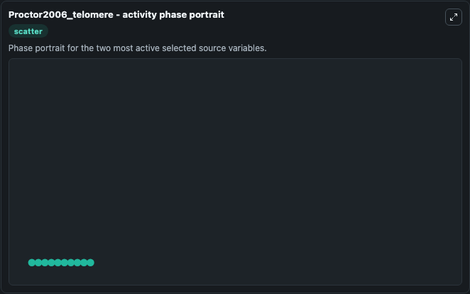

# Proctor2006 Telomere

This Biosimulant lab wraps `Proctor2006 Telomere` as a runnable systems biology model with a companion visualization module.
To the extent possible under law, all copyright and related or neighbouring rights to this encoded model have been dedicated to the public domain worldwide. It can be used to explore the configured dynamics and compare scenario outcomes across configurations.

## What You'll See

The lab asks: Which source-defined system states dominate this SBML model trajectory? Source model: Proctor2006_telomere. It runs for 1.0 time units with a communication step of 0.1. The run uses the model defaults declared by the curated SBML wrapper. The generated visualizations focus on ATP, ADP, Scyclin, Mcyclin, G2cyclin, and G1cyclin, combining trajectory, endpoint-comparison, and summary-table views from one completed dark-mode run.

In this captured run, **G1cyclin** moved from 0 to 0.1439 across 1.0 simulation windows.


### Output Visualizations



*Summary table for Proctor2006 Telomere, reporting the scientific question, observed answer, dominant module, and caveat.*



*Trajectories of G1cyclin, ATP, ADP, Scyclin, Mcyclin, and G2cyclin across the 1.0 simulation. In this run **G1cyclin** climbed from 0 to 0.1439 and **ATP** fell from 1e+04 to 10000.0 — the largest movements among the focused observables.*



*Largest-excursion ranking of the focused observables — the absolute movement magnitude during the run. Top 3: **G1cyclin** = 0.1439, **ATP** = 4.68e-07, **ADP** = 4.68e-07.*



*Endpoint snapshot of the focused observables — final values from the captured run. Top 3 by value: **ATP** = 10000.0, **ADP** = 1000.0, **G1cyclin** = 0.1439.*



*Visualization card from the Proctor2006 Telomere dark-mode run.*


## Model Context

- Core model: `models/core`
- Visualization model: `models/visualisation`
- Standard: `other`
- Upstream source: `biomodels_ebi:BIOMD0000000087`
- License: `CC0`

## Inputs

| Input | Maps To | Default | Notes |
|---|---|---|---|
| Initial Model State ATP | `systemsbiology_sbml_proctor2006_telomere_biomd0000000087_model.initial_model_state_atp` | | Source state initial condition exposed as a model-specific control because no explicit intervention parameter is identifiable. Maps to SBML symbol `ATP`. |
| Initial Model State ADP | `systemsbiology_sbml_proctor2006_telomere_biomd0000000087_model.initial_model_state_adp` | | Source state initial condition exposed as a model-specific control because no explicit intervention parameter is identifiable. Maps to SBML symbol `ADP`. |
| Initial Scyclin | `systemsbiology_sbml_proctor2006_telomere_biomd0000000087_model.initial_scyclin` | | Source state initial condition exposed as a model-specific control because no explicit intervention parameter is identifiable. Maps to SBML symbol `Scyclin`. |
| Initial Mcyclin | `systemsbiology_sbml_proctor2006_telomere_biomd0000000087_model.initial_mcyclin` | | Source state initial condition exposed as a model-specific control because no explicit intervention parameter is identifiable. Maps to SBML symbol `Mcyclin`. |
| Initial G2cyclin | `systemsbiology_sbml_proctor2006_telomere_biomd0000000087_model.initial_g2cyclin` | | Source state initial condition exposed as a model-specific control because no explicit intervention parameter is identifiable. Maps to SBML symbol `G2cyclin`. |
| Initial G1cyclin | `systemsbiology_sbml_proctor2006_telomere_biomd0000000087_model.initial_g1cyclin` | | Source state initial condition exposed as a model-specific control because no explicit intervention parameter is identifiable. Maps to SBML symbol `G1cyclin`. |

## Outputs

| Output | Maps To | Role |
|---|---|---|
| `state` | `systemsbiology_sbml_proctor2006_telomere_biomd0000000087_model.state` | Available to the visualization model and downstream workflows. |
| `summary` | `systemsbiology_sbml_proctor2006_telomere_biomd0000000087_model.summary` | Available to the visualization model and downstream workflows. |
| `species_labels` | `systemsbiology_sbml_proctor2006_telomere_biomd0000000087_model.species_labels` | Available to the visualization model and downstream workflows. |
| `atp` | `systemsbiology_sbml_proctor2006_telomere_biomd0000000087_model.atp` | Available to the visualization model and downstream workflows. |
| `adp` | `systemsbiology_sbml_proctor2006_telomere_biomd0000000087_model.adp` | Available to the visualization model and downstream workflows. |
| `scyclin` | `systemsbiology_sbml_proctor2006_telomere_biomd0000000087_model.scyclin` | Available to the visualization model and downstream workflows. |
| `mcyclin` | `systemsbiology_sbml_proctor2006_telomere_biomd0000000087_model.mcyclin` | Available to the visualization model and downstream workflows. |
| `g2cyclin` | `systemsbiology_sbml_proctor2006_telomere_biomd0000000087_model.g2cyclin` | Available to the visualization model and downstream workflows. |
| `g1cyclin` | `systemsbiology_sbml_proctor2006_telomere_biomd0000000087_model.g1cyclin` | Available to the visualization model and downstream workflows. |

## Runtime

- Duration: `1.0`
- Communication step: `0.1`

## Running Locally

```bash
biosimulant labs serve
```
