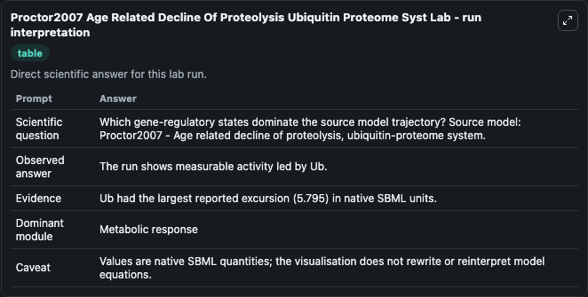
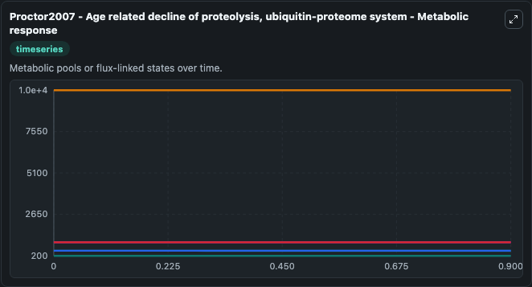
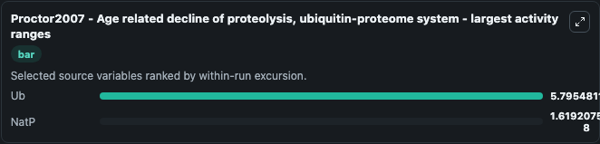
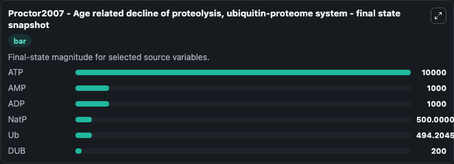
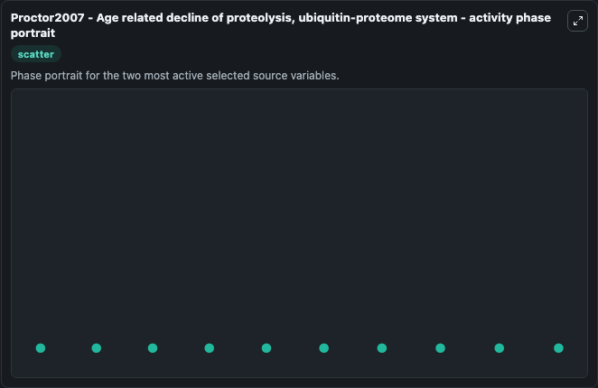

# Proctor2007 Age Related Decline Of Proteolysis Ubiquitin Proteome Syst

This Biosimulant lab wraps `Proctor2007 Age Related Decline Of Proteolysis Ubiquitin Proteome Syst` as a runnable systems biology model with a companion visualization module.
Proctor2007 - Age related decline of proteolysis, ubiquitin-proteome system This is a stochastic model of the ubiquitin-proteasome system for a generic pool of native proteins (NatP), which have a hal. It can be used to explore the configured dynamics and compare scenario outcomes across configurations.

## What You'll See

The lab asks: Which gene-regulatory states dominate the source model trajectory? Source model: Proctor2007 - Age related decline of proteolysis, ubiquitin-proteome system. It runs for 1.0 time units with a communication step of 0.1. The run uses the model defaults declared by the curated SBML wrapper. The generated visualizations focus on ATP, AMP, ADP, Ub, NatP, and DUB, combining trajectory, endpoint-comparison, and summary-table views from one completed dark-mode run.

In this captured run, **Ub** moved from 500.0 to 494.2 across 1.0 simulation windows.


### Output Visualizations



*Summary table for Proctor2007 Age Related Decline Of Proteolysis Ubiquitin Proteome Syst, reporting the scientific question, observed answer, dominant module, and caveat.*



*Trajectories of Ub, NatP, ATP, AMP, ADP, and DUB across the 1.0 simulation. In this run **NatP** climbed from 500.0 to 500.0 and **Ub** fell from 500.0 to 494.2 — the largest movements among the focused observables.*



*Largest-excursion ranking of the focused observables — the absolute movement magnitude during the run. Top 2: **Ub** = 5.795, **NatP** = 1.62e-08.*



*Endpoint snapshot of the focused observables — final values from the captured run. Top 3 by value: **ATP** = 1e+04, **AMP** = 1000.0, **ADP** = 1000.0, with 3 more observables below.*



*Visualization card from the Proctor2007 Age Related Decline Of Proteolysis Ubiquitin Proteome Syst dark-mode run.*


## Model Context

- Core model: `models/core`
- Visualization model: `models/visualisation`
- Standard: `other`
- Upstream source: `biomodels_ebi:BIOMD0000000105`
- License: `CC0`

## Inputs

| Input | Maps To | Default | Notes |
|---|---|---|---|
| Initial Model State ATP | `systemsbiology_sbml_proctor2007_age_related_decline_of_proteolysis_u_biomd0000000105_model.initial_model_state_atp` | | Source state initial condition exposed as a model-specific control because no explicit intervention parameter is identifiable. Maps to SBML symbol `ATP`. |
| Initial Model State AMP | `systemsbiology_sbml_proctor2007_age_related_decline_of_proteolysis_u_biomd0000000105_model.initial_model_state_amp` | | Source state initial condition exposed as a model-specific control because no explicit intervention parameter is identifiable. Maps to SBML symbol `AMP`. |
| Initial Model State ADP | `systemsbiology_sbml_proctor2007_age_related_decline_of_proteolysis_u_biomd0000000105_model.initial_model_state_adp` | | Source state initial condition exposed as a model-specific control because no explicit intervention parameter is identifiable. Maps to SBML symbol `ADP`. |
| Initial Model State Ub | `systemsbiology_sbml_proctor2007_age_related_decline_of_proteolysis_u_biomd0000000105_model.initial_model_state_ub` | | Source state initial condition exposed as a model-specific control because no explicit intervention parameter is identifiable. Maps to SBML symbol `Ub`. |
| Initial Nat P | `systemsbiology_sbml_proctor2007_age_related_decline_of_proteolysis_u_biomd0000000105_model.initial_nat_p` | | Source state initial condition exposed as a model-specific control because no explicit intervention parameter is identifiable. Maps to SBML symbol `NatP`. |
| Initial Model State Dub | `systemsbiology_sbml_proctor2007_age_related_decline_of_proteolysis_u_biomd0000000105_model.initial_model_state_dub` | | Source state initial condition exposed as a model-specific control because no explicit intervention parameter is identifiable. Maps to SBML symbol `DUB`. |

## Outputs

| Output | Maps To | Role |
|---|---|---|
| `state` | `systemsbiology_sbml_proctor2007_age_related_decline_of_proteolysis_u_biomd0000000105_model.state` | Available to the visualization model and downstream workflows. |
| `summary` | `systemsbiology_sbml_proctor2007_age_related_decline_of_proteolysis_u_biomd0000000105_model.summary` | Available to the visualization model and downstream workflows. |
| `species_labels` | `systemsbiology_sbml_proctor2007_age_related_decline_of_proteolysis_u_biomd0000000105_model.species_labels` | Available to the visualization model and downstream workflows. |
| `atp` | `systemsbiology_sbml_proctor2007_age_related_decline_of_proteolysis_u_biomd0000000105_model.atp` | Available to the visualization model and downstream workflows. |
| `amp` | `systemsbiology_sbml_proctor2007_age_related_decline_of_proteolysis_u_biomd0000000105_model.amp` | Available to the visualization model and downstream workflows. |
| `adp` | `systemsbiology_sbml_proctor2007_age_related_decline_of_proteolysis_u_biomd0000000105_model.adp` | Available to the visualization model and downstream workflows. |
| `model_state_ub` | `systemsbiology_sbml_proctor2007_age_related_decline_of_proteolysis_u_biomd0000000105_model.model_state_ub` | Available to the visualization model and downstream workflows. |
| `nat_p` | `systemsbiology_sbml_proctor2007_age_related_decline_of_proteolysis_u_biomd0000000105_model.nat_p` | Available to the visualization model and downstream workflows. |
| `dub` | `systemsbiology_sbml_proctor2007_age_related_decline_of_proteolysis_u_biomd0000000105_model.dub` | Available to the visualization model and downstream workflows. |

## Runtime

- Duration: `1.0`
- Communication step: `0.1`

## Running Locally

```bash
biosimulant labs serve
```
