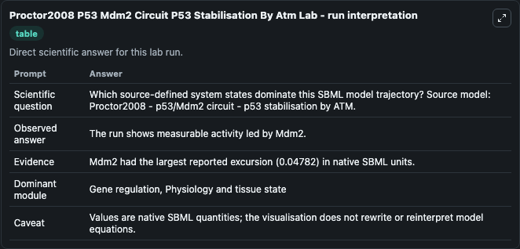
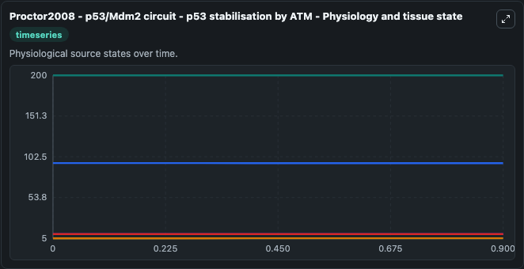
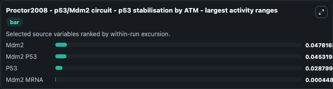
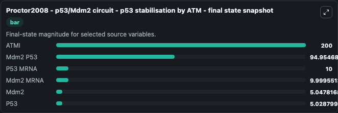
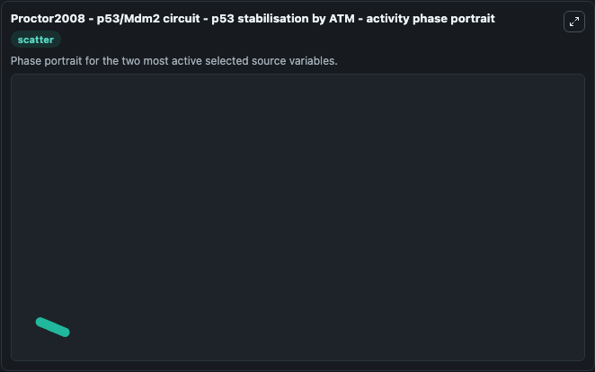

# Proctor2008 P53 Mdm2 Circuit P53 Stabilisation By Atm

This Biosimulant lab wraps `Proctor2008 P53 Mdm2 Circuit P53 Stabilisation By Atm` as a runnable systems biology model with a companion visualization module.
Proctor2008 - p53/Mdm2 circuit - p53 stabilisation by ATM This model is described in the article: Explaining oscillations and variability in the p53-Mdm2 system. It can be used to explore the configured dynamics and compare scenario outcomes across configurations.

## What You'll See

The lab asks: Which source-defined system states dominate this SBML model trajectory? Source model: Proctor2008 - p53/Mdm2 circuit - p53 stabilisation by ATM. It runs for 1.0 time units with a communication step of 0.1. The run uses the model defaults declared by the curated SBML wrapper. The generated visualizations focus on P53 MRNA, Mdm2 MRNA, ATMI, Mdm2 P53, P53, and Mdm2, combining trajectory, endpoint-comparison, and summary-table views from one completed dark-mode run.

In this captured run, **Mdm2** moved from 5.000 to 5.048 across 1.0 simulation windows.


### Output Visualizations



*Summary table for Proctor2008 P53 Mdm2 Circuit P53 Stabilisation By Atm, reporting the scientific question, observed answer, dominant module, and caveat.*



*Trajectories of Mdm2, Mdm2 P53, P53, Mdm2 MRNA, P53 MRNA, and ATMI across the 1.0 simulation. In this run **Mdm2** climbed from 5.000 to 5.048 and **Mdm2 P53** fell from 95.000 to 94.955 — the largest movements among the focused observables.*



*Largest-excursion ranking of the focused observables — the absolute movement magnitude during the run. Top 3: **Mdm2** = 0.0478, **Mdm2 P53** = 0.0453, **P53** = 0.0288, with 1 more observable below.*



*Endpoint snapshot of the focused observables — final values from the captured run. Top 3 by value: **ATMI** = 200.0, **Mdm2 P53** = 94.955, **P53 MRNA** = 10.000, with 3 more observables below.*



*Visualization card from the Proctor2008 P53 Mdm2 Circuit P53 Stabilisation By Atm dark-mode run.*


## Model Context

- Core model: `models/core`
- Visualization model: `models/visualisation`
- Standard: `other`
- Upstream source: `biomodels_ebi:BIOMD0000000188`
- License: `CC0`

## Inputs

| Input | Maps To | Default | Notes |
|---|---|---|---|
| Initial P53 MRNA | `systemsbiology_sbml_proctor2008_p53_mdm2_circuit_p53_stabilisation_b_biomd0000000188_model.initial_p53_mrna` | | Source state initial condition exposed as a model-specific control because no explicit intervention parameter is identifiable. Maps to SBML symbol `p53_mRNA`. |
| Initial Mdm2 MRNA | `systemsbiology_sbml_proctor2008_p53_mdm2_circuit_p53_stabilisation_b_biomd0000000188_model.initial_mdm2_mrna` | | Source state initial condition exposed as a model-specific control because no explicit intervention parameter is identifiable. Maps to SBML symbol `Mdm2_mRNA`. |
| Initial Atmi | `systemsbiology_sbml_proctor2008_p53_mdm2_circuit_p53_stabilisation_b_biomd0000000188_model.initial_atmi` | | Source state initial condition exposed as a model-specific control because no explicit intervention parameter is identifiable. Maps to SBML symbol `ATMI`. |
| Initial Mdm2 P53 | `systemsbiology_sbml_proctor2008_p53_mdm2_circuit_p53_stabilisation_b_biomd0000000188_model.initial_mdm2_p53` | | Source state initial condition exposed as a model-specific control because no explicit intervention parameter is identifiable. Maps to SBML symbol `Mdm2_p53`. |
| Initial Model State P53 | `systemsbiology_sbml_proctor2008_p53_mdm2_circuit_p53_stabilisation_b_biomd0000000188_model.initial_model_state_p53` | | Source state initial condition exposed as a model-specific control because no explicit intervention parameter is identifiable. Maps to SBML symbol `p53`. |
| Initial Mdm2 | `systemsbiology_sbml_proctor2008_p53_mdm2_circuit_p53_stabilisation_b_biomd0000000188_model.initial_mdm2` | | Source state initial condition exposed as a model-specific control because no explicit intervention parameter is identifiable. Maps to SBML symbol `Mdm2`. |

## Outputs

| Output | Maps To | Role |
|---|---|---|
| `state` | `systemsbiology_sbml_proctor2008_p53_mdm2_circuit_p53_stabilisation_b_biomd0000000188_model.state` | Available to the visualization model and downstream workflows. |
| `summary` | `systemsbiology_sbml_proctor2008_p53_mdm2_circuit_p53_stabilisation_b_biomd0000000188_model.summary` | Available to the visualization model and downstream workflows. |
| `species_labels` | `systemsbiology_sbml_proctor2008_p53_mdm2_circuit_p53_stabilisation_b_biomd0000000188_model.species_labels` | Available to the visualization model and downstream workflows. |
| `p53_mrna` | `systemsbiology_sbml_proctor2008_p53_mdm2_circuit_p53_stabilisation_b_biomd0000000188_model.p53_mrna` | Available to the visualization model and downstream workflows. |
| `mdm2_mrna` | `systemsbiology_sbml_proctor2008_p53_mdm2_circuit_p53_stabilisation_b_biomd0000000188_model.mdm2_mrna` | Available to the visualization model and downstream workflows. |
| `atmi` | `systemsbiology_sbml_proctor2008_p53_mdm2_circuit_p53_stabilisation_b_biomd0000000188_model.atmi` | Available to the visualization model and downstream workflows. |
| `mdm2_p53` | `systemsbiology_sbml_proctor2008_p53_mdm2_circuit_p53_stabilisation_b_biomd0000000188_model.mdm2_p53` | Available to the visualization model and downstream workflows. |
| `p53` | `systemsbiology_sbml_proctor2008_p53_mdm2_circuit_p53_stabilisation_b_biomd0000000188_model.p53` | Available to the visualization model and downstream workflows. |
| `mdm2` | `systemsbiology_sbml_proctor2008_p53_mdm2_circuit_p53_stabilisation_b_biomd0000000188_model.mdm2` | Available to the visualization model and downstream workflows. |

## Runtime

- Duration: `1.0`
- Communication step: `0.1`

## Running Locally

```bash
biosimulant labs serve
```
