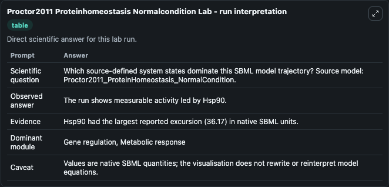
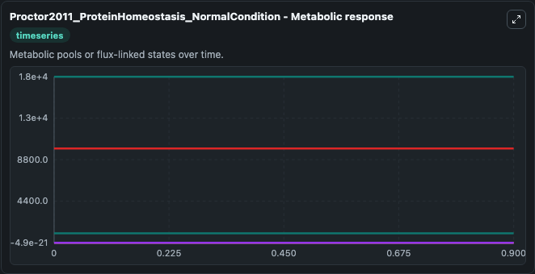
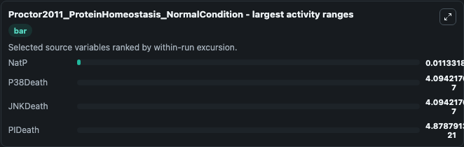
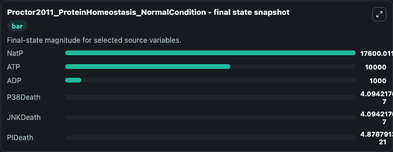
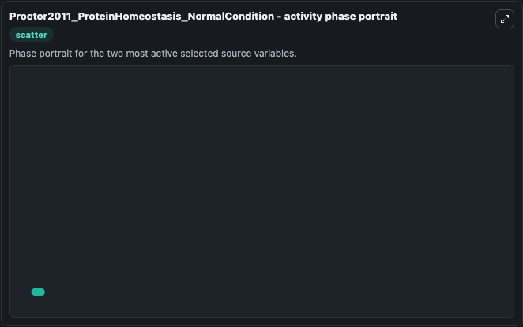

# Proctor2011 Proteinhomeostasis Normalcondition

This Biosimulant lab wraps `Proctor2011 Proteinhomeostasis Normalcondition` as a runnable systems biology model with a companion visualization module.
This model is from the article: Modelling the Role of the Hsp70/Hsp90 System in the Maintenance of Protein Homeostasis Proctor CJ, Lorimer IAJ PLoS ONE 2011; 6(7): e22038. It can be used to explore the configured dynamics and compare scenario outcomes across configurations.

## What You'll See

The lab asks: Which source-defined system states dominate this SBML model trajectory? Source model: Proctor2011_ProteinHomeostasis_NormalCondition. It runs for 1.0 time units with a communication step of 0.1. The run uses the model defaults declared by the curated SBML wrapper. The generated visualizations focus on NatP, ATP, ADP, PIDeath, P38Death, and JNKDeath, combining trajectory, endpoint-comparison, and summary-table views from one completed dark-mode run.

In this captured run, **NatP** moved from 1.76e+04 to 1.76e+04 across 1.0 simulation windows.


### Output Visualizations



*Summary table for Proctor2011 Proteinhomeostasis Normalcondition, reporting the scientific question, observed answer, dominant module, and caveat.*



*Trajectories of NatP, P38Death, JNKDeath, PIDeath, ATP, and ADP across the 1.0 simulation. In this run **NatP** climbed from 1.76e+04 to 1.76e+04 and **PIDeath** fell from 0 to -4.88e-21 — the largest movements among the focused observables.*



*Largest-excursion ranking of the focused observables — the absolute movement magnitude during the run. Top 3: **NatP** = 0.0113, **P38Death** = 4.09e-07, **JNKDeath** = 4.09e-07, with 1 more observable below.*



*Endpoint snapshot of the focused observables — final values from the captured run. Top 3 by value: **NatP** = 1.76e+04, **ATP** = 1e+04, **ADP** = 1000.0, with 3 more observables below.*



*Visualization card from the Proctor2011 Proteinhomeostasis Normalcondition dark-mode run.*


## Model Context

- Core model: `models/core`
- Visualization model: `models/visualisation`
- Standard: `other`
- Upstream source: `biomodels_ebi:BIOMD0000000344`
- License: `CC0`

## Inputs

| Input | Maps To | Default | Notes |
|---|---|---|---|
| Initial Nat P | `systemsbiology_sbml_proctor2011_proteinhomeostasis_normalcondition_biomd0000000344_model.initial_nat_p` | | Source state initial condition exposed as a model-specific control because no explicit intervention parameter is identifiable. Maps to SBML symbol `NatP`. |
| Initial Model State ATP | `systemsbiology_sbml_proctor2011_proteinhomeostasis_normalcondition_biomd0000000344_model.initial_model_state_atp` | | Source state initial condition exposed as a model-specific control because no explicit intervention parameter is identifiable. Maps to SBML symbol `ATP`. |
| Initial Model State ADP | `systemsbiology_sbml_proctor2011_proteinhomeostasis_normalcondition_biomd0000000344_model.initial_model_state_adp` | | Source state initial condition exposed as a model-specific control because no explicit intervention parameter is identifiable. Maps to SBML symbol `ADP`. |
| Initial Pi Death | `systemsbiology_sbml_proctor2011_proteinhomeostasis_normalcondition_biomd0000000344_model.initial_pi_death` | | Source state initial condition exposed as a model-specific control because no explicit intervention parameter is identifiable. Maps to SBML symbol `PIDeath`. |
| Initial P38 Death | `systemsbiology_sbml_proctor2011_proteinhomeostasis_normalcondition_biomd0000000344_model.initial_p38_death` | | Source state initial condition exposed as a model-specific control because no explicit intervention parameter is identifiable. Maps to SBML symbol `p38Death`. |
| Initial Jnk Death | `systemsbiology_sbml_proctor2011_proteinhomeostasis_normalcondition_biomd0000000344_model.initial_jnk_death` | | Source state initial condition exposed as a model-specific control because no explicit intervention parameter is identifiable. Maps to SBML symbol `JNKDeath`. |

## Outputs

| Output | Maps To | Role |
|---|---|---|
| `state` | `systemsbiology_sbml_proctor2011_proteinhomeostasis_normalcondition_biomd0000000344_model.state` | Available to the visualization model and downstream workflows. |
| `summary` | `systemsbiology_sbml_proctor2011_proteinhomeostasis_normalcondition_biomd0000000344_model.summary` | Available to the visualization model and downstream workflows. |
| `species_labels` | `systemsbiology_sbml_proctor2011_proteinhomeostasis_normalcondition_biomd0000000344_model.species_labels` | Available to the visualization model and downstream workflows. |
| `nat_p` | `systemsbiology_sbml_proctor2011_proteinhomeostasis_normalcondition_biomd0000000344_model.nat_p` | Available to the visualization model and downstream workflows. |
| `atp` | `systemsbiology_sbml_proctor2011_proteinhomeostasis_normalcondition_biomd0000000344_model.atp` | Available to the visualization model and downstream workflows. |
| `adp` | `systemsbiology_sbml_proctor2011_proteinhomeostasis_normalcondition_biomd0000000344_model.adp` | Available to the visualization model and downstream workflows. |
| `pi_death` | `systemsbiology_sbml_proctor2011_proteinhomeostasis_normalcondition_biomd0000000344_model.pi_death` | Available to the visualization model and downstream workflows. |
| `p38_death` | `systemsbiology_sbml_proctor2011_proteinhomeostasis_normalcondition_biomd0000000344_model.p38_death` | Available to the visualization model and downstream workflows. |
| `jnk_death` | `systemsbiology_sbml_proctor2011_proteinhomeostasis_normalcondition_biomd0000000344_model.jnk_death` | Available to the visualization model and downstream workflows. |

## Runtime

- Duration: `1.0`
- Communication step: `0.1`

## Running Locally

```bash
biosimulant labs serve
```
