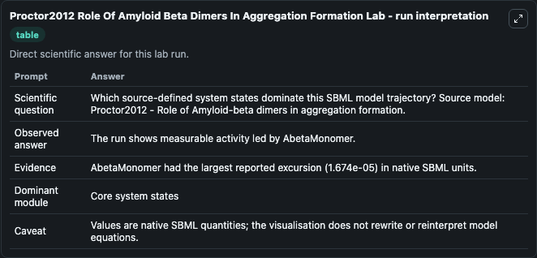
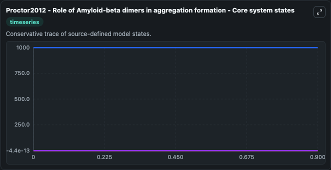
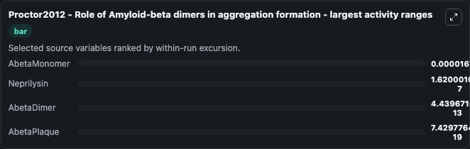
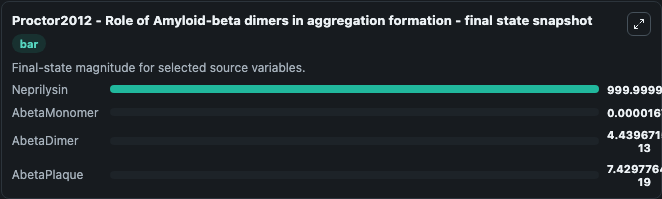
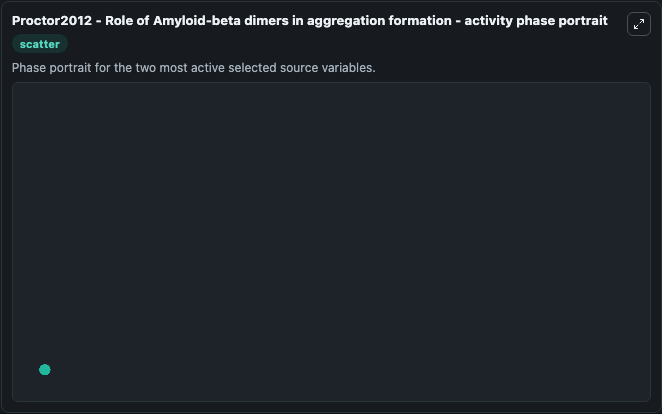

# Proctor2012 Role Of Amyloid Beta Dimers In Aggregation Formation

This Biosimulant lab wraps `Proctor2012 Role Of Amyloid Beta Dimers In Aggregation Formation` as a runnable systems biology model with a companion visualization module.
Proctor2012 - Amyloid-beta aggregation This model supports the current thinking that levels of dimers are important in initiating the aggregation process. It can be used to explore the configured dynamics and compare scenario outcomes across configurations.

## What You'll See

The lab asks: Which source-defined system states dominate this SBML model trajectory? Source model: Proctor2012 - Role of Amyloid-beta dimers in aggregation formation. It runs for 1.0 time units with a communication step of 0.1. The run uses the model defaults declared by the curated SBML wrapper. The generated visualizations focus on Neprilysin, AbetaPlaque, AbetaMonomer, and AbetaDimer, combining trajectory, endpoint-comparison, and summary-table views from one completed dark-mode run.

In this captured run, **AbetaMonomer** moved from 0 to 1.67e-05 across 1.0 simulation windows.


### Output Visualizations



*Summary table for Proctor2012 Role Of Amyloid Beta Dimers In Aggregation Formation, reporting the scientific question, observed answer, dominant module, and caveat.*



*Trajectories of AbetaMonomer, Neprilysin, AbetaDimer, and AbetaPlaque across the 1.0 simulation. In this run **AbetaMonomer** climbed from 0 to 1.67e-05 and **Neprilysin** fell from 1000.0 to 1000.0 — the largest movements among the focused observables.*



*Largest-excursion ranking of the focused observables — the absolute movement magnitude during the run. Top 3: **AbetaMonomer** = 1.67e-05, **Neprilysin** = 1.62e-07, **AbetaDimer** = 4.44e-13, with 1 more observable below.*



*Trajectories of AbetaMonomer, Neprilysin, AbetaDimer, and AbetaPlaque across the 1.0 simulation. In this run **AbetaMonomer** climbed from 0 to 1.67e-05 and **Neprilysin** fell from 1000.0 to 1000.0 — the largest movements among the focused observables.*



*Visualization card from the Proctor2012 Role Of Amyloid Beta Dimers In Aggregation Formation dark-mode run.*


## Model Context

- Core model: `models/core`
- Visualization model: `models/visualisation`
- Standard: `other`
- Upstream source: `biomodels_ebi:BIOMD0000000462`
- License: `CC0`

## Inputs

| Input | Maps To | Default | Notes |
|---|---|---|---|
| Initial Neprilysin | `systemsbiology_sbml_proctor2012_role_of_amyloid_beta_dimers_in_aggre_biomd0000000462_model.initial_neprilysin` | | Source state initial condition exposed as a model-specific control because no explicit intervention parameter is identifiable. Maps to SBML symbol `Nep`. |
| Initial Abeta Plaque | `systemsbiology_sbml_proctor2012_role_of_amyloid_beta_dimers_in_aggre_biomd0000000462_model.initial_abeta_plaque` | | Source state initial condition exposed as a model-specific control because no explicit intervention parameter is identifiable. Maps to SBML symbol `AbP`. |
| Initial Abeta Monomer | `systemsbiology_sbml_proctor2012_role_of_amyloid_beta_dimers_in_aggre_biomd0000000462_model.initial_abeta_monomer` | | Source state initial condition exposed as a model-specific control because no explicit intervention parameter is identifiable. Maps to SBML symbol `Abeta`. |
| Initial Abeta Dimer | `systemsbiology_sbml_proctor2012_role_of_amyloid_beta_dimers_in_aggre_biomd0000000462_model.initial_abeta_dimer` | | Source state initial condition exposed as a model-specific control because no explicit intervention parameter is identifiable. Maps to SBML symbol `AbDim`. |

## Outputs

| Output | Maps To | Role |
|---|---|---|
| `state` | `systemsbiology_sbml_proctor2012_role_of_amyloid_beta_dimers_in_aggre_biomd0000000462_model.state` | Available to the visualization model and downstream workflows. |
| `summary` | `systemsbiology_sbml_proctor2012_role_of_amyloid_beta_dimers_in_aggre_biomd0000000462_model.summary` | Available to the visualization model and downstream workflows. |
| `species_labels` | `systemsbiology_sbml_proctor2012_role_of_amyloid_beta_dimers_in_aggre_biomd0000000462_model.species_labels` | Available to the visualization model and downstream workflows. |
| `neprilysin` | `systemsbiology_sbml_proctor2012_role_of_amyloid_beta_dimers_in_aggre_biomd0000000462_model.neprilysin` | Available to the visualization model and downstream workflows. |
| `abeta_plaque` | `systemsbiology_sbml_proctor2012_role_of_amyloid_beta_dimers_in_aggre_biomd0000000462_model.abeta_plaque` | Available to the visualization model and downstream workflows. |
| `abeta_monomer` | `systemsbiology_sbml_proctor2012_role_of_amyloid_beta_dimers_in_aggre_biomd0000000462_model.abeta_monomer` | Available to the visualization model and downstream workflows. |
| `abeta_dimer` | `systemsbiology_sbml_proctor2012_role_of_amyloid_beta_dimers_in_aggre_biomd0000000462_model.abeta_dimer` | Available to the visualization model and downstream workflows. |

## Runtime

- Duration: `1.0`
- Communication step: `0.1`

## Running Locally

```bash
biosimulant labs serve
```
