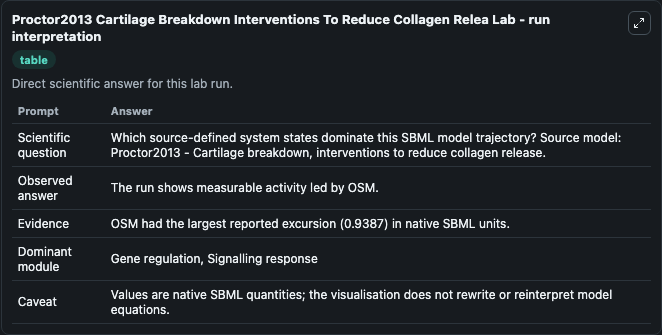
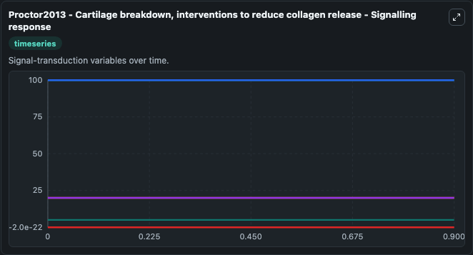
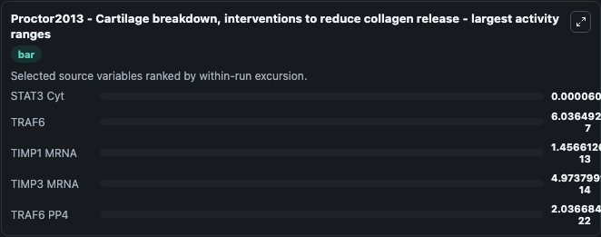
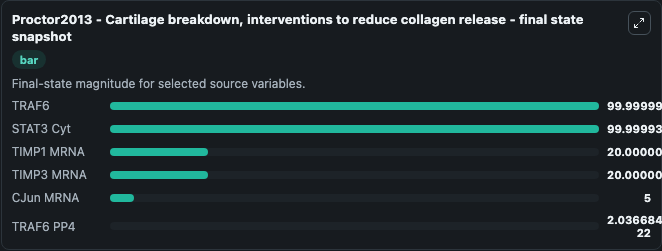
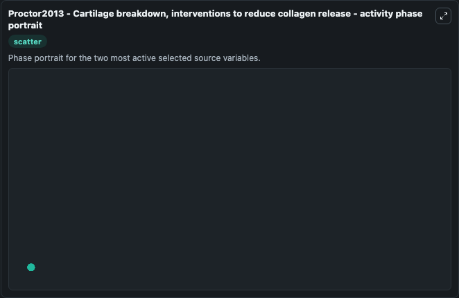

# Proctor2013 Cartilage Breakdown Interventions To Reduce Collagen Relea

This Biosimulant lab wraps `Proctor2013 Cartilage Breakdown Interventions To Reduce Collagen Relea` as a runnable systems biology model with a companion visualization module.
Proctor2013 - Cartilage breakdown, interventions to reduce collagen release The molecular pathways involved in cartilage breakdown is studied using this model to examine possible interventions to redu. It can be used to explore the configured dynamics and compare scenario outcomes across configurations.

## What You'll See

The lab asks: Which source-defined system states dominate this SBML model trajectory? Source model: Proctor2013 - Cartilage breakdown, interventions to reduce collagen release. It runs for 1.0 time units with a communication step of 0.1. The run uses the model defaults declared by the curated SBML wrapper. The generated visualizations focus on TRAF6, STAT3 Cyt, TIMP3 MRNA, TIMP1 MRNA, CJun MRNA, and TRAF6 PP4, combining trajectory, endpoint-comparison, and summary-table views from one completed dark-mode run.

In this captured run, **STAT3 Cyt** moved from 100.0 to 100.000 across 1.0 simulation windows.


### Output Visualizations



*Summary table for Proctor2013 Cartilage Breakdown Interventions To Reduce Collagen Relea, reporting the scientific question, observed answer, dominant module, and caveat.*



*Trajectories of STAT3 Cyt, TRAF6, TIMP1 MRNA, TIMP3 MRNA, TRAF6 PP4, and CJun MRNA across the 1.0 simulation. In this run **TIMP1 MRNA** climbed from 20.000 to 20.000 and **STAT3 Cyt** fell from 100.0 to 100.000 — the largest movements among the focused observables.*



*Largest-excursion ranking of the focused observables — the absolute movement magnitude during the run. Top 3: **STAT3 Cyt** = 6.06e-05, **TRAF6** = 6.04e-07, **TIMP1 MRNA** = 1.46e-13, with 2 more observables below.*



*Endpoint snapshot of the focused observables — final values from the captured run. Top 3 by value: **TRAF6** = 100.000, **STAT3 Cyt** = 100.000, **TIMP1 MRNA** = 20.000, with 3 more observables below.*



*Visualization card from the Proctor2013 Cartilage Breakdown Interventions To Reduce Collagen Relea dark-mode run.*


## Model Context

- Core model: `models/core`
- Visualization model: `models/visualisation`
- Standard: `other`
- Upstream source: `biomodels_ebi:BIOMD0000000504`
- License: `CC0`

## Inputs

| Input | Maps To | Default | Notes |
|---|---|---|---|
| Initial Traf6 | `systemsbiology_sbml_proctor2013_cartilage_breakdown_interventions_to_biomd0000000504_model.initial_traf6` | | Source state initial condition exposed as a model-specific control because no explicit intervention parameter is identifiable. Maps to SBML symbol `TRAF6`. |
| Initial Stat3 Cyt | `systemsbiology_sbml_proctor2013_cartilage_breakdown_interventions_to_biomd0000000504_model.initial_stat3_cyt` | | Source state initial condition exposed as a model-specific control because no explicit intervention parameter is identifiable. Maps to SBML symbol `STAT3_cyt`. |
| Initial Timp3 MRNA | `systemsbiology_sbml_proctor2013_cartilage_breakdown_interventions_to_biomd0000000504_model.initial_timp3_mrna` | | Source state initial condition exposed as a model-specific control because no explicit intervention parameter is identifiable. Maps to SBML symbol `TIMP3_mRNA`. |
| Initial Timp1 MRNA | `systemsbiology_sbml_proctor2013_cartilage_breakdown_interventions_to_biomd0000000504_model.initial_timp1_mrna` | | Source state initial condition exposed as a model-specific control because no explicit intervention parameter is identifiable. Maps to SBML symbol `TIMP1_mRNA`. |
| Initial C Jun MRNA | `systemsbiology_sbml_proctor2013_cartilage_breakdown_interventions_to_biomd0000000504_model.initial_c_jun_mrna` | | Source state initial condition exposed as a model-specific control because no explicit intervention parameter is identifiable. Maps to SBML symbol `cJun_mRNA`. |
| Initial Traf6 PP4 | `systemsbiology_sbml_proctor2013_cartilage_breakdown_interventions_to_biomd0000000504_model.initial_traf6_pp4` | | Source state initial condition exposed as a model-specific control because no explicit intervention parameter is identifiable. Maps to SBML symbol `TRAF6_PP4`. |

## Outputs

| Output | Maps To | Role |
|---|---|---|
| `state` | `systemsbiology_sbml_proctor2013_cartilage_breakdown_interventions_to_biomd0000000504_model.state` | Available to the visualization model and downstream workflows. |
| `summary` | `systemsbiology_sbml_proctor2013_cartilage_breakdown_interventions_to_biomd0000000504_model.summary` | Available to the visualization model and downstream workflows. |
| `species_labels` | `systemsbiology_sbml_proctor2013_cartilage_breakdown_interventions_to_biomd0000000504_model.species_labels` | Available to the visualization model and downstream workflows. |
| `traf6` | `systemsbiology_sbml_proctor2013_cartilage_breakdown_interventions_to_biomd0000000504_model.traf6` | Available to the visualization model and downstream workflows. |
| `stat3_cyt` | `systemsbiology_sbml_proctor2013_cartilage_breakdown_interventions_to_biomd0000000504_model.stat3_cyt` | Available to the visualization model and downstream workflows. |
| `timp3_mrna` | `systemsbiology_sbml_proctor2013_cartilage_breakdown_interventions_to_biomd0000000504_model.timp3_mrna` | Available to the visualization model and downstream workflows. |
| `timp1_mrna` | `systemsbiology_sbml_proctor2013_cartilage_breakdown_interventions_to_biomd0000000504_model.timp1_mrna` | Available to the visualization model and downstream workflows. |
| `c_jun_mrna` | `systemsbiology_sbml_proctor2013_cartilage_breakdown_interventions_to_biomd0000000504_model.c_jun_mrna` | Available to the visualization model and downstream workflows. |
| `traf6_pp4` | `systemsbiology_sbml_proctor2013_cartilage_breakdown_interventions_to_biomd0000000504_model.traf6_pp4` | Available to the visualization model and downstream workflows. |

## Runtime

- Duration: `1.0`
- Communication step: `0.1`

## Running Locally

```bash
biosimulant labs serve
```
