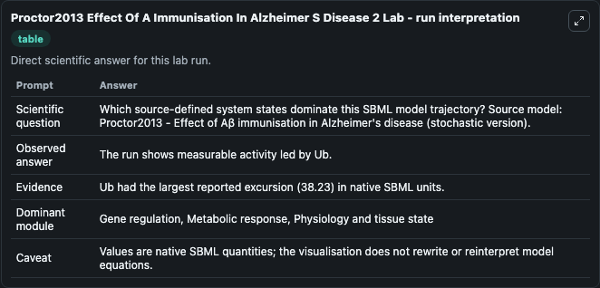
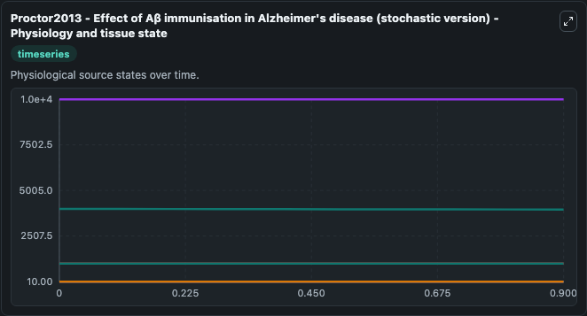
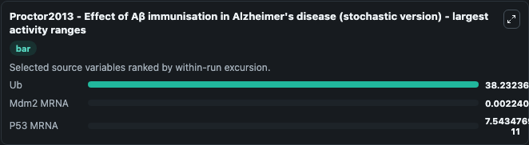
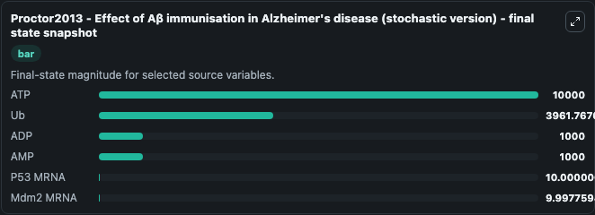
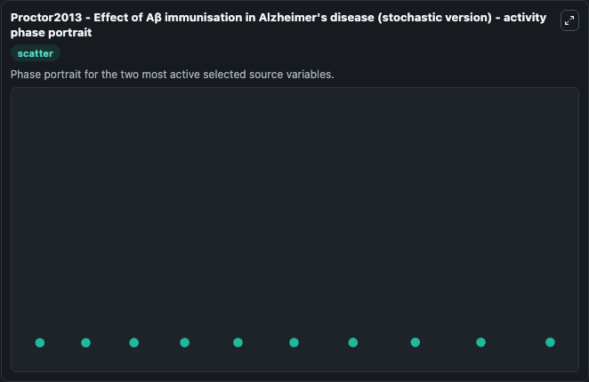

# Proctor2013 Effect Of A Immunisation In Alzheimer S Disease 2

This Biosimulant lab wraps `Proctor2013 Effect Of A Immunisation In Alzheimer S Disease 2` as a runnable systems biology model with a companion visualization module.
Proctor2013 - Effect of Aβ immunisationin Alzheimer's disease (stochastic version) Extension of a previously publishedstochastic model (designed to examine some of the key pathwaysinvolved in the aggr. It can be used to explore the configured dynamics and compare scenario outcomes across configurations.

## What You'll See

The lab asks: Which source-defined system states dominate this SBML model trajectory? Source model: Proctor2013 - Effect of Aβ immunisation in Alzheimer's disease (stochastic version). It runs for 1.0 time units with a communication step of 0.1. The run uses the model defaults declared by the curated SBML wrapper. The generated visualizations focus on ATP, ADP, P53 MRNA, Mdm2 MRNA, Ub, and AMP, combining trajectory, endpoint-comparison, and summary-table views from one completed dark-mode run.

In this captured run, **Ub** moved from 4000.0 to 3961.8 across 1.0 simulation windows.


### Output Visualizations



*Summary table for Proctor2013 Effect Of A Immunisation In Alzheimer S Disease 2, reporting the scientific question, observed answer, dominant module, and caveat.*



*Trajectories of Ub, Mdm2 MRNA, P53 MRNA, ATP, ADP, and AMP across the 1.0 simulation. In this run **P53 MRNA** climbed from 10.000 to 10.000 and **Ub** fell from 4000.0 to 3961.8 — the largest movements among the focused observables.*



*Largest-excursion ranking of the focused observables — the absolute movement magnitude during the run. Top 3: **Ub** = 38.232, **Mdm2 MRNA** = 0.00224, **P53 MRNA** = 7.54e-11.*



*Endpoint snapshot of the focused observables — final values from the captured run. Top 3 by value: **ATP** = 1e+04, **Ub** = 3961.8, **ADP** = 1000.0, with 3 more observables below.*



*Visualization card from the Proctor2013 Effect Of A Immunisation In Alzheimer S Disease 2 dark-mode run.*


## Model Context

- Core model: `models/core`
- Visualization model: `models/visualisation`
- Standard: `other`
- Upstream source: `biomodels_ebi:BIOMD0000000634`
- License: `CC0`

## Inputs

| Input | Maps To | Default | Notes |
|---|---|---|---|
| Initial Model State ATP | `systemsbiology_sbml_proctor2013_effect_of_a_immunisation_in_alzheime_biomd0000000634_model.initial_model_state_atp` | | Source state initial condition exposed as a model-specific control because no explicit intervention parameter is identifiable. Maps to SBML symbol `ATP`. |
| Initial Model State ADP | `systemsbiology_sbml_proctor2013_effect_of_a_immunisation_in_alzheime_biomd0000000634_model.initial_model_state_adp` | | Source state initial condition exposed as a model-specific control because no explicit intervention parameter is identifiable. Maps to SBML symbol `ADP`. |
| Initial P53 MRNA | `systemsbiology_sbml_proctor2013_effect_of_a_immunisation_in_alzheime_biomd0000000634_model.initial_p53_mrna` | | Source state initial condition exposed as a model-specific control because no explicit intervention parameter is identifiable. Maps to SBML symbol `p53_mRNA`. |
| Initial Mdm2 MRNA | `systemsbiology_sbml_proctor2013_effect_of_a_immunisation_in_alzheime_biomd0000000634_model.initial_mdm2_mrna` | | Source state initial condition exposed as a model-specific control because no explicit intervention parameter is identifiable. Maps to SBML symbol `Mdm2_mRNA`. |
| Initial Model State Ub | `systemsbiology_sbml_proctor2013_effect_of_a_immunisation_in_alzheime_biomd0000000634_model.initial_model_state_ub` | | Source state initial condition exposed as a model-specific control because no explicit intervention parameter is identifiable. Maps to SBML symbol `Ub`. |
| Initial Model State AMP | `systemsbiology_sbml_proctor2013_effect_of_a_immunisation_in_alzheime_biomd0000000634_model.initial_model_state_amp` | | Source state initial condition exposed as a model-specific control because no explicit intervention parameter is identifiable. Maps to SBML symbol `AMP`. |

## Outputs

| Output | Maps To | Role |
|---|---|---|
| `state` | `systemsbiology_sbml_proctor2013_effect_of_a_immunisation_in_alzheime_biomd0000000634_model.state` | Available to the visualization model and downstream workflows. |
| `summary` | `systemsbiology_sbml_proctor2013_effect_of_a_immunisation_in_alzheime_biomd0000000634_model.summary` | Available to the visualization model and downstream workflows. |
| `species_labels` | `systemsbiology_sbml_proctor2013_effect_of_a_immunisation_in_alzheime_biomd0000000634_model.species_labels` | Available to the visualization model and downstream workflows. |
| `atp` | `systemsbiology_sbml_proctor2013_effect_of_a_immunisation_in_alzheime_biomd0000000634_model.atp` | Available to the visualization model and downstream workflows. |
| `adp` | `systemsbiology_sbml_proctor2013_effect_of_a_immunisation_in_alzheime_biomd0000000634_model.adp` | Available to the visualization model and downstream workflows. |
| `p53_mrna` | `systemsbiology_sbml_proctor2013_effect_of_a_immunisation_in_alzheime_biomd0000000634_model.p53_mrna` | Available to the visualization model and downstream workflows. |
| `mdm2_mrna` | `systemsbiology_sbml_proctor2013_effect_of_a_immunisation_in_alzheime_biomd0000000634_model.mdm2_mrna` | Available to the visualization model and downstream workflows. |
| `model_state_ub` | `systemsbiology_sbml_proctor2013_effect_of_a_immunisation_in_alzheime_biomd0000000634_model.model_state_ub` | Available to the visualization model and downstream workflows. |
| `amp` | `systemsbiology_sbml_proctor2013_effect_of_a_immunisation_in_alzheime_biomd0000000634_model.amp` | Available to the visualization model and downstream workflows. |

## Runtime

- Duration: `1.0`
- Communication step: `0.1`

## Running Locally

```bash
biosimulant labs serve
```
