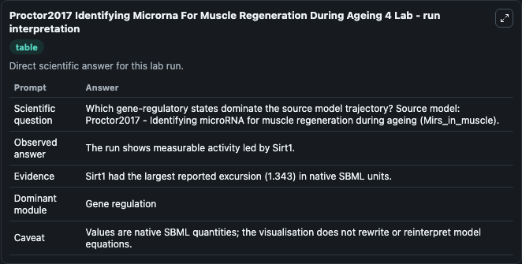
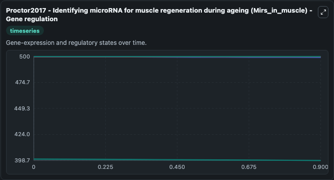
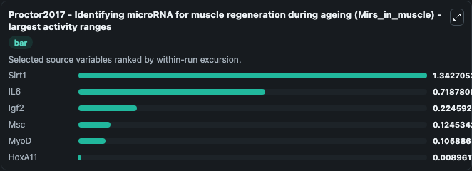
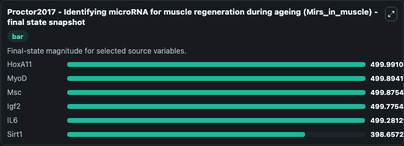
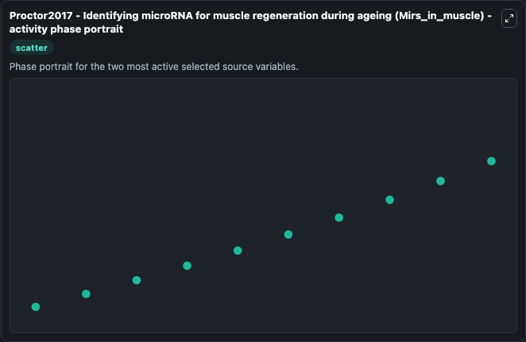

# Proctor2017 Identifying Microrna For Muscle Regeneration During Ageing 4 (MODEL1704110004)

This Biosimulant lab wraps `MODEL1704110004 Proctor2017 Identifying Microrna For Muscle Regeneration During Ageing 4` as a runnable systems biology model with a companion visualization module.
Proctor2017 - Identifying microRNA for muscleregeneration during ageing (Mirs_in_muscle) This model is described in the article: Using computer simulation models to investigate the most promising micr. It can be used to explore the configured dynamics and compare scenario outcomes across configurations.

## What You'll See

The lab asks: Which gene-regulatory states dominate the source model trajectory? Source model: Proctor2017 - Identifying microRNA for muscle regeneration during ageing (Mirs_in_muscle). It runs for 1.0 time units with a communication step of 0.1. The run uses the model defaults declared by the curated SBML wrapper. The generated visualizations focus on MyoD, Msc, Igf2, IL6, HoxA11, and Sirt1, combining trajectory, endpoint-comparison, and summary-table views from one completed dark-mode run.

In this captured run, **Sirt1** moved from 400.0 to 398.7 across 1.0 simulation windows.


### Output Visualizations



*Summary table for Proctor2017 Identifying Microrna For Muscle Regeneration During Ageing 4, reporting the scientific question, observed answer, dominant module, and caveat.*



*Trajectories of Sirt1, IL6, Igf2, Msc, MyoD, and HoxA11 across the 1.0 simulation. In this run **Sirt1** fell from 400.0 to 398.7 — the largest movements among the focused observables.*



*Largest-excursion ranking of the focused observables — the absolute movement magnitude during the run. Top 3: **Sirt1** = 1.343, **IL6** = 0.7188, **Igf2** = 0.2246, with 3 more observables below.*



*Endpoint snapshot of the focused observables — final values from the captured run. Top 3 by value: **HoxA11** = 500.0, **MyoD** = 499.9, **Msc** = 499.9, with 3 more observables below.*



*Visualization card from the Proctor2017 Identifying Microrna For Muscle Regeneration During Ageing 4 dark-mode run.*


## Model Context

- Core model: `models/core`
- Visualization model: `models/visualisation`
- Standard: `other`
- Upstream source: `biomodels_ebi:MODEL1704110004`
- License: `CC0`

## Inputs

| Input | Maps To | Default | Notes |
|---|---|---|---|
| Initial Myo D | `systemsbiology_sbml_proctor2017_identifying_microrna_for_muscle_rege_model1704110004_model.initial_myo_d` | | Source state initial condition exposed as a model-specific control because no explicit intervention parameter is identifiable. Maps to SBML symbol `MyoD`. |
| Initial Model State Msc | `systemsbiology_sbml_proctor2017_identifying_microrna_for_muscle_rege_model1704110004_model.initial_model_state_msc` | | Source state initial condition exposed as a model-specific control because no explicit intervention parameter is identifiable. Maps to SBML symbol `Msc`. |
| Initial Igf2 | `systemsbiology_sbml_proctor2017_identifying_microrna_for_muscle_rege_model1704110004_model.initial_igf2` | | Source state initial condition exposed as a model-specific control because no explicit intervention parameter is identifiable. Maps to SBML symbol `Igf2`. |
| Initial Model State IL6 | `systemsbiology_sbml_proctor2017_identifying_microrna_for_muscle_rege_model1704110004_model.initial_model_state_il6` | | Source state initial condition exposed as a model-specific control because no explicit intervention parameter is identifiable. Maps to SBML symbol `IL6`. |
| Initial Hox A11 | `systemsbiology_sbml_proctor2017_identifying_microrna_for_muscle_rege_model1704110004_model.initial_hox_a11` | | Source state initial condition exposed as a model-specific control because no explicit intervention parameter is identifiable. Maps to SBML symbol `HoxA11`. |
| Initial Sirt1 | `systemsbiology_sbml_proctor2017_identifying_microrna_for_muscle_rege_model1704110004_model.initial_sirt1` | | Source state initial condition exposed as a model-specific control because no explicit intervention parameter is identifiable. Maps to SBML symbol `Sirt1`. |

## Outputs

| Output | Maps To | Role |
|---|---|---|
| `state` | `systemsbiology_sbml_proctor2017_identifying_microrna_for_muscle_rege_model1704110004_model.state` | Available to the visualization model and downstream workflows. |
| `summary` | `systemsbiology_sbml_proctor2017_identifying_microrna_for_muscle_rege_model1704110004_model.summary` | Available to the visualization model and downstream workflows. |
| `species_labels` | `systemsbiology_sbml_proctor2017_identifying_microrna_for_muscle_rege_model1704110004_model.species_labels` | Available to the visualization model and downstream workflows. |
| `myo_d` | `systemsbiology_sbml_proctor2017_identifying_microrna_for_muscle_rege_model1704110004_model.myo_d` | Available to the visualization model and downstream workflows. |
| `msc` | `systemsbiology_sbml_proctor2017_identifying_microrna_for_muscle_rege_model1704110004_model.msc` | Available to the visualization model and downstream workflows. |
| `igf2` | `systemsbiology_sbml_proctor2017_identifying_microrna_for_muscle_rege_model1704110004_model.igf2` | Available to the visualization model and downstream workflows. |
| `il6` | `systemsbiology_sbml_proctor2017_identifying_microrna_for_muscle_rege_model1704110004_model.il6` | Available to the visualization model and downstream workflows. |
| `hox_a11` | `systemsbiology_sbml_proctor2017_identifying_microrna_for_muscle_rege_model1704110004_model.hox_a11` | Available to the visualization model and downstream workflows. |
| `sirt1` | `systemsbiology_sbml_proctor2017_identifying_microrna_for_muscle_rege_model1704110004_model.sirt1` | Available to the visualization model and downstream workflows. |

## Runtime

- Duration: `1.0`
- Communication step: `0.1`

## Running Locally

```bash
biosimulant labs serve
```
