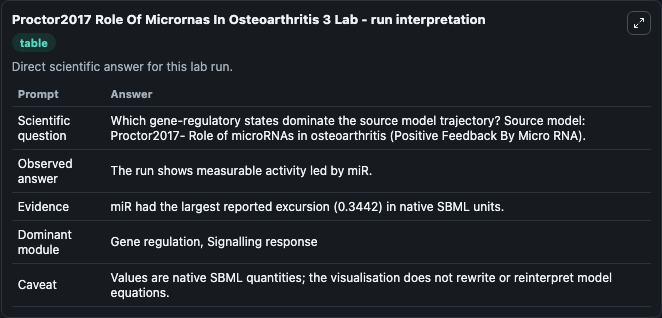
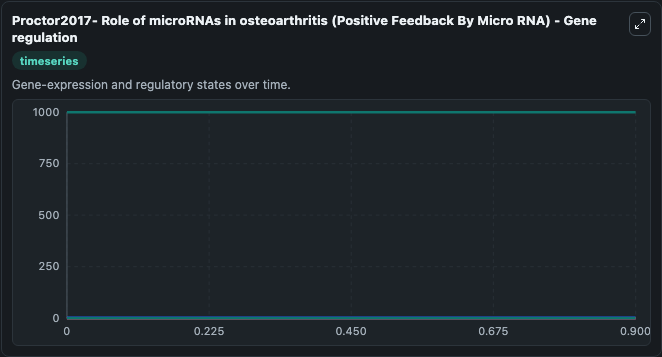
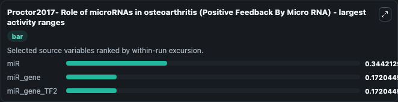
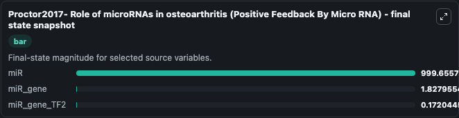
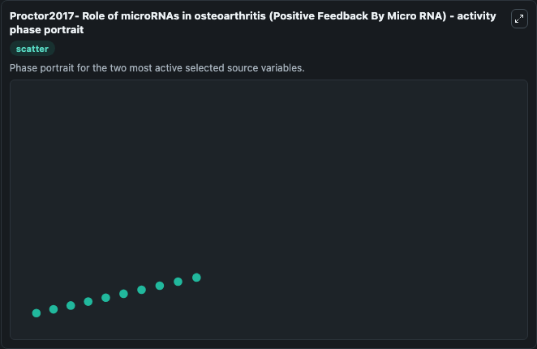

# Proctor2017 Role Of Micrornas In Osteoarthritis 3

This Biosimulant lab wraps `Proctor2017 Role Of Micrornas In Osteoarthritis 3` as a runnable systems biology model with a companion visualization module.
Proctor2017- Role of microRNAs inosteoarthritis (Positive Feedback By Micro RNA) This model is described in the article: Computer simulation models as a tool to investigate the role of microRNAs in os. It can be used to explore the configured dynamics and compare scenario outcomes across configurations.

## What You'll See

The lab asks: Which gene-regulatory states dominate the source model trajectory? Source model: Proctor2017- Role of microRNAs in osteoarthritis (Positive Feedback By Micro RNA). It runs for 1.0 time units with a communication step of 0.1. The run uses the model defaults declared by the curated SBML wrapper. The generated visualizations focus on Signal, miR, miR_gene, miR_gene_TF2, miR_gene_TF1, and TF1_mRNA, combining trajectory, endpoint-comparison, and summary-table views from one completed dark-mode run.

In this captured run, **miR** moved from 1000.0 to 999.7 across 1.0 simulation windows.


### Output Visualizations



*Summary table for Proctor2017 Role Of Micrornas In Osteoarthritis 3, reporting the scientific question, observed answer, dominant module, and caveat.*



*Trajectories of miR, miR_gene, miR_gene_TF2, Signal, miR_gene_TF1, and TF1_mRNA across the 1.0 simulation. In this run **miR_gene_TF2** climbed from 0 to 0.1720 and **miR** fell from 1000.0 to 999.7 — the largest movements among the focused observables.*



*Largest-excursion ranking of the focused observables — the absolute movement magnitude during the run. Top 3: **miR** = 0.3442, **miR_gene** = 0.1720, **miR_gene_TF2** = 0.1720.*



*Endpoint snapshot of the focused observables — final values from the captured run. Top 3 by value: **miR** = 999.7, **miR_gene** = 1.828, **miR_gene_TF2** = 0.1720.*



*Visualization card from the Proctor2017 Role Of Micrornas In Osteoarthritis 3 dark-mode run.*


## Model Context

- Core model: `models/core`
- Visualization model: `models/visualisation`
- Standard: `other`
- Upstream source: `biomodels_ebi:BIOMD0000000862`
- License: `CC0`

## Inputs

| Input | Maps To | Default | Notes |
|---|---|---|---|
| Initial Signal | `systemsbiology_sbml_proctor2017_role_of_micrornas_in_osteoarthritis_biomd0000000862_model.initial_signal` | | Source state initial condition exposed as a model-specific control because no explicit intervention parameter is identifiable. Maps to SBML symbol `Signal`. |
| Initial Mi R | `systemsbiology_sbml_proctor2017_role_of_micrornas_in_osteoarthritis_biomd0000000862_model.initial_mi_r` | | Source state initial condition exposed as a model-specific control because no explicit intervention parameter is identifiable. Maps to SBML symbol `miR`. |
| Initial Mi R Gene | `systemsbiology_sbml_proctor2017_role_of_micrornas_in_osteoarthritis_biomd0000000862_model.initial_mi_r_gene` | | Source state initial condition exposed as a model-specific control because no explicit intervention parameter is identifiable. Maps to SBML symbol `miR_gene`. |
| Initial Mi R Gene TF2 | `systemsbiology_sbml_proctor2017_role_of_micrornas_in_osteoarthritis_biomd0000000862_model.initial_mi_r_gene_tf2` | | Source state initial condition exposed as a model-specific control because no explicit intervention parameter is identifiable. Maps to SBML symbol `miR_gene_TF2`. |
| Initial Mi R Gene TF1 | `systemsbiology_sbml_proctor2017_role_of_micrornas_in_osteoarthritis_biomd0000000862_model.initial_mi_r_gene_tf1` | | Source state initial condition exposed as a model-specific control because no explicit intervention parameter is identifiable. Maps to SBML symbol `miR_gene_TF1`. |
| Initial TF1 MRNA | `systemsbiology_sbml_proctor2017_role_of_micrornas_in_osteoarthritis_biomd0000000862_model.initial_tf1_mrna` | | Source state initial condition exposed as a model-specific control because no explicit intervention parameter is identifiable. Maps to SBML symbol `TF1_mRNA`. |

## Outputs

| Output | Maps To | Role |
|---|---|---|
| `state` | `systemsbiology_sbml_proctor2017_role_of_micrornas_in_osteoarthritis_biomd0000000862_model.state` | Available to the visualization model and downstream workflows. |
| `summary` | `systemsbiology_sbml_proctor2017_role_of_micrornas_in_osteoarthritis_biomd0000000862_model.summary` | Available to the visualization model and downstream workflows. |
| `species_labels` | `systemsbiology_sbml_proctor2017_role_of_micrornas_in_osteoarthritis_biomd0000000862_model.species_labels` | Available to the visualization model and downstream workflows. |
| `signal` | `systemsbiology_sbml_proctor2017_role_of_micrornas_in_osteoarthritis_biomd0000000862_model.signal` | Available to the visualization model and downstream workflows. |
| `mi_r` | `systemsbiology_sbml_proctor2017_role_of_micrornas_in_osteoarthritis_biomd0000000862_model.mi_r` | Available to the visualization model and downstream workflows. |
| `mi_r_gene` | `systemsbiology_sbml_proctor2017_role_of_micrornas_in_osteoarthritis_biomd0000000862_model.mi_r_gene` | Available to the visualization model and downstream workflows. |
| `mi_r_gene_tf2` | `systemsbiology_sbml_proctor2017_role_of_micrornas_in_osteoarthritis_biomd0000000862_model.mi_r_gene_tf2` | Available to the visualization model and downstream workflows. |
| `mi_r_gene_tf1` | `systemsbiology_sbml_proctor2017_role_of_micrornas_in_osteoarthritis_biomd0000000862_model.mi_r_gene_tf1` | Available to the visualization model and downstream workflows. |
| `tf1_mrna` | `systemsbiology_sbml_proctor2017_role_of_micrornas_in_osteoarthritis_biomd0000000862_model.tf1_mrna` | Available to the visualization model and downstream workflows. |

## Runtime

- Duration: `1.0`
- Communication step: `0.1`

## Running Locally

```bash
biosimulant labs serve
```
