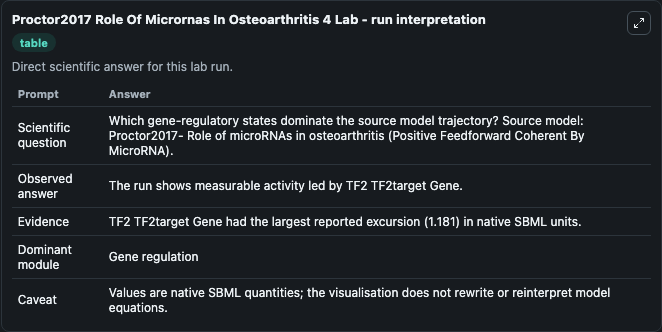
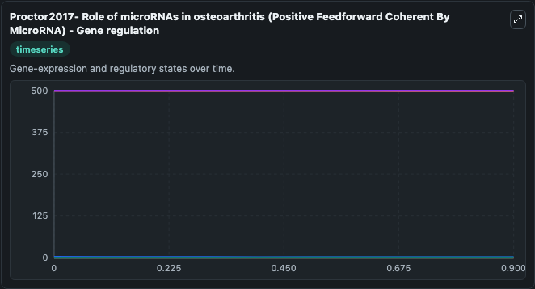
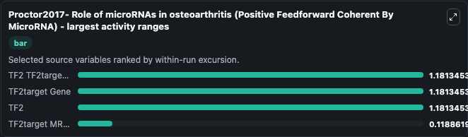
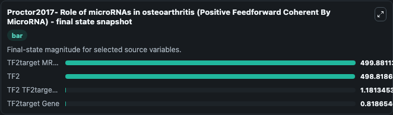
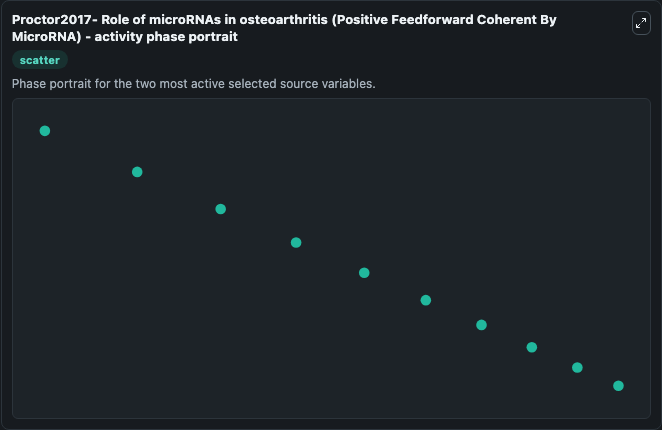

# Proctor2017 Role Of Micrornas In Osteoarthritis 4

This Biosimulant lab wraps `Proctor2017 Role Of Micrornas In Osteoarthritis 4` as a runnable systems biology model with a companion visualization module.
Proctor2017- Role of microRNAs inosteoarthritis (Positive Feedforward Coherent By MicroRNA) This model is described in the article: Computer simulation models as a tool to investigate the role of micr. It can be used to explore the configured dynamics and compare scenario outcomes across configurations.

## What You'll See

The lab asks: Which gene-regulatory states dominate the source model trajectory? Source model: Proctor2017- Role of microRNAs in osteoarthritis (Positive Feedforward Coherent By MicroRNA). It runs for 1.0 time units with a communication step of 0.1. The run uses the model defaults declared by the curated SBML wrapper. The generated visualizations focus on TF2target MRNA, TF2, TF2target Gene, TF2 TF2target Gene, TF1 TF2target Gene, and TF1, combining trajectory, endpoint-comparison, and summary-table views from one completed dark-mode run.

In this captured run, **TF2 TF2target Gene** moved from 0 to 1.181 across 1.0 simulation windows.


### Output Visualizations



*Summary table for Proctor2017 Role Of Micrornas In Osteoarthritis 4, reporting the scientific question, observed answer, dominant module, and caveat.*



*Trajectories of TF2 TF2target Gene, TF2target Gene, TF2, TF2target MRNA, TF1 TF2target Gene, and TF1 across the 1.0 simulation. In this run **TF2 TF2target Gene** climbed from 0 to 1.181 and **TF2target Gene** fell from 2.000 to 0.8187 — the largest movements among the focused observables.*



*Largest-excursion ranking of the focused observables — the absolute movement magnitude during the run. Top 3: **TF2 TF2target Gene** = 1.181, **TF2target Gene** = 1.181, **TF2** = 1.181, with 1 more observable below.*



*Endpoint snapshot of the focused observables — final values from the captured run. Top 3 by value: **TF2target MRNA** = 499.9, **TF2** = 498.8, **TF2 TF2target Gene** = 1.181, with 1 more observable below.*



*Visualization card from the Proctor2017 Role Of Micrornas In Osteoarthritis 4 dark-mode run.*


## Model Context

- Core model: `models/core`
- Visualization model: `models/visualisation`
- Standard: `other`
- Upstream source: `biomodels_ebi:MODEL1610100003`
- License: `CC0`

## Inputs

| Input | Maps To | Default | Notes |
|---|---|---|---|
| Initial Tf2target MRNA | `systemsbiology_sbml_proctor2017_role_of_micrornas_in_osteoarthritis_model1610100003_model.initial_tf2target_mrna` | | Source state initial condition exposed as a model-specific control because no explicit intervention parameter is identifiable. Maps to SBML symbol `TF2target_mRNA`. |
| Initial Model State TF2 | `systemsbiology_sbml_proctor2017_role_of_micrornas_in_osteoarthritis_model1610100003_model.initial_model_state_tf2` | | Source state initial condition exposed as a model-specific control because no explicit intervention parameter is identifiable. Maps to SBML symbol `TF2`. |
| Initial Tf2target Gene | `systemsbiology_sbml_proctor2017_role_of_micrornas_in_osteoarthritis_model1610100003_model.initial_tf2target_gene` | | Source state initial condition exposed as a model-specific control because no explicit intervention parameter is identifiable. Maps to SBML symbol `TF2target_gene`. |
| Initial TF2 Tf2target Gene | `systemsbiology_sbml_proctor2017_role_of_micrornas_in_osteoarthritis_model1610100003_model.initial_tf2_tf2target_gene` | | Source state initial condition exposed as a model-specific control because no explicit intervention parameter is identifiable. Maps to SBML symbol `TF2_TF2target_gene`. |
| Initial TF1 Tf2target Gene | `systemsbiology_sbml_proctor2017_role_of_micrornas_in_osteoarthritis_model1610100003_model.initial_tf1_tf2target_gene` | | Source state initial condition exposed as a model-specific control because no explicit intervention parameter is identifiable. Maps to SBML symbol `TF1_TF2target_gene`. |
| Initial Model State TF1 | `systemsbiology_sbml_proctor2017_role_of_micrornas_in_osteoarthritis_model1610100003_model.initial_model_state_tf1` | | Source state initial condition exposed as a model-specific control because no explicit intervention parameter is identifiable. Maps to SBML symbol `TF1`. |

## Outputs

| Output | Maps To | Role |
|---|---|---|
| `state` | `systemsbiology_sbml_proctor2017_role_of_micrornas_in_osteoarthritis_model1610100003_model.state` | Available to the visualization model and downstream workflows. |
| `summary` | `systemsbiology_sbml_proctor2017_role_of_micrornas_in_osteoarthritis_model1610100003_model.summary` | Available to the visualization model and downstream workflows. |
| `species_labels` | `systemsbiology_sbml_proctor2017_role_of_micrornas_in_osteoarthritis_model1610100003_model.species_labels` | Available to the visualization model and downstream workflows. |
| `tf2target_mrna` | `systemsbiology_sbml_proctor2017_role_of_micrornas_in_osteoarthritis_model1610100003_model.tf2target_mrna` | Available to the visualization model and downstream workflows. |
| `tf2` | `systemsbiology_sbml_proctor2017_role_of_micrornas_in_osteoarthritis_model1610100003_model.tf2` | Available to the visualization model and downstream workflows. |
| `tf2target_gene` | `systemsbiology_sbml_proctor2017_role_of_micrornas_in_osteoarthritis_model1610100003_model.tf2target_gene` | Available to the visualization model and downstream workflows. |
| `tf2_tf2target_gene` | `systemsbiology_sbml_proctor2017_role_of_micrornas_in_osteoarthritis_model1610100003_model.tf2_tf2target_gene` | Available to the visualization model and downstream workflows. |
| `tf1_tf2target_gene` | `systemsbiology_sbml_proctor2017_role_of_micrornas_in_osteoarthritis_model1610100003_model.tf1_tf2target_gene` | Available to the visualization model and downstream workflows. |
| `tf1` | `systemsbiology_sbml_proctor2017_role_of_micrornas_in_osteoarthritis_model1610100003_model.tf1` | Available to the visualization model and downstream workflows. |

## Runtime

- Duration: `1.0`
- Communication step: `0.1`

## Running Locally

```bash
biosimulant labs serve
```
