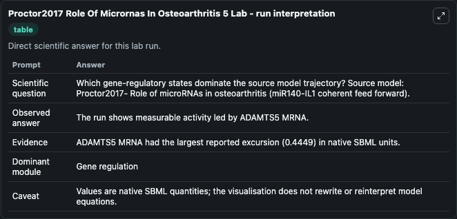
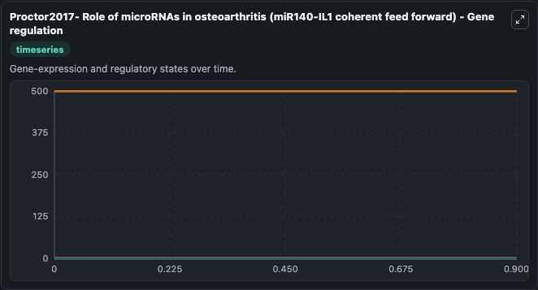
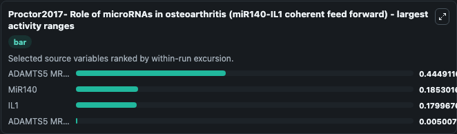
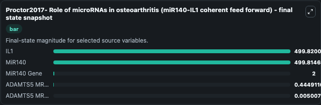
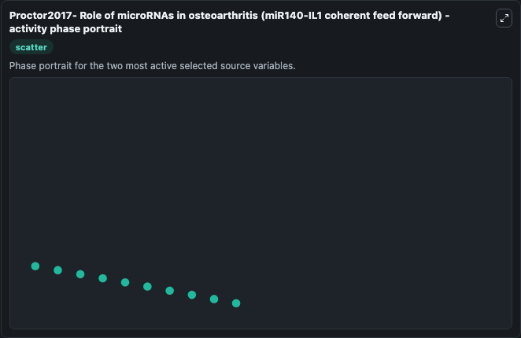

# Proctor2017 Role Of Micrornas In Osteoarthritis 5

This Biosimulant lab wraps `Proctor2017 Role Of Micrornas In Osteoarthritis 5` as a runnable systems biology model with a companion visualization module.
Proctor2017- Role of microRNAs inosteoarthritis (miR140-IL1 coherent feed forward) This model is described in the article: Computer simulation models as a tool to investigate the role of microRNAs in. It can be used to explore the configured dynamics and compare scenario outcomes across configurations.

## What You'll See

The lab asks: Which gene-regulatory states dominate the source model trajectory? Source model: Proctor2017- Role of microRNAs in osteoarthritis (miR140-IL1 coherent feed forward). It runs for 1.0 time units with a communication step of 0.1. The run uses the model defaults declared by the curated SBML wrapper. The generated visualizations focus on MiR140, IL1, MiR140 Gene, Sink, ADAMTS5 MRNA MiR140, and ADAMTS5 MRNA, combining trajectory, endpoint-comparison, and summary-table views from one completed dark-mode run.

In this captured run, **ADAMTS5 MRNA** moved from 0 to 0.4449 across 1.0 simulation windows.


### Output Visualizations



*Summary table for Proctor2017 Role Of Micrornas In Osteoarthritis 5, reporting the scientific question, observed answer, dominant module, and caveat.*



*Trajectories of ADAMTS5 MRNA, MiR140, IL1, ADAMTS5 MRNA MiR140, MiR140 Gene, and Sink across the 1.0 simulation. In this run **ADAMTS5 MRNA** climbed from 0 to 0.4449 and **MiR140** fell from 500.0 to 499.8 — the largest movements among the focused observables.*



*Largest-excursion ranking of the focused observables — the absolute movement magnitude during the run. Top 3: **ADAMTS5 MRNA** = 0.4449, **MiR140** = 0.1853, **IL1** = 0.1800, with 1 more observable below.*



*Endpoint snapshot of the focused observables — final values from the captured run. Top 3 by value: **IL1** = 499.8, **MiR140** = 499.8, **MiR140 Gene** = 2.000, with 2 more observables below.*



*Visualization card from the Proctor2017 Role Of Micrornas In Osteoarthritis 5 dark-mode run.*


## Model Context

- Core model: `models/core`
- Visualization model: `models/visualisation`
- Standard: `other`
- Upstream source: `biomodels_ebi:MODEL1705170001`
- License: `CC0`

## Inputs

| Input | Maps To | Default | Notes |
|---|---|---|---|
| Initial Mi R140 | `systemsbiology_sbml_proctor2017_role_of_micrornas_in_osteoarthritis_model1705170001_model.initial_mi_r140` | | Source state initial condition exposed as a model-specific control because no explicit intervention parameter is identifiable. Maps to SBML symbol `miR140`. |
| Initial Model State IL1 | `systemsbiology_sbml_proctor2017_role_of_micrornas_in_osteoarthritis_model1705170001_model.initial_model_state_il1` | | Source state initial condition exposed as a model-specific control because no explicit intervention parameter is identifiable. Maps to SBML symbol `IL1`. |
| Initial Mi R140 Gene | `systemsbiology_sbml_proctor2017_role_of_micrornas_in_osteoarthritis_model1705170001_model.initial_mi_r140_gene` | | Source state initial condition exposed as a model-specific control because no explicit intervention parameter is identifiable. Maps to SBML symbol `miR140_gene`. |
| Initial Sink | `systemsbiology_sbml_proctor2017_role_of_micrornas_in_osteoarthritis_model1705170001_model.initial_sink` | | Source state initial condition exposed as a model-specific control because no explicit intervention parameter is identifiable. Maps to SBML symbol `Sink`. |
| Initial Adamts5 MRNA Mi R140 | `systemsbiology_sbml_proctor2017_role_of_micrornas_in_osteoarthritis_model1705170001_model.initial_adamts5_mrna_mi_r140` | | Source state initial condition exposed as a model-specific control because no explicit intervention parameter is identifiable. Maps to SBML symbol `ADAMTS5_mRNA_miR140`. |
| Initial Adamts5 MRNA | `systemsbiology_sbml_proctor2017_role_of_micrornas_in_osteoarthritis_model1705170001_model.initial_adamts5_mrna` | | Source state initial condition exposed as a model-specific control because no explicit intervention parameter is identifiable. Maps to SBML symbol `ADAMTS5_mRNA`. |

## Outputs

| Output | Maps To | Role |
|---|---|---|
| `state` | `systemsbiology_sbml_proctor2017_role_of_micrornas_in_osteoarthritis_model1705170001_model.state` | Available to the visualization model and downstream workflows. |
| `summary` | `systemsbiology_sbml_proctor2017_role_of_micrornas_in_osteoarthritis_model1705170001_model.summary` | Available to the visualization model and downstream workflows. |
| `species_labels` | `systemsbiology_sbml_proctor2017_role_of_micrornas_in_osteoarthritis_model1705170001_model.species_labels` | Available to the visualization model and downstream workflows. |
| `mi_r140` | `systemsbiology_sbml_proctor2017_role_of_micrornas_in_osteoarthritis_model1705170001_model.mi_r140` | Available to the visualization model and downstream workflows. |
| `il1` | `systemsbiology_sbml_proctor2017_role_of_micrornas_in_osteoarthritis_model1705170001_model.il1` | Available to the visualization model and downstream workflows. |
| `mi_r140_gene` | `systemsbiology_sbml_proctor2017_role_of_micrornas_in_osteoarthritis_model1705170001_model.mi_r140_gene` | Available to the visualization model and downstream workflows. |
| `sink` | `systemsbiology_sbml_proctor2017_role_of_micrornas_in_osteoarthritis_model1705170001_model.sink` | Available to the visualization model and downstream workflows. |
| `adamts5_mrna_mi_r140` | `systemsbiology_sbml_proctor2017_role_of_micrornas_in_osteoarthritis_model1705170001_model.adamts5_mrna_mi_r140` | Available to the visualization model and downstream workflows. |
| `adamts5_mrna` | `systemsbiology_sbml_proctor2017_role_of_micrornas_in_osteoarthritis_model1705170001_model.adamts5_mrna` | Available to the visualization model and downstream workflows. |

## Runtime

- Duration: `1.0`
- Communication step: `0.1`

## Running Locally

```bash
biosimulant labs serve
```
