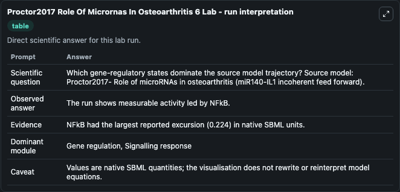
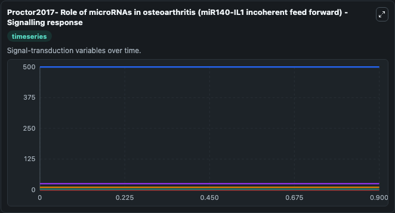
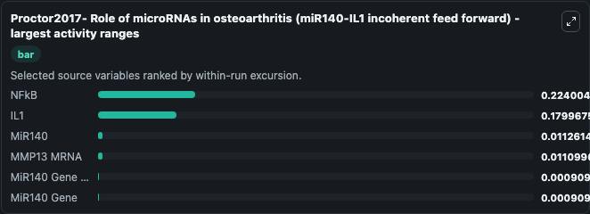
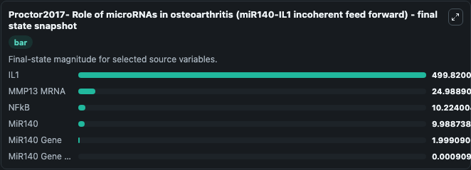
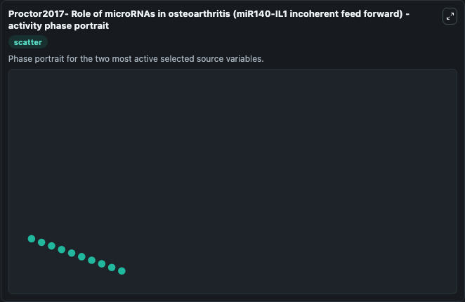

# Proctor2017 Role Of Micrornas In Osteoarthritis 6

This Biosimulant lab wraps `Proctor2017 Role Of Micrornas In Osteoarthritis 6` as a runnable systems biology model with a companion visualization module.
Proctor2017- Role of microRNAs in osteoarthritis (miR140-IL1 incoherent feed forward) This model is described in the article: Computer simulation models as a tool to investigate the role of microRNAs. It can be used to explore the configured dynamics and compare scenario outcomes across configurations.

## What You'll See

The lab asks: Which gene-regulatory states dominate the source model trajectory? Source model: Proctor2017- Role of microRNAs in osteoarthritis (miR140-IL1 incoherent feed forward). It runs for 1.0 time units with a communication step of 0.1. The run uses the model defaults declared by the curated SBML wrapper. The generated visualizations focus on NFkB, MiR140 Gene NFkB, IL1, MMP13 MRNA, MiR140, and MiR140 Gene, combining trajectory, endpoint-comparison, and summary-table views from one completed dark-mode run.

In this captured run, **NFkB** moved from 10.000 to 10.224 across 1.0 simulation windows.


### Output Visualizations



*Summary table for Proctor2017 Role Of Micrornas In Osteoarthritis 6, reporting the scientific question, observed answer, dominant module, and caveat.*



*Trajectories of NFkB, IL1, MiR140, MMP13 MRNA, MiR140 Gene NFkB, and MiR140 Gene across the 1.0 simulation. In this run **NFkB** climbed from 10.000 to 10.224 and **IL1** fell from 500.0 to 499.8 — the largest movements among the focused observables.*



*Largest-excursion ranking of the focused observables — the absolute movement magnitude during the run. Top 3: **NFkB** = 0.2240, **IL1** = 0.1800, **MiR140** = 0.0113, with 3 more observables below.*



*Endpoint snapshot of the focused observables — final values from the captured run. Top 3 by value: **IL1** = 499.8, **MMP13 MRNA** = 24.989, **NFkB** = 10.224, with 3 more observables below.*



*Visualization card from the Proctor2017 Role Of Micrornas In Osteoarthritis 6 dark-mode run.*


## Model Context

- Core model: `models/core`
- Visualization model: `models/visualisation`
- Standard: `other`
- Upstream source: `biomodels_ebi:MODEL1705170002`
- License: `CC0`

## Inputs

| Input | Maps To | Default | Notes |
|---|---|---|---|
| Initial N Fk B | `systemsbiology_sbml_proctor2017_role_of_micrornas_in_osteoarthritis_model1705170002_model.initial_n_fk_b` | | Source state initial condition exposed as a model-specific control because no explicit intervention parameter is identifiable. Maps to SBML symbol `NFkB`. |
| Initial Mi R140 Gene N Fk B | `systemsbiology_sbml_proctor2017_role_of_micrornas_in_osteoarthritis_model1705170002_model.initial_mi_r140_gene_n_fk_b` | | Source state initial condition exposed as a model-specific control because no explicit intervention parameter is identifiable. Maps to SBML symbol `miR140_gene_NFkB`. |
| Initial Model State IL1 | `systemsbiology_sbml_proctor2017_role_of_micrornas_in_osteoarthritis_model1705170002_model.initial_model_state_il1` | | Source state initial condition exposed as a model-specific control because no explicit intervention parameter is identifiable. Maps to SBML symbol `IL1`. |
| Initial Mmp13 MRNA | `systemsbiology_sbml_proctor2017_role_of_micrornas_in_osteoarthritis_model1705170002_model.initial_mmp13_mrna` | | Source state initial condition exposed as a model-specific control because no explicit intervention parameter is identifiable. Maps to SBML symbol `MMP13_mRNA`. |
| Initial Mi R140 | `systemsbiology_sbml_proctor2017_role_of_micrornas_in_osteoarthritis_model1705170002_model.initial_mi_r140` | | Source state initial condition exposed as a model-specific control because no explicit intervention parameter is identifiable. Maps to SBML symbol `miR140`. |
| Initial Mi R140 Gene | `systemsbiology_sbml_proctor2017_role_of_micrornas_in_osteoarthritis_model1705170002_model.initial_mi_r140_gene` | | Source state initial condition exposed as a model-specific control because no explicit intervention parameter is identifiable. Maps to SBML symbol `miR140_gene`. |

## Outputs

| Output | Maps To | Role |
|---|---|---|
| `state` | `systemsbiology_sbml_proctor2017_role_of_micrornas_in_osteoarthritis_model1705170002_model.state` | Available to the visualization model and downstream workflows. |
| `summary` | `systemsbiology_sbml_proctor2017_role_of_micrornas_in_osteoarthritis_model1705170002_model.summary` | Available to the visualization model and downstream workflows. |
| `species_labels` | `systemsbiology_sbml_proctor2017_role_of_micrornas_in_osteoarthritis_model1705170002_model.species_labels` | Available to the visualization model and downstream workflows. |
| `n_fk_b` | `systemsbiology_sbml_proctor2017_role_of_micrornas_in_osteoarthritis_model1705170002_model.n_fk_b` | Available to the visualization model and downstream workflows. |
| `mi_r140_gene_n_fk_b` | `systemsbiology_sbml_proctor2017_role_of_micrornas_in_osteoarthritis_model1705170002_model.mi_r140_gene_n_fk_b` | Available to the visualization model and downstream workflows. |
| `il1` | `systemsbiology_sbml_proctor2017_role_of_micrornas_in_osteoarthritis_model1705170002_model.il1` | Available to the visualization model and downstream workflows. |
| `mmp13_mrna` | `systemsbiology_sbml_proctor2017_role_of_micrornas_in_osteoarthritis_model1705170002_model.mmp13_mrna` | Available to the visualization model and downstream workflows. |
| `mi_r140` | `systemsbiology_sbml_proctor2017_role_of_micrornas_in_osteoarthritis_model1705170002_model.mi_r140` | Available to the visualization model and downstream workflows. |
| `mi_r140_gene` | `systemsbiology_sbml_proctor2017_role_of_micrornas_in_osteoarthritis_model1705170002_model.mi_r140_gene` | Available to the visualization model and downstream workflows. |

## Runtime

- Duration: `1.0`
- Communication step: `0.1`

## Running Locally

```bash
biosimulant labs serve
```
