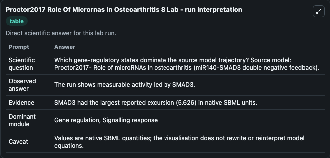
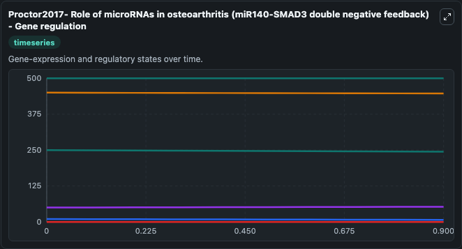
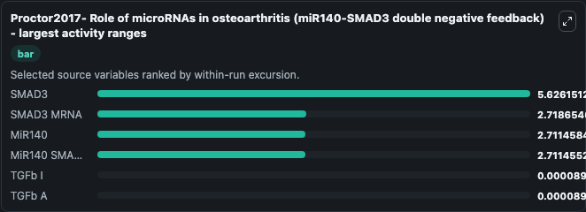
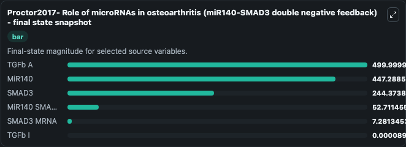
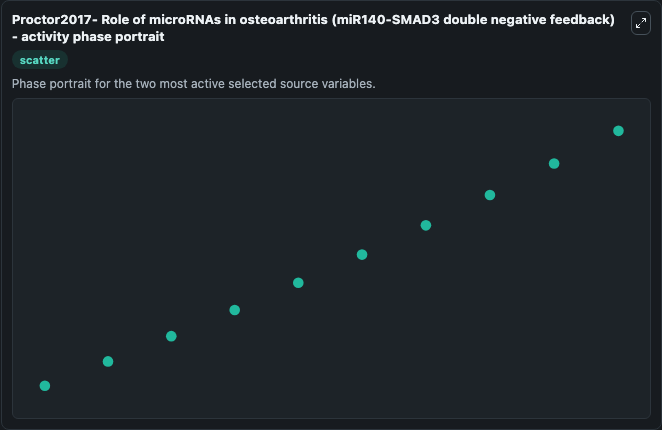

# Proctor2017 Role Of Micrornas In Osteoarthritis 8

This Biosimulant lab wraps `Proctor2017 Role Of Micrornas In Osteoarthritis 8` as a runnable systems biology model with a companion visualization module.
Proctor2017- Role of microRNAs inosteoarthritis (miR140-SMAD3 double negative feedback) This model is described in the article: Computer simulation models as a tool to investigate the role of microRNA. It can be used to explore the configured dynamics and compare scenario outcomes across configurations.

## What You'll See

The lab asks: Which gene-regulatory states dominate the source model trajectory? Source model: Proctor2017- Role of microRNAs in osteoarthritis (miR140-SMAD3 double negative feedback). It runs for 1.0 time units with a communication step of 0.1. The run uses the model defaults declared by the curated SBML wrapper. The generated visualizations focus on TGFb A, TGFb I, MiR140, SMAD3, MiR140 SMAD3 MRNA, and SMAD3 MRNA, combining trajectory, endpoint-comparison, and summary-table views from one completed dark-mode run.

In this captured run, **SMAD3** moved from 250.0 to 244.4 across 1.0 simulation windows.


### Output Visualizations



*Summary table for Proctor2017 Role Of Micrornas In Osteoarthritis 8, reporting the scientific question, observed answer, dominant module, and caveat.*



*Trajectories of SMAD3, SMAD3 MRNA, MiR140, MiR140 SMAD3 MRNA, TGFb I, and TGFb A across the 1.0 simulation. In this run **MiR140 SMAD3 MRNA** climbed from 50.000 to 52.711 and **SMAD3** fell from 250.0 to 244.4 — the largest movements among the focused observables.*



*Largest-excursion ranking of the focused observables — the absolute movement magnitude during the run. Top 3: **SMAD3** = 5.626, **SMAD3 MRNA** = 2.719, **MiR140** = 2.711, with 3 more observables below.*



*Endpoint snapshot of the focused observables — final values from the captured run. Top 3 by value: **TGFb A** = 500.0, **MiR140** = 447.3, **SMAD3** = 244.4, with 3 more observables below.*



*Visualization card from the Proctor2017 Role Of Micrornas In Osteoarthritis 8 dark-mode run.*


## Model Context

- Core model: `models/core`
- Visualization model: `models/visualisation`
- Standard: `other`
- Upstream source: `biomodels_ebi:MODEL1705170000`
- License: `CC0`

## Inputs

| Input | Maps To | Default | Notes |
|---|---|---|---|
| Initial Tg Fb A | `systemsbiology_sbml_proctor2017_role_of_micrornas_in_osteoarthritis_model1705170000_model.initial_tg_fb_a` | | Source state initial condition exposed as a model-specific control because no explicit intervention parameter is identifiable. Maps to SBML symbol `TGFb_A`. |
| Initial Tg Fb I | `systemsbiology_sbml_proctor2017_role_of_micrornas_in_osteoarthritis_model1705170000_model.initial_tg_fb_i` | | Source state initial condition exposed as a model-specific control because no explicit intervention parameter is identifiable. Maps to SBML symbol `TGFb_I`. |
| Initial Mi R140 | `systemsbiology_sbml_proctor2017_role_of_micrornas_in_osteoarthritis_model1705170000_model.initial_mi_r140` | | Source state initial condition exposed as a model-specific control because no explicit intervention parameter is identifiable. Maps to SBML symbol `miR140`. |
| Initial Smad3 | `systemsbiology_sbml_proctor2017_role_of_micrornas_in_osteoarthritis_model1705170000_model.initial_smad3` | | Source state initial condition exposed as a model-specific control because no explicit intervention parameter is identifiable. Maps to SBML symbol `SMAD3`. |
| Initial Mi R140 Smad3 MRNA | `systemsbiology_sbml_proctor2017_role_of_micrornas_in_osteoarthritis_model1705170000_model.initial_mi_r140_smad3_mrna` | | Source state initial condition exposed as a model-specific control because no explicit intervention parameter is identifiable. Maps to SBML symbol `miR140_SMAD3_mRNA`. |
| Initial Smad3 MRNA | `systemsbiology_sbml_proctor2017_role_of_micrornas_in_osteoarthritis_model1705170000_model.initial_smad3_mrna` | | Source state initial condition exposed as a model-specific control because no explicit intervention parameter is identifiable. Maps to SBML symbol `SMAD3_mRNA`. |

## Outputs

| Output | Maps To | Role |
|---|---|---|
| `state` | `systemsbiology_sbml_proctor2017_role_of_micrornas_in_osteoarthritis_model1705170000_model.state` | Available to the visualization model and downstream workflows. |
| `summary` | `systemsbiology_sbml_proctor2017_role_of_micrornas_in_osteoarthritis_model1705170000_model.summary` | Available to the visualization model and downstream workflows. |
| `species_labels` | `systemsbiology_sbml_proctor2017_role_of_micrornas_in_osteoarthritis_model1705170000_model.species_labels` | Available to the visualization model and downstream workflows. |
| `tg_fb_a` | `systemsbiology_sbml_proctor2017_role_of_micrornas_in_osteoarthritis_model1705170000_model.tg_fb_a` | Available to the visualization model and downstream workflows. |
| `tg_fb_i` | `systemsbiology_sbml_proctor2017_role_of_micrornas_in_osteoarthritis_model1705170000_model.tg_fb_i` | Available to the visualization model and downstream workflows. |
| `mi_r140` | `systemsbiology_sbml_proctor2017_role_of_micrornas_in_osteoarthritis_model1705170000_model.mi_r140` | Available to the visualization model and downstream workflows. |
| `smad3` | `systemsbiology_sbml_proctor2017_role_of_micrornas_in_osteoarthritis_model1705170000_model.smad3` | Available to the visualization model and downstream workflows. |
| `mi_r140_smad3_mrna` | `systemsbiology_sbml_proctor2017_role_of_micrornas_in_osteoarthritis_model1705170000_model.mi_r140_smad3_mrna` | Available to the visualization model and downstream workflows. |
| `smad3_mrna` | `systemsbiology_sbml_proctor2017_role_of_micrornas_in_osteoarthritis_model1705170000_model.smad3_mrna` | Available to the visualization model and downstream workflows. |

## Runtime

- Duration: `1.0`
- Communication step: `0.1`

## Running Locally

```bash
biosimulant labs serve
```
