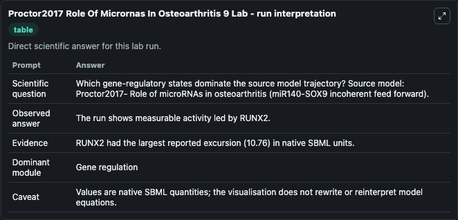
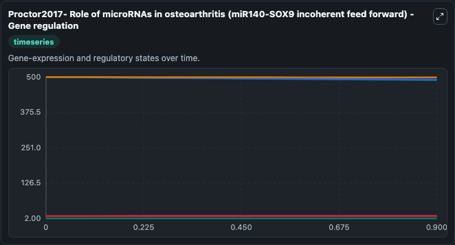
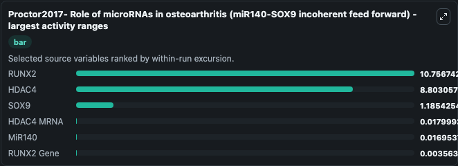
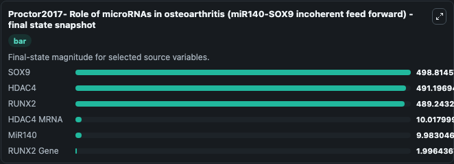
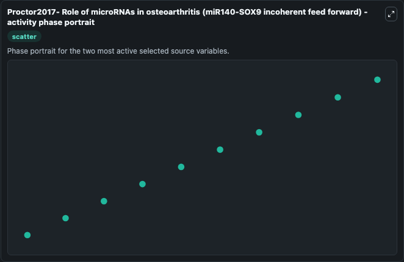

# Proctor2017 Role Of Micrornas In Osteoarthritis 9

This Biosimulant lab wraps `Proctor2017 Role Of Micrornas In Osteoarthritis 9` as a runnable systems biology model with a companion visualization module.
Proctor2017- Role of microRNAs in osteoarthritis (miR140-SOX9 incoherent feed forward) This model is described in the article: Computer simulation models as a tool to investigate the role of microRNAs. It can be used to explore the configured dynamics and compare scenario outcomes across configurations.

## What You'll See

The lab asks: Which gene-regulatory states dominate the source model trajectory? Source model: Proctor2017- Role of microRNAs in osteoarthritis (miR140-SOX9 incoherent feed forward). It runs for 1.0 time units with a communication step of 0.1. The run uses the model defaults declared by the curated SBML wrapper. The generated visualizations focus on SOX9, RUNX2, HDAC4, MiR140, HDAC4 MRNA, and RUNX2 Gene, combining trajectory, endpoint-comparison, and summary-table views from one completed dark-mode run.

In this captured run, **RUNX2** moved from 500.0 to 489.2 across 1.0 simulation windows.


### Output Visualizations



*Summary table for Proctor2017 Role Of Micrornas In Osteoarthritis 9, reporting the scientific question, observed answer, dominant module, and caveat.*



*Trajectories of RUNX2, HDAC4, SOX9, HDAC4 MRNA, MiR140, and RUNX2 Gene across the 1.0 simulation. In this run **HDAC4 MRNA** climbed from 10.000 to 10.018 and **RUNX2** fell from 500.0 to 489.2 — the largest movements among the focused observables.*



*Largest-excursion ranking of the focused observables — the absolute movement magnitude during the run. Top 3: **RUNX2** = 10.757, **HDAC4** = 8.803, **SOX9** = 1.185, with 3 more observables below.*



*Endpoint snapshot of the focused observables — final values from the captured run. Top 3 by value: **SOX9** = 498.8, **HDAC4** = 491.2, **RUNX2** = 489.2, with 3 more observables below.*



*Visualization card from the Proctor2017 Role Of Micrornas In Osteoarthritis 9 dark-mode run.*


## Model Context

- Core model: `models/core`
- Visualization model: `models/visualisation`
- Standard: `other`
- Upstream source: `biomodels_ebi:MODEL1705170003`
- License: `CC0`

## Inputs

| Input | Maps To | Default | Notes |
|---|---|---|---|
| Initial Sox9 | `systemsbiology_sbml_proctor2017_role_of_micrornas_in_osteoarthritis_model1705170003_model.initial_sox9` | | Source state initial condition exposed as a model-specific control because no explicit intervention parameter is identifiable. Maps to SBML symbol `SOX9`. |
| Initial Runx2 | `systemsbiology_sbml_proctor2017_role_of_micrornas_in_osteoarthritis_model1705170003_model.initial_runx2` | | Source state initial condition exposed as a model-specific control because no explicit intervention parameter is identifiable. Maps to SBML symbol `RUNX2`. |
| Initial Hdac4 | `systemsbiology_sbml_proctor2017_role_of_micrornas_in_osteoarthritis_model1705170003_model.initial_hdac4` | | Source state initial condition exposed as a model-specific control because no explicit intervention parameter is identifiable. Maps to SBML symbol `HDAC4`. |
| Initial Mi R140 | `systemsbiology_sbml_proctor2017_role_of_micrornas_in_osteoarthritis_model1705170003_model.initial_mi_r140` | | Source state initial condition exposed as a model-specific control because no explicit intervention parameter is identifiable. Maps to SBML symbol `miR140`. |
| Initial Hdac4 MRNA | `systemsbiology_sbml_proctor2017_role_of_micrornas_in_osteoarthritis_model1705170003_model.initial_hdac4_mrna` | | Source state initial condition exposed as a model-specific control because no explicit intervention parameter is identifiable. Maps to SBML symbol `HDAC4_mRNA`. |
| Initial Runx2 Gene | `systemsbiology_sbml_proctor2017_role_of_micrornas_in_osteoarthritis_model1705170003_model.initial_runx2_gene` | | Source state initial condition exposed as a model-specific control because no explicit intervention parameter is identifiable. Maps to SBML symbol `RUNX2_gene`. |

## Outputs

| Output | Maps To | Role |
|---|---|---|
| `state` | `systemsbiology_sbml_proctor2017_role_of_micrornas_in_osteoarthritis_model1705170003_model.state` | Available to the visualization model and downstream workflows. |
| `summary` | `systemsbiology_sbml_proctor2017_role_of_micrornas_in_osteoarthritis_model1705170003_model.summary` | Available to the visualization model and downstream workflows. |
| `species_labels` | `systemsbiology_sbml_proctor2017_role_of_micrornas_in_osteoarthritis_model1705170003_model.species_labels` | Available to the visualization model and downstream workflows. |
| `sox9` | `systemsbiology_sbml_proctor2017_role_of_micrornas_in_osteoarthritis_model1705170003_model.sox9` | Available to the visualization model and downstream workflows. |
| `runx2` | `systemsbiology_sbml_proctor2017_role_of_micrornas_in_osteoarthritis_model1705170003_model.runx2` | Available to the visualization model and downstream workflows. |
| `hdac4` | `systemsbiology_sbml_proctor2017_role_of_micrornas_in_osteoarthritis_model1705170003_model.hdac4` | Available to the visualization model and downstream workflows. |
| `mi_r140` | `systemsbiology_sbml_proctor2017_role_of_micrornas_in_osteoarthritis_model1705170003_model.mi_r140` | Available to the visualization model and downstream workflows. |
| `hdac4_mrna` | `systemsbiology_sbml_proctor2017_role_of_micrornas_in_osteoarthritis_model1705170003_model.hdac4_mrna` | Available to the visualization model and downstream workflows. |
| `runx2_gene` | `systemsbiology_sbml_proctor2017_role_of_micrornas_in_osteoarthritis_model1705170003_model.runx2_gene` | Available to the visualization model and downstream workflows. |

## Runtime

- Duration: `1.0`
- Communication step: `0.1`

## Running Locally

```bash
biosimulant labs serve
```
