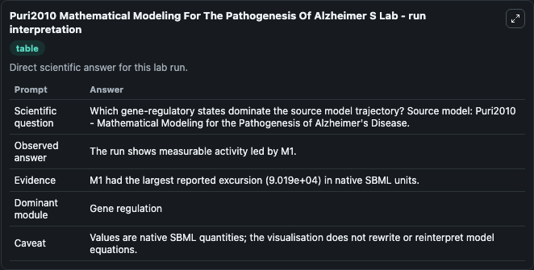
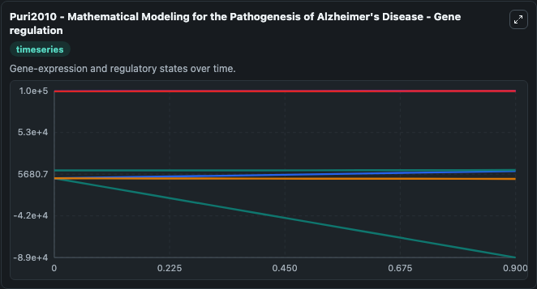
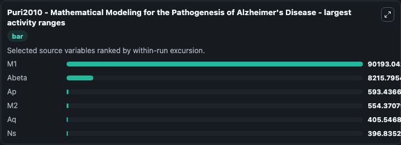
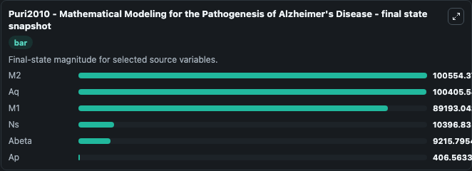
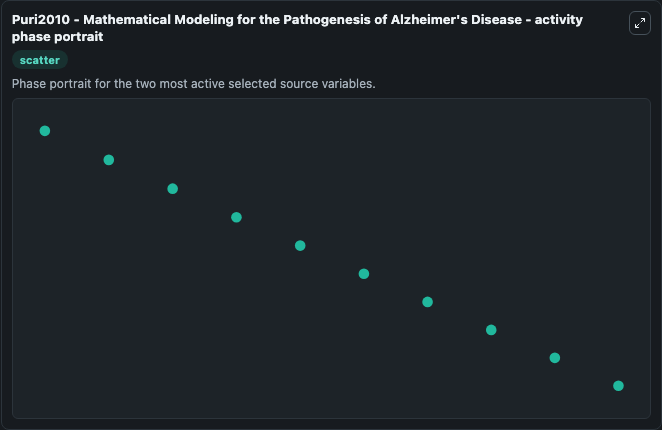

# Puri2010 Mathematical Modeling For The Pathogenesis Of Alzheimer S

This Biosimulant lab wraps `Puri2010 Mathematical Modeling For The Pathogenesis Of Alzheimer S` as a runnable systems biology model with a companion visualization module.
Puri2010 - Mathematical Modeling for thePathogenesis of Alzheimer's Disease Puri2010 - Mathematical Modeling for the Pathogenesis of Alzheimer's Disease Encoded non-curated model. It can be used to explore the configured dynamics and compare scenario outcomes across configurations.

## What You'll See

The lab asks: Which gene-regulatory states dominate the source model trajectory? Source model: Puri2010 - Mathematical Modeling for the Pathogenesis of Alzheimer's Disease. It runs for 1.0 time units with a communication step of 0.1. The run uses the model defaults declared by the curated SBML wrapper. The generated visualizations focus on M2, Aq, Ns, M1, Ap, and Abeta, combining trajectory, endpoint-comparison, and summary-table views from one completed dark-mode run.

In this captured run, **M1** moved from 1000.0 to -8.92e+04 across 1.0 simulation windows.


### Output Visualizations



*Summary table for Puri2010 Mathematical Modeling For The Pathogenesis Of Alzheimer S, reporting the scientific question, observed answer, dominant module, and caveat.*



*Trajectories of M1, Abeta, Ap, M2, Aq, and Ns across the 1.0 simulation. In this run **Abeta** climbed from 1000.0 to 9215.8 and **M1** fell from 1000.0 to -8.92e+04 — the largest movements among the focused observables.*



*Largest-excursion ranking of the focused observables — the absolute movement magnitude during the run. Top 3: **M1** = 9.02e+04, **Abeta** = 8215.8, **Ap** = 593.4, with 3 more observables below.*



*Endpoint snapshot of the focused observables — final values from the captured run. Top 3 by value: **M2** = 1.01e+05, **Aq** = 1e+05, **M1** = 8.92e+04, with 3 more observables below.*



*Visualization card from the Puri2010 Mathematical Modeling For The Pathogenesis Of Alzheimer S dark-mode run.*


## Model Context

- Core model: `models/core`
- Visualization model: `models/visualisation`
- Standard: `other`
- Upstream source: `biomodels_ebi:MODEL1409240001`
- License: `CC0`

## Inputs

| Input | Maps To | Default | Notes |
|---|---|---|---|
| Initial Model State M2 | `systemsbiology_sbml_puri2010_mathematical_modeling_for_the_pathogene_model1409240001_model.initial_model_state_m2` | | Source state initial condition exposed as a model-specific control because no explicit intervention parameter is identifiable. Maps to SBML symbol `M2`. |
| Initial Model State Aq | `systemsbiology_sbml_puri2010_mathematical_modeling_for_the_pathogene_model1409240001_model.initial_model_state_aq` | | Source state initial condition exposed as a model-specific control because no explicit intervention parameter is identifiable. Maps to SBML symbol `Aq`. |
| Initial Model State Ns | `systemsbiology_sbml_puri2010_mathematical_modeling_for_the_pathogene_model1409240001_model.initial_model_state_ns` | | Source state initial condition exposed as a model-specific control because no explicit intervention parameter is identifiable. Maps to SBML symbol `Ns`. |
| Initial Model State M1 | `systemsbiology_sbml_puri2010_mathematical_modeling_for_the_pathogene_model1409240001_model.initial_model_state_m1` | | Source state initial condition exposed as a model-specific control because no explicit intervention parameter is identifiable. Maps to SBML symbol `M1`. |
| Initial Model State Ap | `systemsbiology_sbml_puri2010_mathematical_modeling_for_the_pathogene_model1409240001_model.initial_model_state_ap` | | Source state initial condition exposed as a model-specific control because no explicit intervention parameter is identifiable. Maps to SBML symbol `Ap`. |
| Initial Abeta | `systemsbiology_sbml_puri2010_mathematical_modeling_for_the_pathogene_model1409240001_model.initial_abeta` | | Source state initial condition exposed as a model-specific control because no explicit intervention parameter is identifiable. Maps to SBML symbol `Abeta`. |

## Outputs

| Output | Maps To | Role |
|---|---|---|
| `state` | `systemsbiology_sbml_puri2010_mathematical_modeling_for_the_pathogene_model1409240001_model.state` | Available to the visualization model and downstream workflows. |
| `summary` | `systemsbiology_sbml_puri2010_mathematical_modeling_for_the_pathogene_model1409240001_model.summary` | Available to the visualization model and downstream workflows. |
| `species_labels` | `systemsbiology_sbml_puri2010_mathematical_modeling_for_the_pathogene_model1409240001_model.species_labels` | Available to the visualization model and downstream workflows. |
| `model_state_m2` | `systemsbiology_sbml_puri2010_mathematical_modeling_for_the_pathogene_model1409240001_model.model_state_m2` | Available to the visualization model and downstream workflows. |
| `model_state_aq` | `systemsbiology_sbml_puri2010_mathematical_modeling_for_the_pathogene_model1409240001_model.model_state_aq` | Available to the visualization model and downstream workflows. |
| `model_state_ns` | `systemsbiology_sbml_puri2010_mathematical_modeling_for_the_pathogene_model1409240001_model.model_state_ns` | Available to the visualization model and downstream workflows. |
| `model_state_m1` | `systemsbiology_sbml_puri2010_mathematical_modeling_for_the_pathogene_model1409240001_model.model_state_m1` | Available to the visualization model and downstream workflows. |
| `model_state_ap` | `systemsbiology_sbml_puri2010_mathematical_modeling_for_the_pathogene_model1409240001_model.model_state_ap` | Available to the visualization model and downstream workflows. |
| `abeta` | `systemsbiology_sbml_puri2010_mathematical_modeling_for_the_pathogene_model1409240001_model.abeta` | Available to the visualization model and downstream workflows. |

## Runtime

- Duration: `1.0`
- Communication step: `0.1`

## Running Locally

```bash
biosimulant labs serve
```
