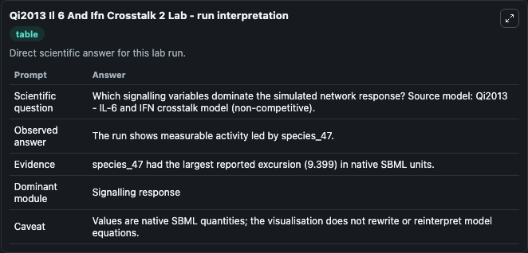
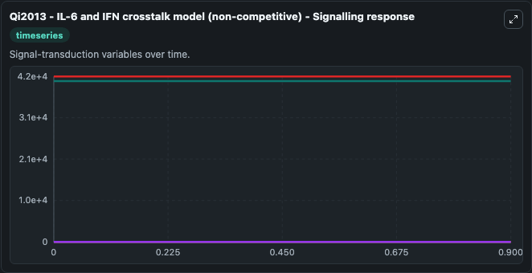
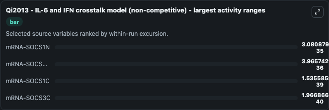
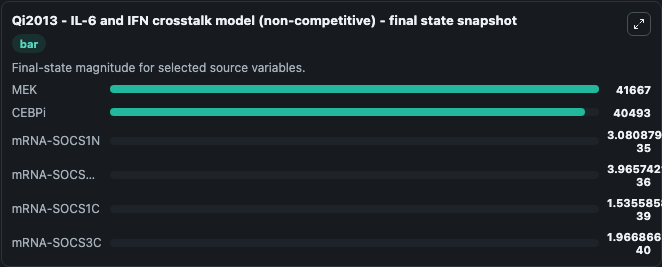
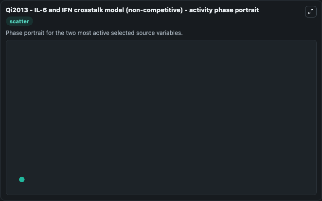

# Qi2013 Il 6 And Ifn Crosstalk 2

This Biosimulant lab wraps `Qi2013 Il 6 And Ifn Crosstalk 2` as a runnable systems biology model with a companion visualization module.
Qi2013 - IL-6 and IFN crosstalk model(non-competitive) This model [BIOMD0000000543] describes the crosstalk between IFN-gamma and IL-6 inducedsignalling; it aims to outline mechanisms and factors that. It can be used to explore the configured dynamics and compare scenario outcomes across configurations.

## What You'll See

The lab asks: Which signalling variables dominate the simulated network response? Source model: Qi2013 - IL-6 and IFN crosstalk model (non-competitive). It runs for 1.0 time units with a communication step of 0.1. The run uses the model defaults declared by the curated SBML wrapper. The generated visualizations focus on mRNA-SOCS3N, mRNA-SOCS3C, mRNA-SOCS1N, mRNA-SOCS1C, MEK, and CEBPi, combining trajectory, endpoint-comparison, and summary-table views from one completed dark-mode run.

In this captured run, **mRNA-SOCS1N** moved from 0 to 3.08e-35 across 1.0 simulation windows.


### Output Visualizations



*Summary table for Qi2013 Il 6 And Ifn Crosstalk 2, reporting the scientific question, observed answer, dominant module, and caveat.*



*Trajectories of mRNA-SOCS1N, mRNA-SOCS3N, mRNA-SOCS1C, mRNA-SOCS3C, MEK, and CEBPi across the 1.0 simulation. In this run **mRNA-SOCS1N** climbed from 0 to 3.08e-35 — the largest movements among the focused observables.*



*Largest-excursion ranking of the focused observables — the absolute movement magnitude during the run. Top 3: **mRNA-SOCS1N** = 3.08e-35, **mRNA-SOCS3N** = 3.97e-36, **mRNA-SOCS1C** = 1.54e-39, with 1 more observable below.*



*Endpoint snapshot of the focused observables — final values from the captured run. Top 3 by value: **MEK** = 4.17e+04, **CEBPi** = 4.05e+04, **mRNA-SOCS1N** = 3.08e-35, with 3 more observables below.*



*Visualization card from the Qi2013 Il 6 And Ifn Crosstalk 2 dark-mode run.*


## Model Context

- Core model: `models/core`
- Visualization model: `models/visualisation`
- Standard: `other`
- Upstream source: `biomodels_ebi:BIOMD0000000543`
- License: `CC0`

## Inputs

| Input | Maps To | Default | Notes |
|---|---|---|---|
| Initial MRNA Socs3 N | `systemsbiology_sbml_qi2013_il_6_and_ifn_crosstalk_model_non_competit_biomd0000000543_model.initial_mrna_socs3_n` | | Source state initial condition exposed as a model-specific control because no explicit intervention parameter is identifiable. Maps to SBML symbol `species_30`. |
| Initial MRNA Socs3 C | `systemsbiology_sbml_qi2013_il_6_and_ifn_crosstalk_model_non_competit_biomd0000000543_model.initial_mrna_socs3_c` | | Source state initial condition exposed as a model-specific control because no explicit intervention parameter is identifiable. Maps to SBML symbol `species_31`. |
| Initial MRNA Socs1 N | `systemsbiology_sbml_qi2013_il_6_and_ifn_crosstalk_model_non_competit_biomd0000000543_model.initial_mrna_socs1_n` | | Source state initial condition exposed as a model-specific control because no explicit intervention parameter is identifiable. Maps to SBML symbol `species_97`. |
| Initial MRNA Socs1 C | `systemsbiology_sbml_qi2013_il_6_and_ifn_crosstalk_model_non_competit_biomd0000000543_model.initial_mrna_socs1_c` | | Source state initial condition exposed as a model-specific control because no explicit intervention parameter is identifiable. Maps to SBML symbol `species_98`. |
| Initial Model State Mek | `systemsbiology_sbml_qi2013_il_6_and_ifn_crosstalk_model_non_competit_biomd0000000543_model.initial_model_state_mek` | | Source state initial condition exposed as a model-specific control because no explicit intervention parameter is identifiable. Maps to SBML symbol `species_51`. |
| Initial Ceb Pi | `systemsbiology_sbml_qi2013_il_6_and_ifn_crosstalk_model_non_competit_biomd0000000543_model.initial_ceb_pi` | | Source state initial condition exposed as a model-specific control because no explicit intervention parameter is identifiable. Maps to SBML symbol `species_74`. |

## Outputs

| Output | Maps To | Role |
|---|---|---|
| `state` | `systemsbiology_sbml_qi2013_il_6_and_ifn_crosstalk_model_non_competit_biomd0000000543_model.state` | Available to the visualization model and downstream workflows. |
| `summary` | `systemsbiology_sbml_qi2013_il_6_and_ifn_crosstalk_model_non_competit_biomd0000000543_model.summary` | Available to the visualization model and downstream workflows. |
| `species_labels` | `systemsbiology_sbml_qi2013_il_6_and_ifn_crosstalk_model_non_competit_biomd0000000543_model.species_labels` | Available to the visualization model and downstream workflows. |
| `mrna_socs3_n` | `systemsbiology_sbml_qi2013_il_6_and_ifn_crosstalk_model_non_competit_biomd0000000543_model.mrna_socs3_n` | Available to the visualization model and downstream workflows. |
| `mrna_socs3_c` | `systemsbiology_sbml_qi2013_il_6_and_ifn_crosstalk_model_non_competit_biomd0000000543_model.mrna_socs3_c` | Available to the visualization model and downstream workflows. |
| `mrna_socs1_n` | `systemsbiology_sbml_qi2013_il_6_and_ifn_crosstalk_model_non_competit_biomd0000000543_model.mrna_socs1_n` | Available to the visualization model and downstream workflows. |
| `mrna_socs1_c` | `systemsbiology_sbml_qi2013_il_6_and_ifn_crosstalk_model_non_competit_biomd0000000543_model.mrna_socs1_c` | Available to the visualization model and downstream workflows. |
| `mek` | `systemsbiology_sbml_qi2013_il_6_and_ifn_crosstalk_model_non_competit_biomd0000000543_model.mek` | Available to the visualization model and downstream workflows. |
| `ceb_pi` | `systemsbiology_sbml_qi2013_il_6_and_ifn_crosstalk_model_non_competit_biomd0000000543_model.ceb_pi` | Available to the visualization model and downstream workflows. |

## Runtime

- Duration: `1.0`
- Communication step: `0.1`

## Running Locally

```bash
biosimulant labs serve
```
