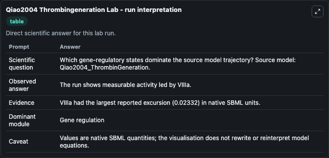
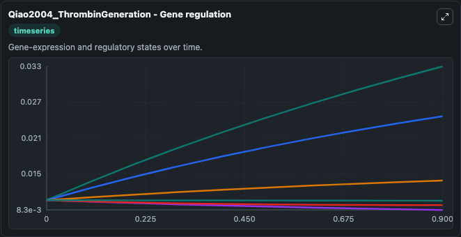
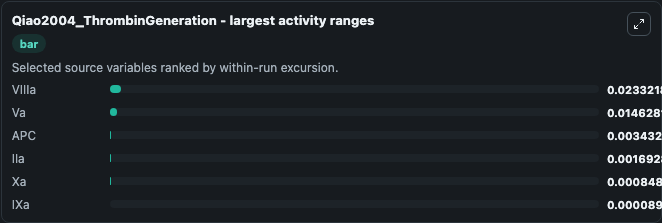
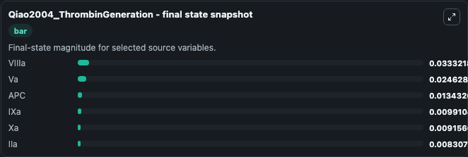
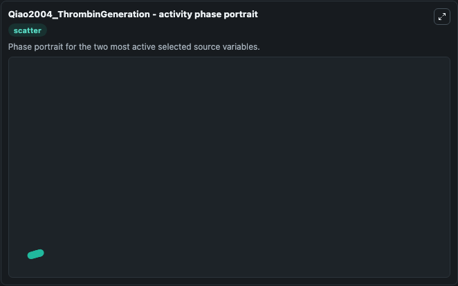

# Qiao2004 Thrombingeneration

This Biosimulant lab wraps `Qiao2004 Thrombingeneration` as a runnable systems biology model with a companion visualization module.
This model originates from BioModels Database: A Database of Annotated Published Models (http://www.ebi.ac.uk/biomodels/). It can be used to explore the configured dynamics and compare scenario outcomes across configurations.

## What You'll See

The lab asks: Which gene-regulatory states dominate the source model trajectory? Source model: Qiao2004_ThrombinGeneration. It runs for 1.0 time units with a communication step of 0.1. The run uses the model defaults declared by the curated SBML wrapper. The generated visualizations focus on Xa, Va, VIIIa, IXa, IIa, and APC, combining trajectory, endpoint-comparison, and summary-table views from one completed dark-mode run.

In this captured run, **VIIIa** moved from 0.0100 to 0.0333 across 1.0 simulation windows.


### Output Visualizations



*Summary table for Qiao2004 Thrombingeneration, reporting the scientific question, observed answer, dominant module, and caveat.*



*Trajectories of VIIIa, Va, APC, IIa, Xa, and IXa across the 1.0 simulation. In this run **VIIIa** climbed from 0.0100 to 0.0333 and **IIa** fell from 0.0100 to 0.00831 — the largest movements among the focused observables.*



*Largest-excursion ranking of the focused observables — the absolute movement magnitude during the run. Top 3: **VIIIa** = 0.0233, **Va** = 0.0146, **APC** = 0.00343, with 3 more observables below.*



*Endpoint snapshot of the focused observables — final values from the captured run. Top 3 by value: **VIIIa** = 0.0333, **Va** = 0.0246, **APC** = 0.0134, with 3 more observables below.*



*Visualization card from the Qiao2004 Thrombingeneration dark-mode run.*


## Model Context

- Core model: `models/core`
- Visualization model: `models/visualisation`
- Standard: `other`
- Upstream source: `biomodels_ebi:MODEL1108260015`
- License: `CC0`

## Inputs

| Input | Maps To | Default | Notes |
|---|---|---|---|
| Initial Model State Xa | `systemsbiology_sbml_qiao2004_thrombingeneration_model1108260015_model.initial_model_state_xa` | | Source state initial condition exposed as a model-specific control because no explicit intervention parameter is identifiable. Maps to SBML symbol `Xa`. |
| Initial Model State Va | `systemsbiology_sbml_qiao2004_thrombingeneration_model1108260015_model.initial_model_state_va` | | Source state initial condition exposed as a model-specific control because no explicit intervention parameter is identifiable. Maps to SBML symbol `Va`. |
| Initial Vii Ia | `systemsbiology_sbml_qiao2004_thrombingeneration_model1108260015_model.initial_vii_ia` | | Source state initial condition exposed as a model-specific control because no explicit intervention parameter is identifiable. Maps to SBML symbol `VIIIa`. |
| Initial I Xa | `systemsbiology_sbml_qiao2004_thrombingeneration_model1108260015_model.initial_i_xa` | | Source state initial condition exposed as a model-specific control because no explicit intervention parameter is identifiable. Maps to SBML symbol `IXa`. |
| Initial I Ia | `systemsbiology_sbml_qiao2004_thrombingeneration_model1108260015_model.initial_i_ia` | | Source state initial condition exposed as a model-specific control because no explicit intervention parameter is identifiable. Maps to SBML symbol `IIa`. |
| Initial Model State Apc | `systemsbiology_sbml_qiao2004_thrombingeneration_model1108260015_model.initial_model_state_apc` | | Source state initial condition exposed as a model-specific control because no explicit intervention parameter is identifiable. Maps to SBML symbol `APC`. |

## Outputs

| Output | Maps To | Role |
|---|---|---|
| `state` | `systemsbiology_sbml_qiao2004_thrombingeneration_model1108260015_model.state` | Available to the visualization model and downstream workflows. |
| `summary` | `systemsbiology_sbml_qiao2004_thrombingeneration_model1108260015_model.summary` | Available to the visualization model and downstream workflows. |
| `species_labels` | `systemsbiology_sbml_qiao2004_thrombingeneration_model1108260015_model.species_labels` | Available to the visualization model and downstream workflows. |
| `model_state_xa` | `systemsbiology_sbml_qiao2004_thrombingeneration_model1108260015_model.model_state_xa` | Available to the visualization model and downstream workflows. |
| `model_state_va` | `systemsbiology_sbml_qiao2004_thrombingeneration_model1108260015_model.model_state_va` | Available to the visualization model and downstream workflows. |
| `vii_ia` | `systemsbiology_sbml_qiao2004_thrombingeneration_model1108260015_model.vii_ia` | Available to the visualization model and downstream workflows. |
| `i_xa` | `systemsbiology_sbml_qiao2004_thrombingeneration_model1108260015_model.i_xa` | Available to the visualization model and downstream workflows. |
| `i_ia` | `systemsbiology_sbml_qiao2004_thrombingeneration_model1108260015_model.i_ia` | Available to the visualization model and downstream workflows. |
| `apc` | `systemsbiology_sbml_qiao2004_thrombingeneration_model1108260015_model.apc` | Available to the visualization model and downstream workflows. |

## Runtime

- Duration: `1.0`
- Communication step: `0.1`

## Running Locally

```bash
biosimulant labs serve
```
