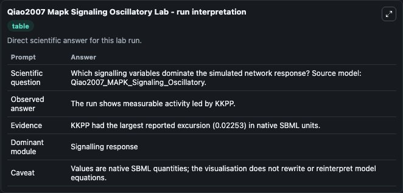
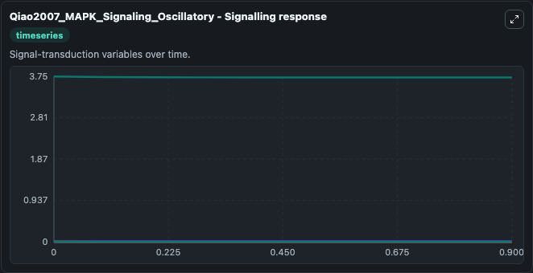
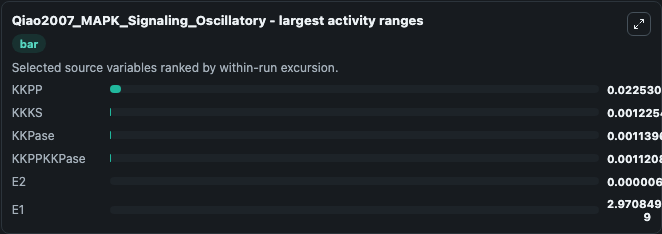
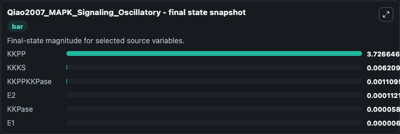
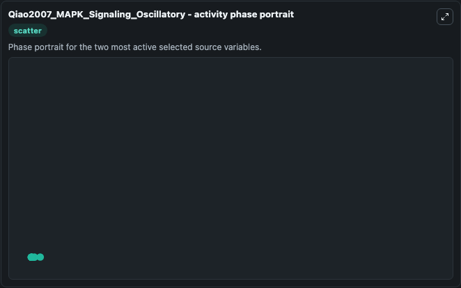

# Qiao2007 Mapk Signaling Oscillatory

This Biosimulant lab wraps `Qiao2007 Mapk Signaling Oscillatory` as a runnable systems biology model with a companion visualization module.
This model originates from BioModels Database: A Database of Annotated Published Models (http://www.ebi.ac.uk/biomodels/). It can be used to explore the configured dynamics and compare scenario outcomes across configurations.

## What You'll See

The lab asks: Which signalling variables dominate the simulated network response? Source model: Qiao2007_MAPK_Signaling_Oscillatory. It runs for 1.0 time units with a communication step of 0.1. The run uses the model defaults declared by the curated SBML wrapper. The generated visualizations focus on KKPP, KKKS, KKPase, E2, E1, and KKPPKKPase, combining trajectory, endpoint-comparison, and summary-table views from one completed dark-mode run.

In this captured run, **KKPP** moved from 3.749 to 3.727 across 1.0 simulation windows.


### Output Visualizations



*Summary table for Qiao2007 Mapk Signaling Oscillatory, reporting the scientific question, observed answer, dominant module, and caveat.*



*Trajectories of KKPP, KKKS, KKPase, KKPPKKPase, E2, and E1 across the 1.0 simulation. In this run **KKPPKKPase** climbed from 0 to 0.00111 and **KKPP** fell from 3.749 to 3.727 — the largest movements among the focused observables.*



*Largest-excursion ranking of the focused observables — the absolute movement magnitude during the run. Top 3: **KKPP** = 0.0225, **KKKS** = 0.00123, **KKPase** = 0.00114, with 3 more observables below.*



*Endpoint snapshot of the focused observables — final values from the captured run. Top 3 by value: **KKPP** = 3.727, **KKKS** = 0.00621, **KKPPKKPase** = 0.00111, with 3 more observables below.*



*Visualization card from the Qiao2007 Mapk Signaling Oscillatory dark-mode run.*


## Model Context

- Core model: `models/core`
- Visualization model: `models/visualisation`
- Standard: `other`
- Upstream source: `biomodels_ebi:MODEL6185746832`
- License: `CC0`

## Inputs

| Input | Maps To | Default | Notes |
|---|---|---|---|
| Initial Kkpp | `systemsbiology_sbml_qiao2007_mapk_signaling_oscillatory_model6185746832_model.initial_kkpp` | | Source state initial condition exposed as a model-specific control because no explicit intervention parameter is identifiable. Maps to SBML symbol `KKPP`. |
| Initial Kkks | `systemsbiology_sbml_qiao2007_mapk_signaling_oscillatory_model6185746832_model.initial_kkks` | | Source state initial condition exposed as a model-specific control because no explicit intervention parameter is identifiable. Maps to SBML symbol `KKKS`. |
| Initial Kk Pase | `systemsbiology_sbml_qiao2007_mapk_signaling_oscillatory_model6185746832_model.initial_kk_pase` | | Source state initial condition exposed as a model-specific control because no explicit intervention parameter is identifiable. Maps to SBML symbol `KKPase`. |
| Initial Model State E2 | `systemsbiology_sbml_qiao2007_mapk_signaling_oscillatory_model6185746832_model.initial_model_state_e2` | | Source state initial condition exposed as a model-specific control because no explicit intervention parameter is identifiable. Maps to SBML symbol `E2`. |
| Initial Model State E1 | `systemsbiology_sbml_qiao2007_mapk_signaling_oscillatory_model6185746832_model.initial_model_state_e1` | | Source state initial condition exposed as a model-specific control because no explicit intervention parameter is identifiable. Maps to SBML symbol `E1`. |
| Initial Kkppkk Pase | `systemsbiology_sbml_qiao2007_mapk_signaling_oscillatory_model6185746832_model.initial_kkppkk_pase` | | Source state initial condition exposed as a model-specific control because no explicit intervention parameter is identifiable. Maps to SBML symbol `KKPPKKPase`. |

## Outputs

| Output | Maps To | Role |
|---|---|---|
| `state` | `systemsbiology_sbml_qiao2007_mapk_signaling_oscillatory_model6185746832_model.state` | Available to the visualization model and downstream workflows. |
| `summary` | `systemsbiology_sbml_qiao2007_mapk_signaling_oscillatory_model6185746832_model.summary` | Available to the visualization model and downstream workflows. |
| `species_labels` | `systemsbiology_sbml_qiao2007_mapk_signaling_oscillatory_model6185746832_model.species_labels` | Available to the visualization model and downstream workflows. |
| `kkpp` | `systemsbiology_sbml_qiao2007_mapk_signaling_oscillatory_model6185746832_model.kkpp` | Available to the visualization model and downstream workflows. |
| `kkks` | `systemsbiology_sbml_qiao2007_mapk_signaling_oscillatory_model6185746832_model.kkks` | Available to the visualization model and downstream workflows. |
| `kk_pase` | `systemsbiology_sbml_qiao2007_mapk_signaling_oscillatory_model6185746832_model.kk_pase` | Available to the visualization model and downstream workflows. |
| `model_state_e2` | `systemsbiology_sbml_qiao2007_mapk_signaling_oscillatory_model6185746832_model.model_state_e2` | Available to the visualization model and downstream workflows. |
| `model_state_e1` | `systemsbiology_sbml_qiao2007_mapk_signaling_oscillatory_model6185746832_model.model_state_e1` | Available to the visualization model and downstream workflows. |
| `kkppkk_pase` | `systemsbiology_sbml_qiao2007_mapk_signaling_oscillatory_model6185746832_model.kkppkk_pase` | Available to the visualization model and downstream workflows. |

## Runtime

- Duration: `1.0`
- Communication step: `0.1`

## Running Locally

```bash
biosimulant labs serve
```
