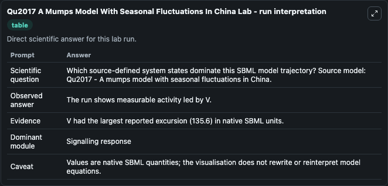
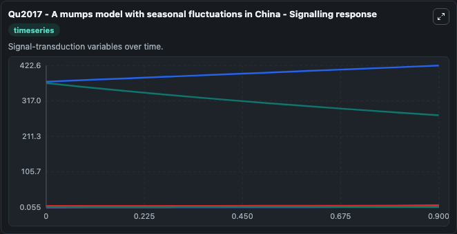
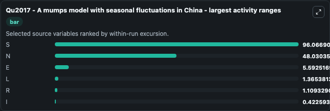
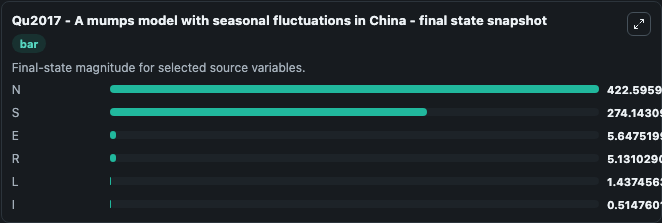
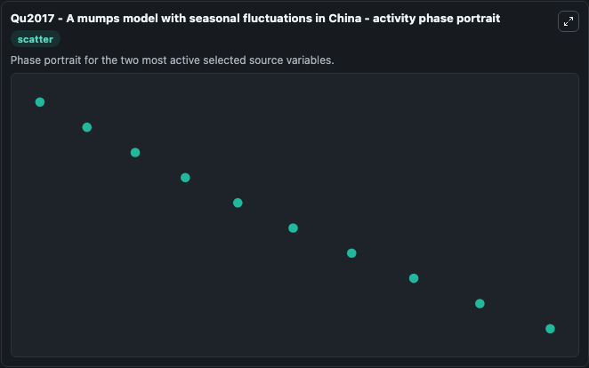

# Qu2017 A Mumps Model With Seasonal Fluctuations In China

This Biosimulant lab wraps `Qu2017 A Mumps Model With Seasonal Fluctuations In China` as a runnable systems biology model with a companion visualization module.
Systems Biology Qu2017AMumps Model With Seasonal Fluctuations Model1808280011Model represents core biological mechanisms from biomodels_ebi reference biomodels_ebi:MODEL1808280011. It can be used to explore the configured dynamics and compare scenario outcomes across configurations.

## What You'll See

The lab asks: Which source-defined system states dominate this SBML model trajectory? Source model: Qu2017 - A mumps model with seasonal fluctuations in China. It runs for 1.0 time units with a communication step of 0.1. The run uses the model defaults declared by the curated SBML wrapper. The generated visualizations focus on N, S, R, I, L, and E, combining trajectory, endpoint-comparison, and summary-table views from one completed dark-mode run.

In this captured run, **S** moved from 370.2 to 274.1 across 1.0 simulation windows.


### Output Visualizations



*Summary table for Qu2017 A Mumps Model With Seasonal Fluctuations In China, reporting the scientific question, observed answer, dominant module, and caveat.*



*Trajectories of S, N, E, L, R, and I across the 1.0 simulation. In this run **N** climbed from 374.6 to 422.6 and **S** fell from 370.2 to 274.1 — the largest movements among the focused observables.*



*Largest-excursion ranking of the focused observables — the absolute movement magnitude during the run. Top 3: **S** = 96.067, **N** = 48.030, **E** = 5.593, with 3 more observables below.*



*Endpoint snapshot of the focused observables — final values from the captured run. Top 3 by value: **N** = 422.6, **S** = 274.1, **E** = 5.648, with 3 more observables below.*



*Visualization card from the Qu2017 A Mumps Model With Seasonal Fluctuations In China dark-mode run.*


## Model Context

- Core model: `models/core`
- Visualization model: `models/visualisation`
- Standard: `other`
- Upstream source: `biomodels_ebi:MODEL1808280011`
- License: `CC0`

## Inputs

| Input | Maps To | Default | Notes |
|---|---|---|---|
| Initial Model State N | `systemsbiology_sbml_qu2017_a_mumps_model_with_seasonal_fluctuations_model1808280011_model.initial_model_state_n` | | Source state initial condition exposed as a model-specific control because no explicit intervention parameter is identifiable. Maps to SBML symbol `N`. |
| Initial Model State S | `systemsbiology_sbml_qu2017_a_mumps_model_with_seasonal_fluctuations_model1808280011_model.initial_model_state_s` | | Source state initial condition exposed as a model-specific control because no explicit intervention parameter is identifiable. Maps to SBML symbol `S`. |
| Initial Model State R | `systemsbiology_sbml_qu2017_a_mumps_model_with_seasonal_fluctuations_model1808280011_model.initial_model_state_r` | | Source state initial condition exposed as a model-specific control because no explicit intervention parameter is identifiable. Maps to SBML symbol `R`. |
| Initial Model State I | `systemsbiology_sbml_qu2017_a_mumps_model_with_seasonal_fluctuations_model1808280011_model.initial_model_state_i` | | Source state initial condition exposed as a model-specific control because no explicit intervention parameter is identifiable. Maps to SBML symbol `I`. |
| Initial Model State L | `systemsbiology_sbml_qu2017_a_mumps_model_with_seasonal_fluctuations_model1808280011_model.initial_model_state_l` | | Source state initial condition exposed as a model-specific control because no explicit intervention parameter is identifiable. Maps to SBML symbol `L`. |
| Initial Model State E | `systemsbiology_sbml_qu2017_a_mumps_model_with_seasonal_fluctuations_model1808280011_model.initial_model_state_e` | | Source state initial condition exposed as a model-specific control because no explicit intervention parameter is identifiable. Maps to SBML symbol `E`. |

## Outputs

| Output | Maps To | Role |
|---|---|---|
| `state` | `systemsbiology_sbml_qu2017_a_mumps_model_with_seasonal_fluctuations_model1808280011_model.state` | Available to the visualization model and downstream workflows. |
| `summary` | `systemsbiology_sbml_qu2017_a_mumps_model_with_seasonal_fluctuations_model1808280011_model.summary` | Available to the visualization model and downstream workflows. |
| `species_labels` | `systemsbiology_sbml_qu2017_a_mumps_model_with_seasonal_fluctuations_model1808280011_model.species_labels` | Available to the visualization model and downstream workflows. |
| `model_state_n` | `systemsbiology_sbml_qu2017_a_mumps_model_with_seasonal_fluctuations_model1808280011_model.model_state_n` | Available to the visualization model and downstream workflows. |
| `model_state_s` | `systemsbiology_sbml_qu2017_a_mumps_model_with_seasonal_fluctuations_model1808280011_model.model_state_s` | Available to the visualization model and downstream workflows. |
| `model_state_r` | `systemsbiology_sbml_qu2017_a_mumps_model_with_seasonal_fluctuations_model1808280011_model.model_state_r` | Available to the visualization model and downstream workflows. |
| `model_state_i` | `systemsbiology_sbml_qu2017_a_mumps_model_with_seasonal_fluctuations_model1808280011_model.model_state_i` | Available to the visualization model and downstream workflows. |
| `model_state_l` | `systemsbiology_sbml_qu2017_a_mumps_model_with_seasonal_fluctuations_model1808280011_model.model_state_l` | Available to the visualization model and downstream workflows. |
| `model_state_e` | `systemsbiology_sbml_qu2017_a_mumps_model_with_seasonal_fluctuations_model1808280011_model.model_state_e` | Available to the visualization model and downstream workflows. |

## Runtime

- Duration: `1.0`
- Communication step: `0.1`

## Running Locally

```bash
biosimulant labs serve
```
