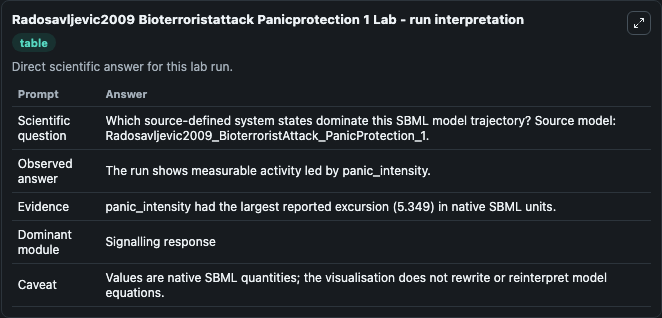
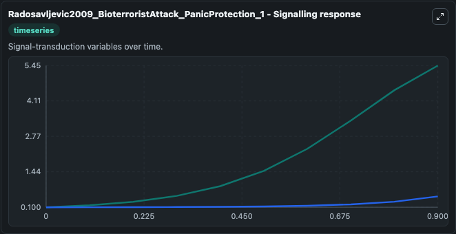
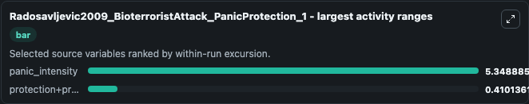
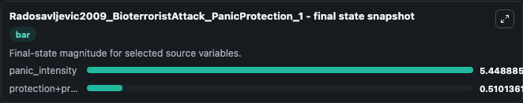
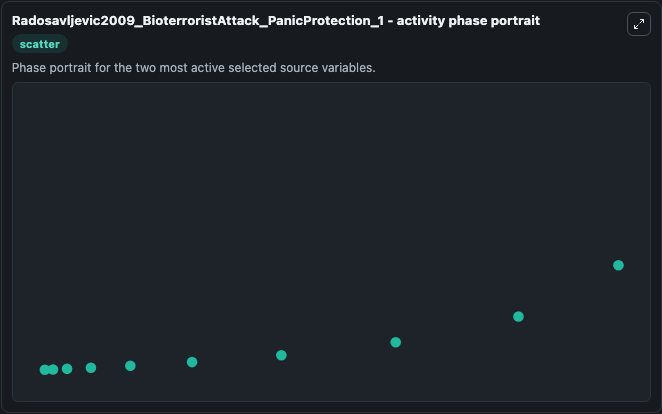

# Radosavljevic2009 Bioterroristattack Panicprotection 1

This Biosimulant lab wraps `Radosavljevic2009 Bioterroristattack Panicprotection 1` as a runnable systems biology model with a companion visualization module.
This model is from the article: Epidemics of panic during a bioterrorist attack--a mathematical model. It can be used to explore the configured dynamics and compare scenario outcomes across configurations.

## What You'll See

The lab asks: Which source-defined system states dominate this SBML model trajectory? Source model: Radosavljevic2009_BioterroristAttack_PanicProtection_1. It runs for 1.0 time units with a communication step of 0.1. The run uses the model defaults declared by the curated SBML wrapper. The generated visualizations focus on protection+prevention_intensity, and panic_intensity, combining trajectory, endpoint-comparison, and summary-table views from one completed dark-mode run.

In this captured run, **panic_intensity** moved from 0.1000 to 5.449 across 1.0 simulation windows.


### Output Visualizations



*Summary table for Radosavljevic2009 Bioterroristattack Panicprotection 1, reporting the scientific question, observed answer, dominant module, and caveat.*



*Trajectories of panic_intensity, and protection+prevention_intensity across the 1.0 simulation. In this run **panic_intensity** climbed from 0.1000 to 5.449 — the largest movements among the focused observables.*



*Largest-excursion ranking of the focused observables — the absolute movement magnitude during the run. Top 2: **panic_intensity** = 5.349, **protection+prevention_intensity** = 0.4101.*



*Endpoint snapshot of the focused observables — final values from the captured run. Top 2 by value: **panic_intensity** = 5.449, **protection+prevention_intensity** = 0.5101.*



*Visualization card from the Radosavljevic2009 Bioterroristattack Panicprotection 1 dark-mode run.*


## Model Context

- Core model: `models/core`
- Visualization model: `models/visualisation`
- Standard: `other`
- Upstream source: `biomodels_ebi:BIOMD0000000836`
- License: `CC0`

## Inputs

| Input | Maps To | Default | Notes |
|---|---|---|---|
| Initial Protection Prevention Intensity | `systemsbiology_sbml_radosavljevic2009_bioterroristattack_panicprotec_biomd0000000836_model.initial_protection_prevention_intensity` | | Source state initial condition exposed as a model-specific control because no explicit intervention parameter is identifiable. Maps to SBML symbol `P`. |
| Initial Panic Intensity | `systemsbiology_sbml_radosavljevic2009_bioterroristattack_panicprotec_biomd0000000836_model.initial_panic_intensity` | | Source state initial condition exposed as a model-specific control because no explicit intervention parameter is identifiable. Maps to SBML symbol `S`. |

## Outputs

| Output | Maps To | Role |
|---|---|---|
| `state` | `systemsbiology_sbml_radosavljevic2009_bioterroristattack_panicprotec_biomd0000000836_model.state` | Available to the visualization model and downstream workflows. |
| `summary` | `systemsbiology_sbml_radosavljevic2009_bioterroristattack_panicprotec_biomd0000000836_model.summary` | Available to the visualization model and downstream workflows. |
| `species_labels` | `systemsbiology_sbml_radosavljevic2009_bioterroristattack_panicprotec_biomd0000000836_model.species_labels` | Available to the visualization model and downstream workflows. |
| `protection_prevention_intensity` | `systemsbiology_sbml_radosavljevic2009_bioterroristattack_panicprotec_biomd0000000836_model.protection_prevention_intensity` | Available to the visualization model and downstream workflows. |
| `panic_intensity` | `systemsbiology_sbml_radosavljevic2009_bioterroristattack_panicprotec_biomd0000000836_model.panic_intensity` | Available to the visualization model and downstream workflows. |

## Runtime

- Duration: `1.0`
- Communication step: `0.1`

## Running Locally

```bash
biosimulant labs serve
```
