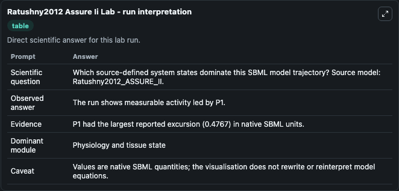
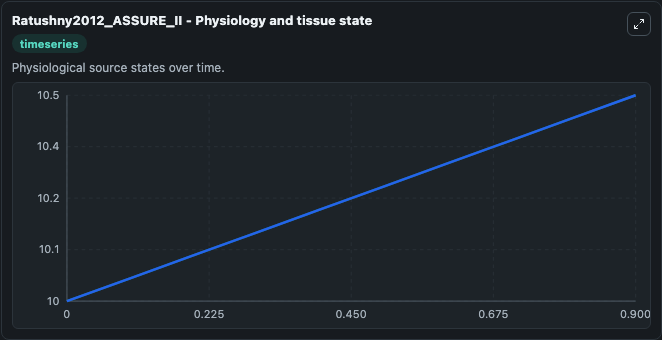
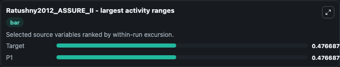
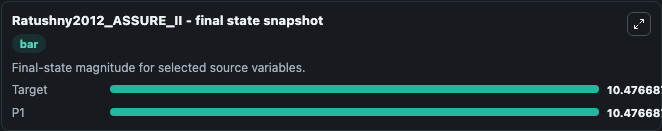
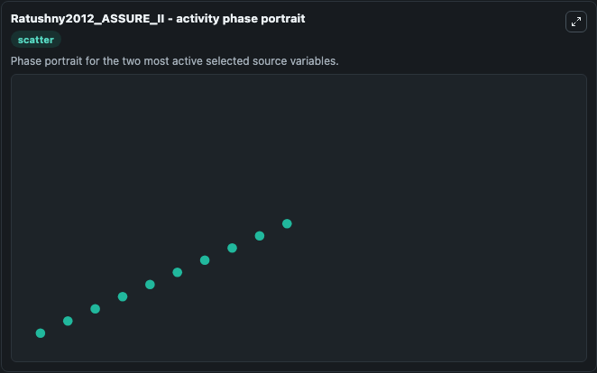

# Ratushny2012 Assure Ii

This Biosimulant lab wraps `Ratushny2012 Assure Ii` as a runnable systems biology model with a companion visualization module.
This model is from the article: Asymmetric positive feedback loops reliably control biological responses Alexander V Ratushny, Ramsey A Saleem, Katherine Sitko, Stephen A Ramsey & John D Aitchison. It can be used to explore the configured dynamics and compare scenario outcomes across configurations.

## What You'll See

The lab asks: Which source-defined system states dominate this SBML model trajectory? Source model: Ratushny2012_ASSURE_II. It runs for 1.0 time units with a communication step of 0.1. The run uses the model defaults declared by the curated SBML wrapper. The generated visualizations focus on Target, and P1, combining trajectory, endpoint-comparison, and summary-table views from one completed dark-mode run.

In this captured run, **Target** moved from 10.000 to 10.477 across 1.0 simulation windows.


### Output Visualizations



*Summary table for Ratushny2012 Assure Ii, reporting the scientific question, observed answer, dominant module, and caveat.*



*Trajectories of Target, and P1 across the 1.0 simulation. In this run **Target** climbed from 10.000 to 10.477 — the largest movements among the focused observables.*



*Largest-excursion ranking of the focused observables — the absolute movement magnitude during the run. Top 2: **Target** = 0.4767, **P1** = 0.4767.*



*Endpoint snapshot of the focused observables — final values from the captured run. Top 2 by value: **Target** = 10.477, **P1** = 10.477.*



*Visualization card from the Ratushny2012 Assure Ii dark-mode run.*


## Model Context

- Core model: `models/core`
- Visualization model: `models/visualisation`
- Standard: `other`
- Upstream source: `biomodels_ebi:BIOMD0000000421`
- License: `CC0`

## Inputs

| Input | Maps To | Default | Notes |
|---|---|---|---|
| Initial Target | `systemsbiology_sbml_ratushny2012_assure_ii_biomd0000000421_model.initial_target` | | Source state initial condition exposed as a model-specific control because no explicit intervention parameter is identifiable. Maps to SBML symbol `Target`. |
| Initial Model State P1 | `systemsbiology_sbml_ratushny2012_assure_ii_biomd0000000421_model.initial_model_state_p1` | | Source state initial condition exposed as a model-specific control because no explicit intervention parameter is identifiable. Maps to SBML symbol `P1`. |

## Outputs

| Output | Maps To | Role |
|---|---|---|
| `state` | `systemsbiology_sbml_ratushny2012_assure_ii_biomd0000000421_model.state` | Available to the visualization model and downstream workflows. |
| `summary` | `systemsbiology_sbml_ratushny2012_assure_ii_biomd0000000421_model.summary` | Available to the visualization model and downstream workflows. |
| `species_labels` | `systemsbiology_sbml_ratushny2012_assure_ii_biomd0000000421_model.species_labels` | Available to the visualization model and downstream workflows. |
| `target` | `systemsbiology_sbml_ratushny2012_assure_ii_biomd0000000421_model.target` | Available to the visualization model and downstream workflows. |
| `model_state_p1` | `systemsbiology_sbml_ratushny2012_assure_ii_biomd0000000421_model.model_state_p1` | Available to the visualization model and downstream workflows. |

## Runtime

- Duration: `1.0`
- Communication step: `0.1`

## Running Locally

```bash
biosimulant labs serve
```
