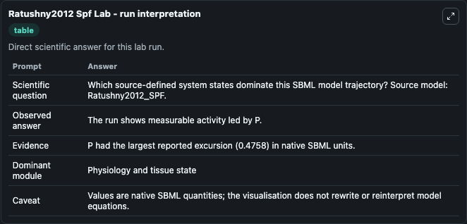
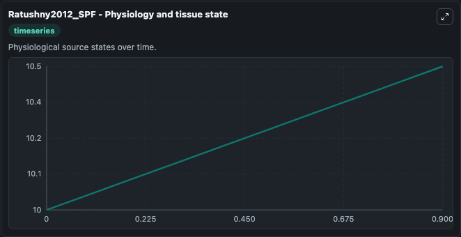
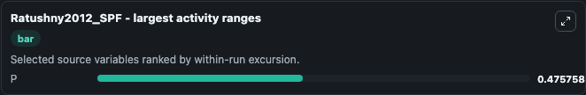

# Ratushny2012 Spf

This Biosimulant lab wraps `Ratushny2012 Spf` as a runnable systems biology model with a companion visualization module.
This model is from the article: Asymmetric positive feedback loops reliably control biological responses Alexander V Ratushny, Ramsey A Saleem, Katherine Sitko, Stephen A Ramsey & John D Aitchison. It can be used to explore the configured dynamics and compare scenario outcomes across configurations.

## What You'll See

The lab asks: Which source-defined system states dominate this SBML model trajectory? Source model: Ratushny2012_SPF. It runs for 1.0 time units with a communication step of 0.1. The run uses the model defaults declared by the curated SBML wrapper. The generated visualizations focus on P, combining trajectory, endpoint-comparison, and summary-table views from one completed dark-mode run.

In this captured run, **P** moved from 10.000 to 10.476 across 1.0 simulation windows.


### Output Visualizations



*Summary table for Ratushny2012 Spf, reporting the scientific question, observed answer, dominant module, and caveat.*



*Trajectories of P across the 1.0 simulation. In this run **P** climbed from 10.000 to 10.476 — the largest movements among the focused observables.*



*Largest-excursion ranking of the focused observables — the absolute movement magnitude during the run. Top 1: **P** = 0.4758.*


*Endpoint snapshot of the focused observables — final values from the captured run. Top 1 by value: **P** = 10.476.*


## Model Context

- Core model: `models/core`
- Visualization model: `models/visualisation`
- Standard: `other`
- Upstream source: `biomodels_ebi:BIOMD0000000418`
- License: `CC0`

## Inputs

| Input | Maps To | Default | Notes |
|---|---|---|---|
| Initial Model State P | `systemsbiology_sbml_ratushny2012_spf_biomd0000000418_model.initial_model_state_p` | | Source state initial condition exposed as a model-specific control because no explicit intervention parameter is identifiable. Maps to SBML symbol `P`. |

## Outputs

| Output | Maps To | Role |
|---|---|---|
| `state` | `systemsbiology_sbml_ratushny2012_spf_biomd0000000418_model.state` | Available to the visualization model and downstream workflows. |
| `summary` | `systemsbiology_sbml_ratushny2012_spf_biomd0000000418_model.summary` | Available to the visualization model and downstream workflows. |
| `species_labels` | `systemsbiology_sbml_ratushny2012_spf_biomd0000000418_model.species_labels` | Available to the visualization model and downstream workflows. |
| `model_state_p` | `systemsbiology_sbml_ratushny2012_spf_biomd0000000418_model.model_state_p` | Available to the visualization model and downstream workflows. |

## Runtime

- Duration: `1.0`
- Communication step: `0.1`

## Running Locally

```bash
biosimulant labs serve
```
