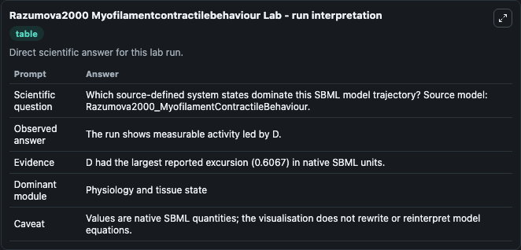
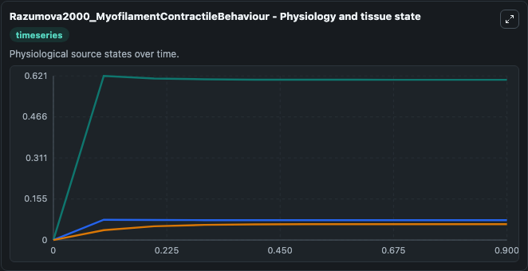
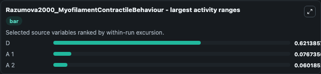
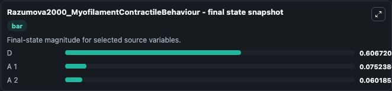
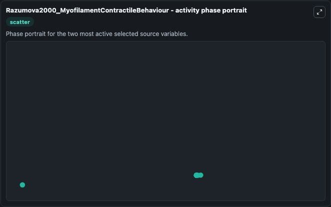

# Razumova2000 Myofilamentcontractilebehaviour

This Biosimulant lab wraps `Razumova2000 Myofilamentcontractilebehaviour` as a runnable systems biology model with a companion visualization module.
This a model from the article: Different myofilament nearest-neighbor interactions have distinctive effects on contractile behavior. It can be used to explore the configured dynamics and compare scenario outcomes across configurations.

## What You'll See

The lab asks: Which source-defined system states dominate this SBML model trajectory? Source model: Razumova2000_MyofilamentContractileBehaviour. It runs for 1.0 time units with a communication step of 0.1. The run uses the model defaults declared by the curated SBML wrapper. The generated visualizations focus on A 2, A 1, and D, combining trajectory, endpoint-comparison, and summary-table views from one completed dark-mode run.

In this captured run, **D** moved from 0 to 0.6067 across 1.0 simulation windows.


### Output Visualizations



*Summary table for Razumova2000 Myofilamentcontractilebehaviour, reporting the scientific question, observed answer, dominant module, and caveat.*



*Trajectories of D, A 1, and A 2 across the 1.0 simulation. In this run **D** climbed from 0 to 0.6067 — the largest movements among the focused observables.*



*Largest-excursion ranking of the focused observables — the absolute movement magnitude during the run. Top 3: **D** = 0.6214, **A 1** = 0.0767, **A 2** = 0.0602.*



*Endpoint snapshot of the focused observables — final values from the captured run. Top 3 by value: **D** = 0.6067, **A 1** = 0.0752, **A 2** = 0.0602.*



*Visualization card from the Razumova2000 Myofilamentcontractilebehaviour dark-mode run.*


## Model Context

- Core model: `models/core`
- Visualization model: `models/visualisation`
- Standard: `other`
- Upstream source: `biomodels_ebi:MODEL7909395757`
- License: `CC0`

## Inputs

| Input | Maps To | Default | Notes |
|---|---|---|---|
| Initial Model State A 2 | `systemsbiology_sbml_razumova2000_myofilamentcontractilebehaviour_model7909395757_model.initial_model_state_a_2` | | Source state initial condition exposed as a model-specific control because no explicit intervention parameter is identifiable. Maps to SBML symbol `A_2`. |
| Initial Model State A 1 | `systemsbiology_sbml_razumova2000_myofilamentcontractilebehaviour_model7909395757_model.initial_model_state_a_1` | | Source state initial condition exposed as a model-specific control because no explicit intervention parameter is identifiable. Maps to SBML symbol `A_1`. |
| Initial Model State D | `systemsbiology_sbml_razumova2000_myofilamentcontractilebehaviour_model7909395757_model.initial_model_state_d` | | Source state initial condition exposed as a model-specific control because no explicit intervention parameter is identifiable. Maps to SBML symbol `D`. |

## Outputs

| Output | Maps To | Role |
|---|---|---|
| `state` | `systemsbiology_sbml_razumova2000_myofilamentcontractilebehaviour_model7909395757_model.state` | Available to the visualization model and downstream workflows. |
| `summary` | `systemsbiology_sbml_razumova2000_myofilamentcontractilebehaviour_model7909395757_model.summary` | Available to the visualization model and downstream workflows. |
| `species_labels` | `systemsbiology_sbml_razumova2000_myofilamentcontractilebehaviour_model7909395757_model.species_labels` | Available to the visualization model and downstream workflows. |
| `a_2` | `systemsbiology_sbml_razumova2000_myofilamentcontractilebehaviour_model7909395757_model.a_2` | Available to the visualization model and downstream workflows. |
| `a_1` | `systemsbiology_sbml_razumova2000_myofilamentcontractilebehaviour_model7909395757_model.a_1` | Available to the visualization model and downstream workflows. |
| `model_state_d` | `systemsbiology_sbml_razumova2000_myofilamentcontractilebehaviour_model7909395757_model.model_state_d` | Available to the visualization model and downstream workflows. |

## Runtime

- Duration: `1.0`
- Communication step: `0.1`

## Running Locally

```bash
biosimulant labs serve
```
