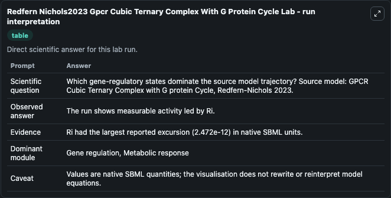
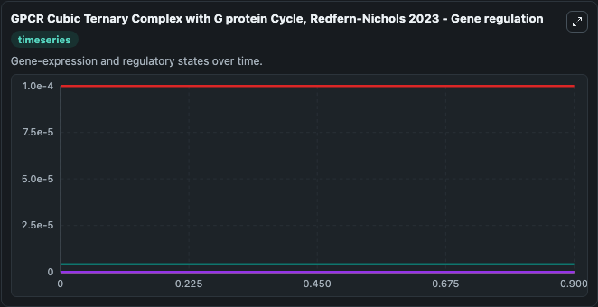
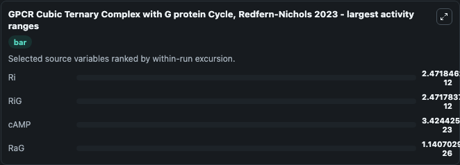
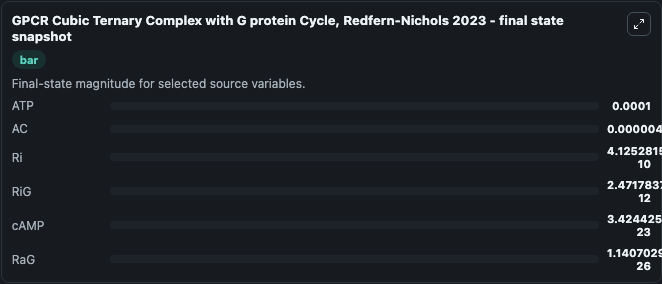
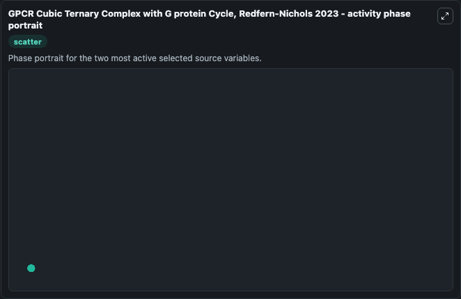

# Redfern Nichols2023 Gpcr Cubic Ternary Complex With G Protein Cycle

This Biosimulant lab wraps `Redfern Nichols2023 Gpcr Cubic Ternary Complex With G Protein Cycle` as a runnable systems biology model with a companion visualization module.
A model of G protein activation using ordinary differential equations. It can be used to explore the configured dynamics and compare scenario outcomes across configurations.

## What You'll See

The lab asks: Which gene-regulatory states dominate the source model trajectory? Source model: GPCR Cubic Ternary Complex with G protein Cycle, Redfern-Nichols 2023. It runs for 1.0 time units with a communication step of 0.1. The run uses the model defaults declared by the curated SBML wrapper. The generated visualizations focus on cAMP, ATP, AC, Ri, RiG, and RaG, combining trajectory, endpoint-comparison, and summary-table views from one completed dark-mode run.

In this captured run, **Ri** moved from 4.15e-10 to 4.13e-10 across 1.0 simulation windows.


### Output Visualizations



*Summary table for Redfern Nichols2023 Gpcr Cubic Ternary Complex With G Protein Cycle, reporting the scientific question, observed answer, dominant module, and caveat.*



*Trajectories of Ri, RiG, cAMP, RaG, ATP, and AC across the 1.0 simulation. In this run **RiG** climbed from 0 to 2.47e-12 and **Ri** fell from 4.15e-10 to 4.13e-10 — the largest movements among the focused observables.*



*Largest-excursion ranking of the focused observables — the absolute movement magnitude during the run. Top 3: **Ri** = 2.47e-12, **RiG** = 2.47e-12, **cAMP** = 3.42e-23, with 1 more observable below.*



*Trajectories of Ri, RiG, cAMP, RaG, ATP, and AC across the 1.0 simulation. In this run **RiG** climbed from 0 to 2.47e-12 and **Ri** fell from 4.15e-10 to 4.13e-10 — the largest movements among the focused observables.*



*Visualization card from the Redfern Nichols2023 Gpcr Cubic Ternary Complex With G Protein Cycle dark-mode run.*


## Model Context

- Core model: `models/core`
- Visualization model: `models/visualisation`
- Standard: `other`
- Upstream source: `biomodels_ebi:MODEL2306220001`
- License: `CC0`

## Inputs

| Input | Maps To | Default | Notes |
|---|---|---|---|
| Event Ligand Applied | `systemsbiology_sbml_gpcr_cubic_ternary_complex_with_g_protein_cycle_model2306220001_model.event_ligand_applied` | | Source parameter exposed because its SBML label indicates a boundary, stimulus, dose, ligand, protocol, substrate, or environmental control. Maps to SBML symbol `Event__Ligand__Applied`. |

## Outputs

| Output | Maps To | Role |
|---|---|---|
| `state` | `systemsbiology_sbml_gpcr_cubic_ternary_complex_with_g_protein_cycle_model2306220001_model.state` | Available to the visualization model and downstream workflows. |
| `summary` | `systemsbiology_sbml_gpcr_cubic_ternary_complex_with_g_protein_cycle_model2306220001_model.summary` | Available to the visualization model and downstream workflows. |
| `species_labels` | `systemsbiology_sbml_gpcr_cubic_ternary_complex_with_g_protein_cycle_model2306220001_model.species_labels` | Available to the visualization model and downstream workflows. |
| `camp` | `systemsbiology_sbml_gpcr_cubic_ternary_complex_with_g_protein_cycle_model2306220001_model.camp` | Available to the visualization model and downstream workflows. |
| `atp` | `systemsbiology_sbml_gpcr_cubic_ternary_complex_with_g_protein_cycle_model2306220001_model.atp` | Available to the visualization model and downstream workflows. |
| `model_state_ac` | `systemsbiology_sbml_gpcr_cubic_ternary_complex_with_g_protein_cycle_model2306220001_model.model_state_ac` | Available to the visualization model and downstream workflows. |
| `model_state_ri` | `systemsbiology_sbml_gpcr_cubic_ternary_complex_with_g_protein_cycle_model2306220001_model.model_state_ri` | Available to the visualization model and downstream workflows. |
| `ri_g` | `systemsbiology_sbml_gpcr_cubic_ternary_complex_with_g_protein_cycle_model2306220001_model.ri_g` | Available to the visualization model and downstream workflows. |
| `ra_g` | `systemsbiology_sbml_gpcr_cubic_ternary_complex_with_g_protein_cycle_model2306220001_model.ra_g` | Available to the visualization model and downstream workflows. |

## Runtime

- Duration: `1.0`
- Communication step: `0.1`

## Running Locally

```bash
biosimulant labs serve
```
