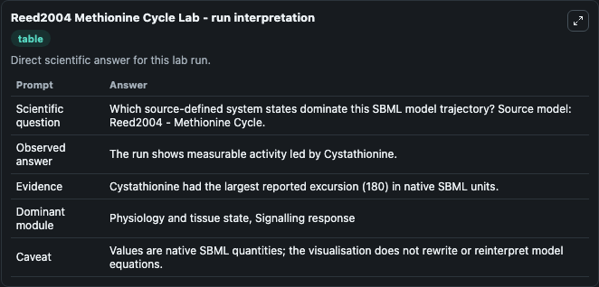
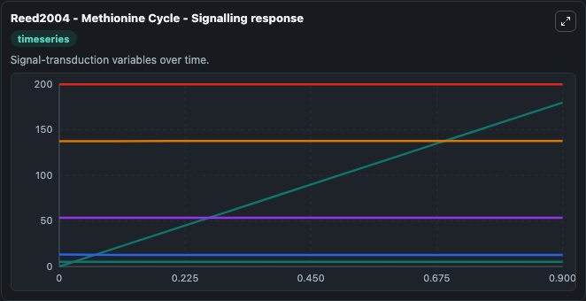
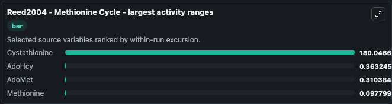
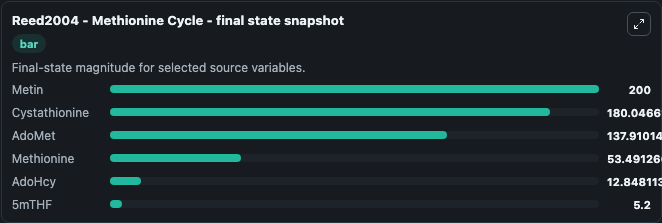
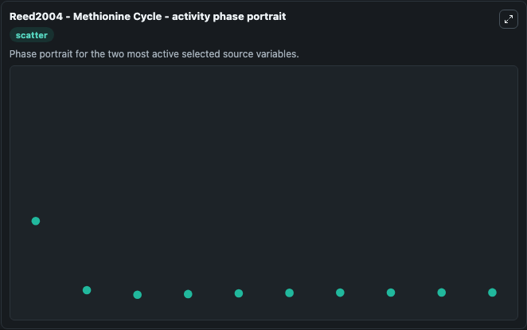

# Reed2004 Methionine Cycle

This Biosimulant lab wraps `Reed2004 Methionine Cycle` as a runnable systems biology model with a companion visualization module.
Reed2004 - Methionine Cycle This model is described in the article: A mathematical model of the methionine cycle. It can be used to explore the configured dynamics and compare scenario outcomes across configurations.

## What You'll See

The lab asks: Which source-defined system states dominate this SBML model trajectory? Source model: Reed2004 - Methionine Cycle. It runs for 1.0 time units with a communication step of 0.1. The run uses the model defaults declared by the curated SBML wrapper. The generated visualizations focus on Cystathionine, Metin, AdoMet, Methionine, AdoHcy, and 5mTHF, combining trajectory, endpoint-comparison, and summary-table views from one completed dark-mode run.

In this captured run, **Cystathionine** moved from 0 to 180.0 across 1.0 simulation windows.


### Output Visualizations



*Summary table for Reed2004 Methionine Cycle, reporting the scientific question, observed answer, dominant module, and caveat.*



*Trajectories of Cystathionine, AdoHcy, AdoMet, Methionine, Metin, and 5mTHF across the 1.0 simulation. In this run **Cystathionine** climbed from 0 to 180.0 and **AdoHcy** fell from 13.200 to 12.848 — the largest movements among the focused observables.*



*Largest-excursion ranking of the focused observables — the absolute movement magnitude during the run. Top 3: **Cystathionine** = 180.0, **AdoHcy** = 0.3632, **AdoMet** = 0.3104, with 1 more observable below.*



*Endpoint snapshot of the focused observables — final values from the captured run. Top 3 by value: **Metin** = 200.0, **Cystathionine** = 180.0, **AdoMet** = 137.9, with 3 more observables below.*



*Visualization card from the Reed2004 Methionine Cycle dark-mode run.*


## Model Context

- Core model: `models/core`
- Visualization model: `models/visualisation`
- Standard: `other`
- Upstream source: `biomodels_ebi:BIOMD0000000698`
- License: `CC0`

## Inputs

| Input | Maps To | Default | Notes |
|---|---|---|---|
| Initial Cystathionine | `systemsbiology_sbml_reed2004_methionine_cycle_biomd0000000698_model.initial_cystathionine` | | Source state initial condition exposed as a model-specific control because no explicit intervention parameter is identifiable. Maps to SBML symbol `Cystathionine`. |
| Initial Metin | `systemsbiology_sbml_reed2004_methionine_cycle_biomd0000000698_model.initial_metin` | | Source state initial condition exposed as a model-specific control because no explicit intervention parameter is identifiable. Maps to SBML symbol `Metin`. |
| Initial Ado Met | `systemsbiology_sbml_reed2004_methionine_cycle_biomd0000000698_model.initial_ado_met` | | Source state initial condition exposed as a model-specific control because no explicit intervention parameter is identifiable. Maps to SBML symbol `AdoMet`. |
| Initial Methionine | `systemsbiology_sbml_reed2004_methionine_cycle_biomd0000000698_model.initial_methionine` | | Source state initial condition exposed as a model-specific control because no explicit intervention parameter is identifiable. Maps to SBML symbol `Methionine`. |
| Initial Ado Hcy | `systemsbiology_sbml_reed2004_methionine_cycle_biomd0000000698_model.initial_ado_hcy` | | Source state initial condition exposed as a model-specific control because no explicit intervention parameter is identifiable. Maps to SBML symbol `AdoHcy`. |
| Initial Model State 5M Thf | `systemsbiology_sbml_reed2004_methionine_cycle_biomd0000000698_model.initial_model_state_5m_thf` | | Source state initial condition exposed as a model-specific control because no explicit intervention parameter is identifiable. Maps to SBML symbol `_5mTHF`. |

## Outputs

| Output | Maps To | Role |
|---|---|---|
| `state` | `systemsbiology_sbml_reed2004_methionine_cycle_biomd0000000698_model.state` | Available to the visualization model and downstream workflows. |
| `summary` | `systemsbiology_sbml_reed2004_methionine_cycle_biomd0000000698_model.summary` | Available to the visualization model and downstream workflows. |
| `species_labels` | `systemsbiology_sbml_reed2004_methionine_cycle_biomd0000000698_model.species_labels` | Available to the visualization model and downstream workflows. |
| `cystathionine` | `systemsbiology_sbml_reed2004_methionine_cycle_biomd0000000698_model.cystathionine` | Available to the visualization model and downstream workflows. |
| `metin` | `systemsbiology_sbml_reed2004_methionine_cycle_biomd0000000698_model.metin` | Available to the visualization model and downstream workflows. |
| `ado_met` | `systemsbiology_sbml_reed2004_methionine_cycle_biomd0000000698_model.ado_met` | Available to the visualization model and downstream workflows. |
| `methionine` | `systemsbiology_sbml_reed2004_methionine_cycle_biomd0000000698_model.methionine` | Available to the visualization model and downstream workflows. |
| `ado_hcy` | `systemsbiology_sbml_reed2004_methionine_cycle_biomd0000000698_model.ado_hcy` | Available to the visualization model and downstream workflows. |
| `model_state_5m_thf` | `systemsbiology_sbml_reed2004_methionine_cycle_biomd0000000698_model.model_state_5m_thf` | Available to the visualization model and downstream workflows. |

## Runtime

- Duration: `1.0`
- Communication step: `0.1`

## Running Locally

```bash
biosimulant labs serve
```
