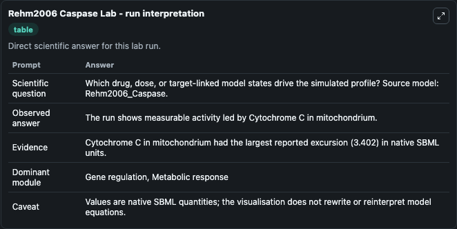
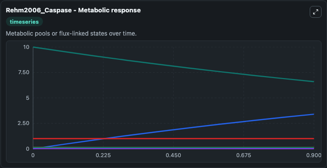
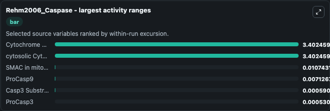
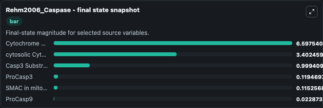
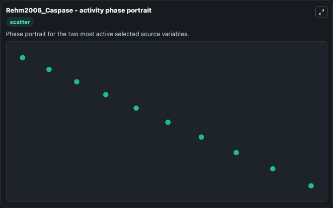

# Rehm2006 Caspase

This Biosimulant lab wraps `Rehm2006 Caspase` as a runnable systems biology model with a companion visualization module.
This is the standard model described in the article: Systems analysis of effector caspase activation and its control by X-linked inhibitor of apoptosis protein. It can be used to explore the configured dynamics and compare scenario outcomes across configurations.

## What You'll See

The lab asks: Which drug, dose, or target-linked model states drive the simulated profile? Source model: Rehm2006_Caspase. It runs for 1.0 time units with a communication step of 0.1. The run uses the model defaults declared by the curated SBML wrapper. The generated visualizations focus on Cytochrome C in mitochondrium, SMAC in mitochondrium, Casp3 Substrate, ProCasp3, ProCasp9, and cytosolic Cytochrome C, combining trajectory, endpoint-comparison, and summary-table views from one completed dark-mode run.

In this captured run, **Cytochrome C in mitochondrium** moved from 10.000 to 6.598 across 1.0 simulation windows.


### Output Visualizations



*Summary table for Rehm2006 Caspase, reporting the scientific question, observed answer, dominant module, and caveat.*



*Trajectories of Cytochrome C in mitochondrium, cytosolic Cytochrome C, SMAC in mitochondrium, ProCasp9, Casp3 Substrate, and ProCasp3 across the 1.0 simulation. In this run **cytosolic Cytochrome C** climbed from 0 to 3.402 and **Cytochrome C in mitochondrium** fell from 10.000 to 6.598 — the largest movements among the focused observables.*



*Largest-excursion ranking of the focused observables — the absolute movement magnitude during the run. Top 3: **Cytochrome C in mitochondrium** = 3.402, **cytosolic Cytochrome C** = 3.402, **SMAC in mitochondrium** = 0.0107, with 3 more observables below.*



*Endpoint snapshot of the focused observables — final values from the captured run. Top 3 by value: **Cytochrome C in mitochondrium** = 6.598, **cytosolic Cytochrome C** = 3.402, **Casp3 Substrate** = 0.9994, with 3 more observables below.*



*Visualization card from the Rehm2006 Caspase dark-mode run.*


## Model Context

- Core model: `models/core`
- Visualization model: `models/visualisation`
- Standard: `other`
- Upstream source: `biomodels_ebi:BIOMD0000000256`
- License: `CC0`

## Inputs

| Input | Maps To | Default | Notes |
|---|---|---|---|
| Initial Cytochrome C In Mitochondrium | `systemsbiology_sbml_rehm2006_caspase_biomd0000000256_model.initial_cytochrome_c_in_mitochondrium` | | Source state initial condition exposed as a model-specific control because no explicit intervention parameter is identifiable. Maps to SBML symbol `CytC_mit`. |
| Initial Smac In Mitochondrium | `systemsbiology_sbml_rehm2006_caspase_biomd0000000256_model.initial_smac_in_mitochondrium` | | Source state initial condition exposed as a model-specific control because no explicit intervention parameter is identifiable. Maps to SBML symbol `SMAC_mito`. |
| Initial Casp3 Substrate | `systemsbiology_sbml_rehm2006_caspase_biomd0000000256_model.initial_casp3_substrate` | | Source state initial condition exposed as a model-specific control because no explicit intervention parameter is identifiable. Maps to SBML symbol `Substrate`. |
| Initial Pro Casp3 | `systemsbiology_sbml_rehm2006_caspase_biomd0000000256_model.initial_pro_casp3` | | Source state initial condition exposed as a model-specific control because no explicit intervention parameter is identifiable. Maps to SBML symbol `PC3`. |
| Initial Pro Casp9 | `systemsbiology_sbml_rehm2006_caspase_biomd0000000256_model.initial_pro_casp9` | | Source state initial condition exposed as a model-specific control because no explicit intervention parameter is identifiable. Maps to SBML symbol `PC9`. |
| Initial Cytosolic Cytochrome C | `systemsbiology_sbml_rehm2006_caspase_biomd0000000256_model.initial_cytosolic_cytochrome_c` | | Source state initial condition exposed as a model-specific control because no explicit intervention parameter is identifiable. Maps to SBML symbol `CytC_cell`. |

## Outputs

| Output | Maps To | Role |
|---|---|---|
| `state` | `systemsbiology_sbml_rehm2006_caspase_biomd0000000256_model.state` | Available to the visualization model and downstream workflows. |
| `summary` | `systemsbiology_sbml_rehm2006_caspase_biomd0000000256_model.summary` | Available to the visualization model and downstream workflows. |
| `species_labels` | `systemsbiology_sbml_rehm2006_caspase_biomd0000000256_model.species_labels` | Available to the visualization model and downstream workflows. |
| `cytochrome_c_in_mitochondrium` | `systemsbiology_sbml_rehm2006_caspase_biomd0000000256_model.cytochrome_c_in_mitochondrium` | Available to the visualization model and downstream workflows. |
| `smac_in_mitochondrium` | `systemsbiology_sbml_rehm2006_caspase_biomd0000000256_model.smac_in_mitochondrium` | Available to the visualization model and downstream workflows. |
| `casp3_substrate` | `systemsbiology_sbml_rehm2006_caspase_biomd0000000256_model.casp3_substrate` | Available to the visualization model and downstream workflows. |
| `pro_casp3` | `systemsbiology_sbml_rehm2006_caspase_biomd0000000256_model.pro_casp3` | Available to the visualization model and downstream workflows. |
| `pro_casp9` | `systemsbiology_sbml_rehm2006_caspase_biomd0000000256_model.pro_casp9` | Available to the visualization model and downstream workflows. |
| `cytosolic_cytochrome_c` | `systemsbiology_sbml_rehm2006_caspase_biomd0000000256_model.cytosolic_cytochrome_c` | Available to the visualization model and downstream workflows. |

## Runtime

- Duration: `1.0`
- Communication step: `0.1`

## Running Locally

```bash
biosimulant labs serve
```
