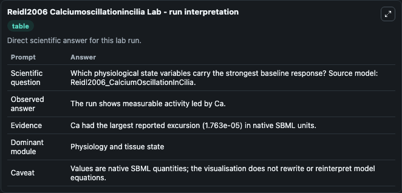
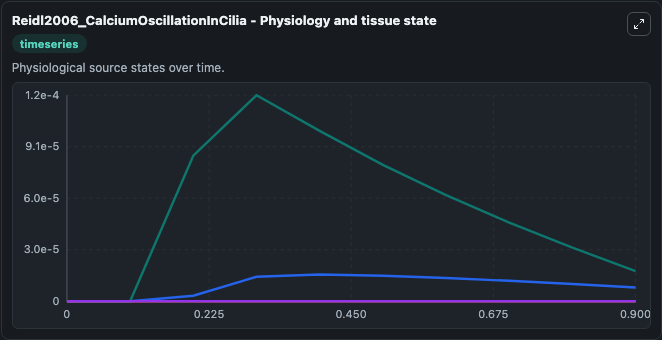
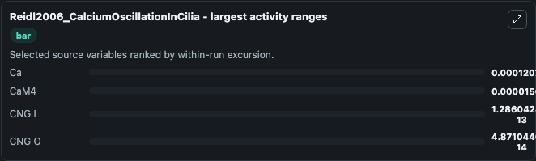
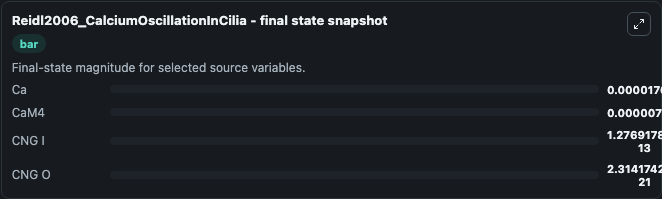
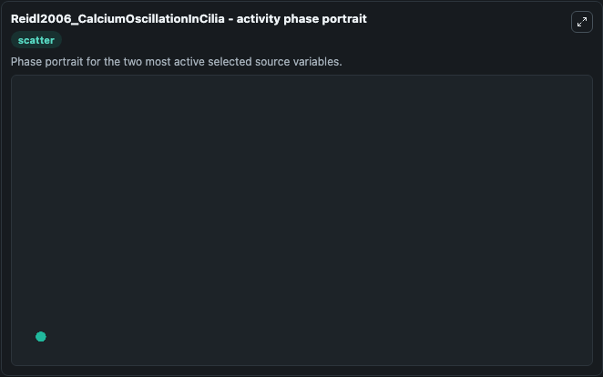

# Reidl2006 Calciumoscillationincilia

This Biosimulant lab wraps `Reidl2006 Calciumoscillationincilia` as a runnable systems biology model with a companion visualization module.
This a model from the article: Model of calcium oscillations due to negative feedback in olfactory cilia. It can be used to explore the configured dynamics and compare scenario outcomes across configurations.

## What You'll See

The lab asks: Which physiological state variables carry the strongest baseline response? Source model: Reidl2006_CalciumOscillationInCilia. It runs for 1.0 time units with a communication step of 0.1. The run uses the model defaults declared by the curated SBML wrapper. The generated visualizations focus on CaM4, Ca, CNG O, and CNG I, combining trajectory, endpoint-comparison, and summary-table views from one completed dark-mode run.

In this captured run, **Ca** moved from 0 to 1.76e-05 across 1.0 simulation windows.


### Output Visualizations



*Summary table for Reidl2006 Calciumoscillationincilia, reporting the scientific question, observed answer, dominant module, and caveat.*



*Trajectories of Ca, CaM4, CNG I, and CNG O across the 1.0 simulation. In this run **Ca** climbed from 0 to 1.76e-05 — the largest movements among the focused observables.*



*Largest-excursion ranking of the focused observables — the absolute movement magnitude during the run. Top 3: **Ca** = 0.000121, **CaM4** = 1.57e-05, **CNG I** = 1.29e-13, with 1 more observable below.*



*Endpoint snapshot of the focused observables — final values from the captured run. Top 3 by value: **Ca** = 1.76e-05, **CaM4** = 7.99e-06, **CNG I** = 1.28e-13, with 1 more observable below.*



*Visualization card from the Reidl2006 Calciumoscillationincilia dark-mode run.*


## Model Context

- Core model: `models/core`
- Visualization model: `models/visualisation`
- Standard: `other`
- Upstream source: `biomodels_ebi:MODEL7908934508`
- License: `CC0`

## Inputs

| Input | Maps To | Default | Notes |
|---|---|---|---|
| Initial Ca M4 | `systemsbiology_sbml_reidl2006_calciumoscillationincilia_model7908934508_model.initial_ca_m4` | | Source state initial condition exposed as a model-specific control because no explicit intervention parameter is identifiable. Maps to SBML symbol `CaM4`. |
| Initial Model State Ca | `systemsbiology_sbml_reidl2006_calciumoscillationincilia_model7908934508_model.initial_model_state_ca` | | Source state initial condition exposed as a model-specific control because no explicit intervention parameter is identifiable. Maps to SBML symbol `Ca`. |
| Initial Cng O | `systemsbiology_sbml_reidl2006_calciumoscillationincilia_model7908934508_model.initial_cng_o` | | Source state initial condition exposed as a model-specific control because no explicit intervention parameter is identifiable. Maps to SBML symbol `CNG_o`. |
| Initial Cng I | `systemsbiology_sbml_reidl2006_calciumoscillationincilia_model7908934508_model.initial_cng_i` | | Source state initial condition exposed as a model-specific control because no explicit intervention parameter is identifiable. Maps to SBML symbol `CNG_i`. |

## Outputs

| Output | Maps To | Role |
|---|---|---|
| `state` | `systemsbiology_sbml_reidl2006_calciumoscillationincilia_model7908934508_model.state` | Available to the visualization model and downstream workflows. |
| `summary` | `systemsbiology_sbml_reidl2006_calciumoscillationincilia_model7908934508_model.summary` | Available to the visualization model and downstream workflows. |
| `species_labels` | `systemsbiology_sbml_reidl2006_calciumoscillationincilia_model7908934508_model.species_labels` | Available to the visualization model and downstream workflows. |
| `ca_m4` | `systemsbiology_sbml_reidl2006_calciumoscillationincilia_model7908934508_model.ca_m4` | Available to the visualization model and downstream workflows. |
| `model_state_ca` | `systemsbiology_sbml_reidl2006_calciumoscillationincilia_model7908934508_model.model_state_ca` | Available to the visualization model and downstream workflows. |
| `cng_o` | `systemsbiology_sbml_reidl2006_calciumoscillationincilia_model7908934508_model.cng_o` | Available to the visualization model and downstream workflows. |
| `cng_i` | `systemsbiology_sbml_reidl2006_calciumoscillationincilia_model7908934508_model.cng_i` | Available to the visualization model and downstream workflows. |

## Runtime

- Duration: `1.0`
- Communication step: `0.1`

## Running Locally

```bash
biosimulant labs serve
```
