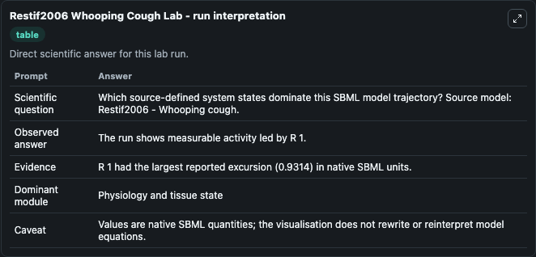
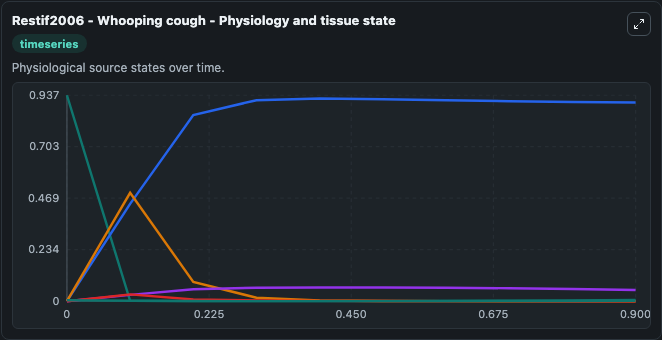
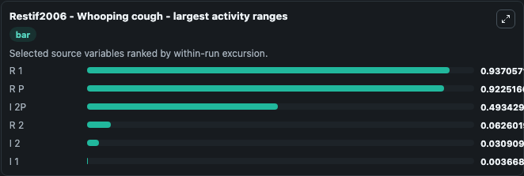
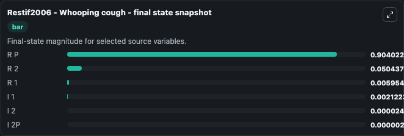
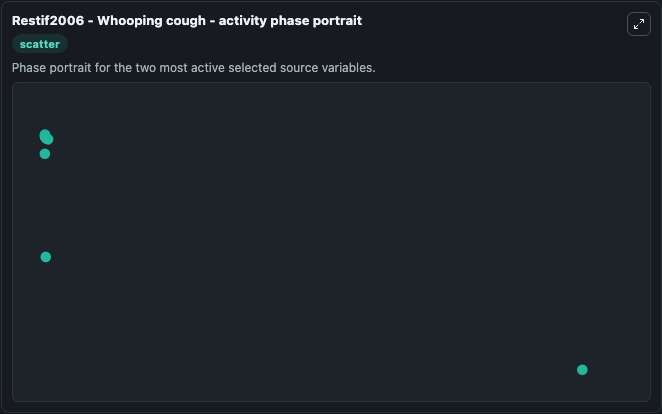

# Restif2006 Whooping Cough

This Biosimulant lab wraps `Restif2006 Whooping Cough` as a runnable systems biology model with a companion visualization module.
Restif2006 - Whooping cough This model is described in the article: Integrating life history and cross-immunity into the evolutionary dynamics of pathogens. It can be used to explore the configured dynamics and compare scenario outcomes across configurations.

## What You'll See

The lab asks: Which source-defined system states dominate this SBML model trajectory? Source model: Restif2006 - Whooping cough. It runs for 1.0 time units with a communication step of 0.1. The run uses the model defaults declared by the curated SBML wrapper. The generated visualizations focus on R 1, I 1, I 2, R P, R 2, and I 2P, combining trajectory, endpoint-comparison, and summary-table views from one completed dark-mode run.

In this captured run, **R 1** moved from 0.9373 to 0.00595 across 1.0 simulation windows.


### Output Visualizations



*Summary table for Restif2006 Whooping Cough, reporting the scientific question, observed answer, dominant module, and caveat.*



*Trajectories of R 1, R P, I 2P, R 2, I 2, and I 1 across the 1.0 simulation. In this run **R P** climbed from 0 to 0.9040 and **R 1** fell from 0.9373 to 0.00595 — the largest movements among the focused observables.*



*Largest-excursion ranking of the focused observables — the absolute movement magnitude during the run. Top 3: **R 1** = 0.9371, **R P** = 0.9225, **I 2P** = 0.4934, with 3 more observables below.*



*Endpoint snapshot of the focused observables — final values from the captured run. Top 3 by value: **R P** = 0.9040, **R 2** = 0.0504, **R 1** = 0.00595, with 3 more observables below.*



*Visualization card from the Restif2006 Whooping Cough dark-mode run.*


## Model Context

- Core model: `models/core`
- Visualization model: `models/visualisation`
- Standard: `other`
- Upstream source: `biomodels_ebi:BIOMD0000000249`
- License: `CC0`

## Inputs

| Input | Maps To | Default | Notes |
|---|---|---|---|
| Initial Model State R 1 | `systemsbiology_sbml_restif2006_whooping_cough_biomd0000000249_model.initial_model_state_r_1` | | Source state initial condition exposed as a model-specific control because no explicit intervention parameter is identifiable. Maps to SBML symbol `R_1`. |
| Initial Model State I 1 | `systemsbiology_sbml_restif2006_whooping_cough_biomd0000000249_model.initial_model_state_i_1` | | Source state initial condition exposed as a model-specific control because no explicit intervention parameter is identifiable. Maps to SBML symbol `I_1`. |
| Initial Model State I 2 | `systemsbiology_sbml_restif2006_whooping_cough_biomd0000000249_model.initial_model_state_i_2` | | Source state initial condition exposed as a model-specific control because no explicit intervention parameter is identifiable. Maps to SBML symbol `I_2`. |
| Initial Model State R P | `systemsbiology_sbml_restif2006_whooping_cough_biomd0000000249_model.initial_model_state_r_p` | | Source state initial condition exposed as a model-specific control because no explicit intervention parameter is identifiable. Maps to SBML symbol `R_p`. |
| Initial Model State R 2 | `systemsbiology_sbml_restif2006_whooping_cough_biomd0000000249_model.initial_model_state_r_2` | | Source state initial condition exposed as a model-specific control because no explicit intervention parameter is identifiable. Maps to SBML symbol `R_2`. |
| Initial I 2 P | `systemsbiology_sbml_restif2006_whooping_cough_biomd0000000249_model.initial_i_2_p` | | Source state initial condition exposed as a model-specific control because no explicit intervention parameter is identifiable. Maps to SBML symbol `I_2p`. |

## Outputs

| Output | Maps To | Role |
|---|---|---|
| `state` | `systemsbiology_sbml_restif2006_whooping_cough_biomd0000000249_model.state` | Available to the visualization model and downstream workflows. |
| `summary` | `systemsbiology_sbml_restif2006_whooping_cough_biomd0000000249_model.summary` | Available to the visualization model and downstream workflows. |
| `species_labels` | `systemsbiology_sbml_restif2006_whooping_cough_biomd0000000249_model.species_labels` | Available to the visualization model and downstream workflows. |
| `r_1` | `systemsbiology_sbml_restif2006_whooping_cough_biomd0000000249_model.r_1` | Available to the visualization model and downstream workflows. |
| `i_1` | `systemsbiology_sbml_restif2006_whooping_cough_biomd0000000249_model.i_1` | Available to the visualization model and downstream workflows. |
| `i_2` | `systemsbiology_sbml_restif2006_whooping_cough_biomd0000000249_model.i_2` | Available to the visualization model and downstream workflows. |
| `r_p` | `systemsbiology_sbml_restif2006_whooping_cough_biomd0000000249_model.r_p` | Available to the visualization model and downstream workflows. |
| `r_2` | `systemsbiology_sbml_restif2006_whooping_cough_biomd0000000249_model.r_2` | Available to the visualization model and downstream workflows. |
| `i_2_p` | `systemsbiology_sbml_restif2006_whooping_cough_biomd0000000249_model.i_2_p` | Available to the visualization model and downstream workflows. |

## Runtime

- Duration: `1.0`
- Communication step: `0.1`

## Running Locally

```bash
biosimulant labs serve
```
