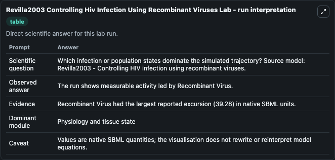
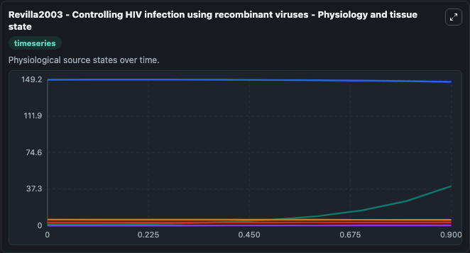
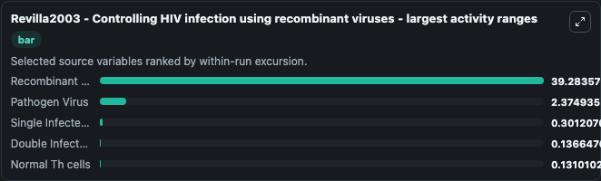
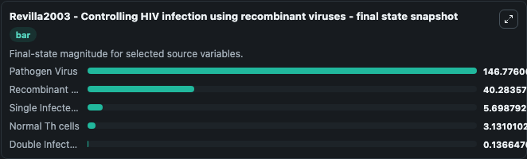
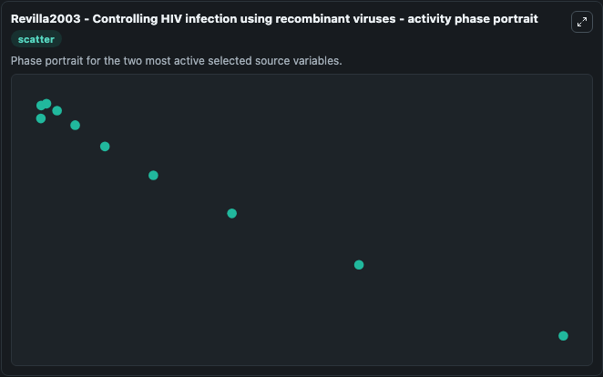

# Revilla2003 Controlling Hiv Infection Using Recombinant Viruses

This Biosimulant lab wraps `Revilla2003 Controlling Hiv Infection Using Recombinant Viruses` as a runnable systems biology model with a companion visualization module.
This a model from the article: Fighting a virus with a virus: a dynamic model for HIV-1 therapy. It can be used to explore the configured dynamics and compare scenario outcomes across configurations.

## What You'll See

The lab asks: Which infection or population states dominate the simulated trajectory? Source model: Revilla2003 - Controlling HIV infection using recombinant viruses. It runs for 1.0 time units with a communication step of 0.1. The run uses the model defaults declared by the curated SBML wrapper. The generated visualizations focus on Normal Th cells, Pathogen Virus, Single Infected Th Cells, Recombinant Virus, and Double Infected Th Cells, combining trajectory, endpoint-comparison, and summary-table views from one completed dark-mode run.

In this captured run, **Recombinant Virus** moved from 1.000 to 40.284 across 1.0 simulation windows.


### Output Visualizations



*Summary table for Revilla2003 Controlling Hiv Infection Using Recombinant Viruses, reporting the scientific question, observed answer, dominant module, and caveat.*



*Trajectories of Recombinant Virus, Pathogen Virus, Single Infected Th Cells, Double Infected Th Cells, and Normal Th cells across the 1.0 simulation. In this run **Recombinant Virus** climbed from 1.000 to 40.284 and **Pathogen Virus** fell from 149.0 to 146.8 — the largest movements among the focused observables.*



*Largest-excursion ranking of the focused observables — the absolute movement magnitude during the run. Top 3: **Recombinant Virus** = 39.284, **Pathogen Virus** = 2.375, **Single Infected Th Cells** = 0.3012, with 2 more observables below.*



*Trajectories of Recombinant Virus, Pathogen Virus, Single Infected Th Cells, Double Infected Th Cells, and Normal Th cells across the 1.0 simulation. In this run **Recombinant Virus** climbed from 1.000 to 40.284 and **Pathogen Virus** fell from 149.0 to 146.8 — the largest movements among the focused observables.*



*Visualization card from the Revilla2003 Controlling Hiv Infection Using Recombinant Viruses dark-mode run.*


## Model Context

- Core model: `models/core`
- Visualization model: `models/visualisation`
- Standard: `other`
- Upstream source: `biomodels_ebi:BIOMD0000000707`
- License: `CC0`

## Inputs

| Input | Maps To | Default | Notes |
|---|---|---|---|
| Initial Normal Th Cells | `systemsbiology_sbml_revilla2003_controlling_hiv_infection_using_reco_biomd0000000707_model.initial_normal_th_cells` | | Source state initial condition exposed as a model-specific control because no explicit intervention parameter is identifiable. Maps to SBML symbol `Normal_Th_cells`. |
| Initial Pathogen Virus | `systemsbiology_sbml_revilla2003_controlling_hiv_infection_using_reco_biomd0000000707_model.initial_pathogen_virus` | | Source state initial condition exposed as a model-specific control because no explicit intervention parameter is identifiable. Maps to SBML symbol `Pathogen_Virus`. |
| Initial Single Infected Th Cells | `systemsbiology_sbml_revilla2003_controlling_hiv_infection_using_reco_biomd0000000707_model.initial_single_infected_th_cells` | | Source state initial condition exposed as a model-specific control because no explicit intervention parameter is identifiable. Maps to SBML symbol `Single_Infected_Th_Cells`. |
| Initial Recombinant Virus | `systemsbiology_sbml_revilla2003_controlling_hiv_infection_using_reco_biomd0000000707_model.initial_recombinant_virus` | | Source state initial condition exposed as a model-specific control because no explicit intervention parameter is identifiable. Maps to SBML symbol `Recombinant_Virus`. |
| Initial Double Infected Th Cells | `systemsbiology_sbml_revilla2003_controlling_hiv_infection_using_reco_biomd0000000707_model.initial_double_infected_th_cells` | | Source state initial condition exposed as a model-specific control because no explicit intervention parameter is identifiable. Maps to SBML symbol `Double_Infected_Th_Cells`. |

## Outputs

| Output | Maps To | Role |
|---|---|---|
| `state` | `systemsbiology_sbml_revilla2003_controlling_hiv_infection_using_reco_biomd0000000707_model.state` | Available to the visualization model and downstream workflows. |
| `summary` | `systemsbiology_sbml_revilla2003_controlling_hiv_infection_using_reco_biomd0000000707_model.summary` | Available to the visualization model and downstream workflows. |
| `species_labels` | `systemsbiology_sbml_revilla2003_controlling_hiv_infection_using_reco_biomd0000000707_model.species_labels` | Available to the visualization model and downstream workflows. |
| `normal_th_cells` | `systemsbiology_sbml_revilla2003_controlling_hiv_infection_using_reco_biomd0000000707_model.normal_th_cells` | Available to the visualization model and downstream workflows. |
| `pathogen_virus` | `systemsbiology_sbml_revilla2003_controlling_hiv_infection_using_reco_biomd0000000707_model.pathogen_virus` | Available to the visualization model and downstream workflows. |
| `single_infected_th_cells` | `systemsbiology_sbml_revilla2003_controlling_hiv_infection_using_reco_biomd0000000707_model.single_infected_th_cells` | Available to the visualization model and downstream workflows. |
| `recombinant_virus` | `systemsbiology_sbml_revilla2003_controlling_hiv_infection_using_reco_biomd0000000707_model.recombinant_virus` | Available to the visualization model and downstream workflows. |
| `double_infected_th_cells` | `systemsbiology_sbml_revilla2003_controlling_hiv_infection_using_reco_biomd0000000707_model.double_infected_th_cells` | Available to the visualization model and downstream workflows. |

## Runtime

- Duration: `1.0`
- Communication step: `0.1`

## Running Locally

```bash
biosimulant labs serve
```
