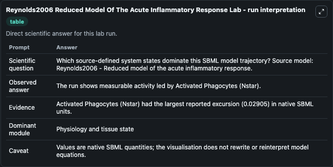
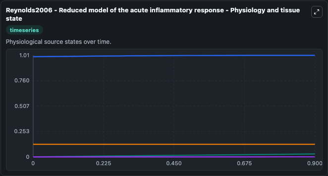
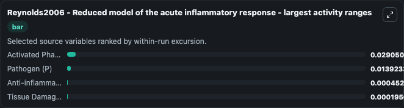
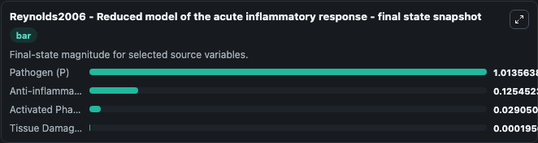
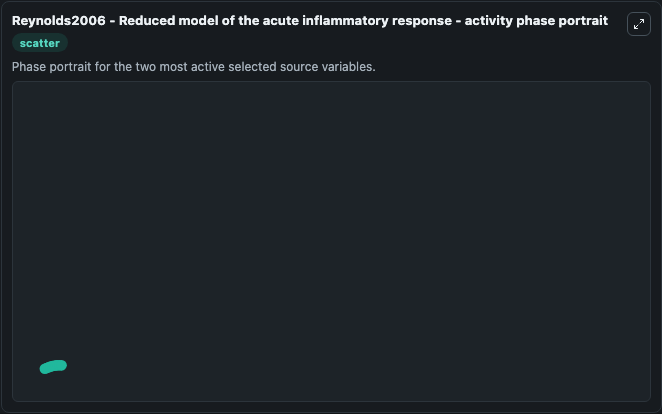

# Reynolds2006 Reduced Model Of The Acute Inflammatory Response

This Biosimulant lab wraps `Reynolds2006 Reduced Model Of The Acute Inflammatory Response` as a runnable systems biology model with a companion visualization module.
Angela Reynolds, Jonathan Rubin, Gilles Clermont, Judy Day, Yoram Vodovotz & G. It can be used to explore the configured dynamics and compare scenario outcomes across configurations.

## What You'll See

The lab asks: Which source-defined system states dominate this SBML model trajectory? Source model: Reynolds2006 - Reduced model of the acute inflammatory response. It runs for 1.0 time units with a communication step of 0.1. The run uses the model defaults declared by the curated SBML wrapper. The generated visualizations focus on Anti-inflammatory mediators (C_A), Activated Phagocytes (Nstar), Pathogen (P), and Tissue Damage (D), combining trajectory, endpoint-comparison, and summary-table views from one completed dark-mode run.

In this captured run, **Activated Phagocytes (Nstar)** moved from 0 to 0.0291 across 1.0 simulation windows.


### Output Visualizations



*Summary table for Reynolds2006 Reduced Model Of The Acute Inflammatory Response, reporting the scientific question, observed answer, dominant module, and caveat.*



*Trajectories of Activated Phagocytes (Nstar), Pathogen (P), Anti-inflammatory mediators (C_A), and Tissue Damage (D) across the 1.0 simulation. In this run **Activated Phagocytes (Nstar)** climbed from 0 to 0.0291 — the largest movements among the focused observables.*



*Trajectories of Activated Phagocytes (Nstar), Pathogen (P), Anti-inflammatory mediators (C_A), and Tissue Damage (D) across the 1.0 simulation. In this run **Activated Phagocytes (Nstar)** climbed from 0 to 0.0291 — the largest movements among the focused observables.*



*Trajectories of Activated Phagocytes (Nstar), Pathogen (P), Anti-inflammatory mediators (C_A), and Tissue Damage (D) across the 1.0 simulation. In this run **Activated Phagocytes (Nstar)** climbed from 0 to 0.0291 — the largest movements among the focused observables.*



*Trajectories of Activated Phagocytes (Nstar), Pathogen (P), Anti-inflammatory mediators (C_A), and Tissue Damage (D) across the 1.0 simulation. In this run **Activated Phagocytes (Nstar)** climbed from 0 to 0.0291 — the largest movements among the focused observables.*


## Model Context

- Core model: `models/core`
- Visualization model: `models/visualisation`
- Standard: `other`
- Upstream source: `biomodels_ebi:BIOMD0000000714`
- License: `CC0`

## Inputs

| Input | Maps To | Default | Notes |
|---|---|---|---|
| Initial Anti Inflammatory Mediators C A | `systemsbiology_sbml_reynolds2006_reduced_model_of_the_acute_inflamma_biomd0000000714_model.initial_anti_inflammatory_mediators_c_a` | | Source state initial condition exposed as a model-specific control because no explicit intervention parameter is identifiable. Maps to SBML symbol `C_A`. |
| Initial Activated Phagocytes Nstar | `systemsbiology_sbml_reynolds2006_reduced_model_of_the_acute_inflamma_biomd0000000714_model.initial_activated_phagocytes_nstar` | | Source state initial condition exposed as a model-specific control because no explicit intervention parameter is identifiable. Maps to SBML symbol `Nstar`. |
| Initial Pathogen P | `systemsbiology_sbml_reynolds2006_reduced_model_of_the_acute_inflamma_biomd0000000714_model.initial_pathogen_p` | | Source state initial condition exposed as a model-specific control because no explicit intervention parameter is identifiable. Maps to SBML symbol `P`. |
| Initial Tissue Damage D | `systemsbiology_sbml_reynolds2006_reduced_model_of_the_acute_inflamma_biomd0000000714_model.initial_tissue_damage_d` | | Source state initial condition exposed as a model-specific control because no explicit intervention parameter is identifiable. Maps to SBML symbol `D`. |

## Outputs

| Output | Maps To | Role |
|---|---|---|
| `state` | `systemsbiology_sbml_reynolds2006_reduced_model_of_the_acute_inflamma_biomd0000000714_model.state` | Available to the visualization model and downstream workflows. |
| `summary` | `systemsbiology_sbml_reynolds2006_reduced_model_of_the_acute_inflamma_biomd0000000714_model.summary` | Available to the visualization model and downstream workflows. |
| `species_labels` | `systemsbiology_sbml_reynolds2006_reduced_model_of_the_acute_inflamma_biomd0000000714_model.species_labels` | Available to the visualization model and downstream workflows. |
| `anti_inflammatory_mediators_c_a` | `systemsbiology_sbml_reynolds2006_reduced_model_of_the_acute_inflamma_biomd0000000714_model.anti_inflammatory_mediators_c_a` | Available to the visualization model and downstream workflows. |
| `activated_phagocytes_nstar` | `systemsbiology_sbml_reynolds2006_reduced_model_of_the_acute_inflamma_biomd0000000714_model.activated_phagocytes_nstar` | Available to the visualization model and downstream workflows. |
| `pathogen_p` | `systemsbiology_sbml_reynolds2006_reduced_model_of_the_acute_inflamma_biomd0000000714_model.pathogen_p` | Available to the visualization model and downstream workflows. |
| `tissue_damage_d` | `systemsbiology_sbml_reynolds2006_reduced_model_of_the_acute_inflamma_biomd0000000714_model.tissue_damage_d` | Available to the visualization model and downstream workflows. |

## Runtime

- Duration: `1.0`
- Communication step: `0.1`

## Running Locally

```bash
biosimulant labs serve
```
