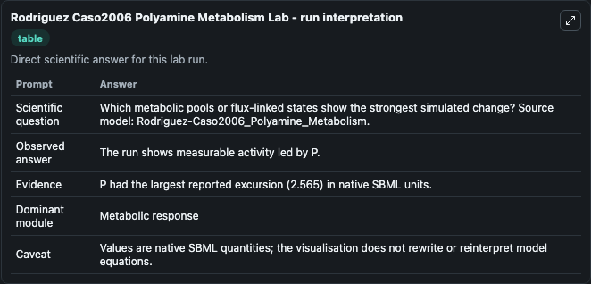
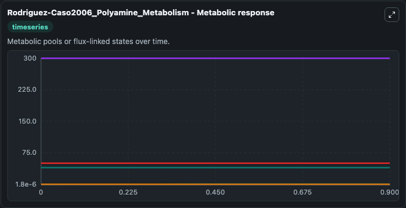
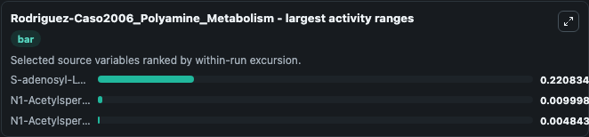
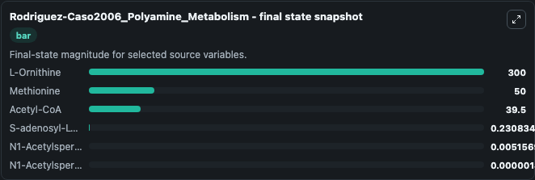
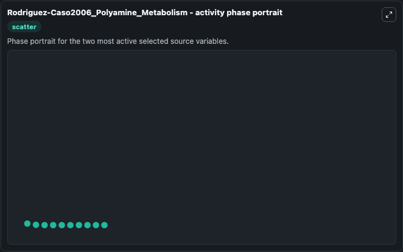

# Rodriguez Caso2006 Polyamine Metabolism

This Biosimulant lab wraps `Rodriguez Caso2006 Polyamine Metabolism` as a runnable systems biology model with a companion visualization module.
SBML creators: Armando Reyes-Palomares * , Carlos Rodríguez-Caso +, Raul Montañez * , Marta Cascante $, Francisca Sánchez-Jiménez * , Miguel A. It can be used to explore the configured dynamics and compare scenario outcomes across configurations.

## What You'll See

The lab asks: Which metabolic pools or flux-linked states show the strongest simulated change? Source model: Rodriguez-Caso2006_Polyamine_Metabolism. It runs for 1.0 time units with a communication step of 0.1. The run uses the model defaults declared by the curated SBML wrapper. The generated visualizations focus on L-Ornithine, Methionine, Acetyl-CoA, S-adenosyl-L-methionine, N1-Acetylspermine, and N1-Acetylspermidine, combining trajectory, endpoint-comparison, and summary-table views from one completed dark-mode run.

In this captured run, **S-adenosyl-L-methionine** moved from 0.0100 to 0.2308 across 1.0 simulation windows.


### Output Visualizations



*Summary table for Rodriguez Caso2006 Polyamine Metabolism, reporting the scientific question, observed answer, dominant module, and caveat.*



*Trajectories of S-adenosyl-L-methionine, N1-Acetylspermine, N1-Acetylspermidine, L-Ornithine, Methionine, and Acetyl-CoA across the 1.0 simulation. In this run **S-adenosyl-L-methionine** climbed from 0.0100 to 0.2308 and **N1-Acetylspermine** fell from 0.0100 to 1.82e-06 — the largest movements among the focused observables.*



*Largest-excursion ranking of the focused observables — the absolute movement magnitude during the run. Top 3: **S-adenosyl-L-methionine** = 0.2208, **N1-Acetylspermine** = 0.01, **N1-Acetylspermidine** = 0.00484.*



*Endpoint snapshot of the focused observables — final values from the captured run. Top 3 by value: **L-Ornithine** = 300.0, **Methionine** = 50.000, **Acetyl-CoA** = 39.500, with 3 more observables below.*



*Visualization card from the Rodriguez Caso2006 Polyamine Metabolism dark-mode run.*


## Model Context

- Core model: `models/core`
- Visualization model: `models/visualisation`
- Standard: `other`
- Upstream source: `biomodels_ebi:BIOMD0000000190`
- License: `CC0`

## Inputs

| Input | Maps To | Default | Notes |
|---|---|---|---|
| Initial L Ornithine | `systemsbiology_sbml_rodriguez_caso2006_polyamine_metabolism_biomd0000000190_model.initial_l_ornithine` | | Source state initial condition exposed as a model-specific control because no explicit intervention parameter is identifiable. Maps to SBML symbol `ORN`. |
| Initial Methionine | `systemsbiology_sbml_rodriguez_caso2006_polyamine_metabolism_biomd0000000190_model.initial_methionine` | | Source state initial condition exposed as a model-specific control because no explicit intervention parameter is identifiable. Maps to SBML symbol `Met`. |
| Initial Acetyl Co A | `systemsbiology_sbml_rodriguez_caso2006_polyamine_metabolism_biomd0000000190_model.initial_acetyl_co_a` | | Source state initial condition exposed as a model-specific control because no explicit intervention parameter is identifiable. Maps to SBML symbol `AcCoA`. |
| Initial S Adenosyl L Methionine | `systemsbiology_sbml_rodriguez_caso2006_polyamine_metabolism_biomd0000000190_model.initial_s_adenosyl_l_methionine` | | Source state initial condition exposed as a model-specific control because no explicit intervention parameter is identifiable. Maps to SBML symbol `SAM`. |
| Initial N1 Acetylspermine | `systemsbiology_sbml_rodriguez_caso2006_polyamine_metabolism_biomd0000000190_model.initial_n1_acetylspermine` | | Source state initial condition exposed as a model-specific control because no explicit intervention parameter is identifiable. Maps to SBML symbol `aS`. |
| Initial N1 Acetylspermidine | `systemsbiology_sbml_rodriguez_caso2006_polyamine_metabolism_biomd0000000190_model.initial_n1_acetylspermidine` | | Source state initial condition exposed as a model-specific control because no explicit intervention parameter is identifiable. Maps to SBML symbol `aD`. |

## Outputs

| Output | Maps To | Role |
|---|---|---|
| `state` | `systemsbiology_sbml_rodriguez_caso2006_polyamine_metabolism_biomd0000000190_model.state` | Available to the visualization model and downstream workflows. |
| `summary` | `systemsbiology_sbml_rodriguez_caso2006_polyamine_metabolism_biomd0000000190_model.summary` | Available to the visualization model and downstream workflows. |
| `species_labels` | `systemsbiology_sbml_rodriguez_caso2006_polyamine_metabolism_biomd0000000190_model.species_labels` | Available to the visualization model and downstream workflows. |
| `l_ornithine` | `systemsbiology_sbml_rodriguez_caso2006_polyamine_metabolism_biomd0000000190_model.l_ornithine` | Available to the visualization model and downstream workflows. |
| `methionine` | `systemsbiology_sbml_rodriguez_caso2006_polyamine_metabolism_biomd0000000190_model.methionine` | Available to the visualization model and downstream workflows. |
| `acetyl_co_a` | `systemsbiology_sbml_rodriguez_caso2006_polyamine_metabolism_biomd0000000190_model.acetyl_co_a` | Available to the visualization model and downstream workflows. |
| `s_adenosyl_l_methionine` | `systemsbiology_sbml_rodriguez_caso2006_polyamine_metabolism_biomd0000000190_model.s_adenosyl_l_methionine` | Available to the visualization model and downstream workflows. |
| `n1_acetylspermine` | `systemsbiology_sbml_rodriguez_caso2006_polyamine_metabolism_biomd0000000190_model.n1_acetylspermine` | Available to the visualization model and downstream workflows. |
| `n1_acetylspermidine` | `systemsbiology_sbml_rodriguez_caso2006_polyamine_metabolism_biomd0000000190_model.n1_acetylspermidine` | Available to the visualization model and downstream workflows. |

## Runtime

- Duration: `1.0`
- Communication step: `0.1`

## Running Locally

```bash
biosimulant labs serve
```
