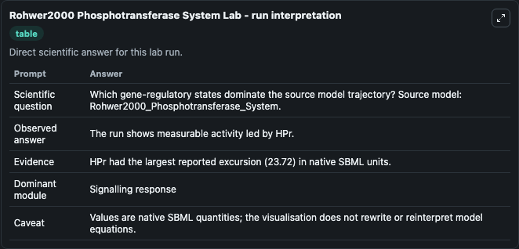
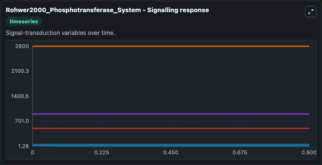
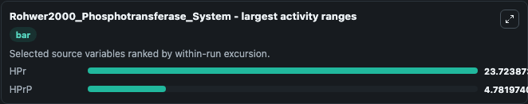
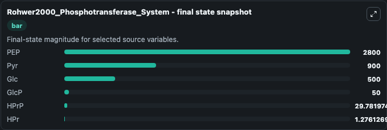
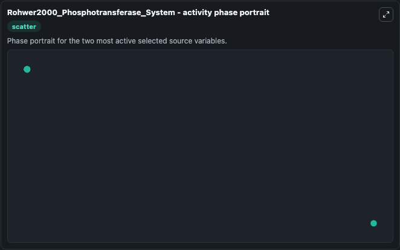

# Rohwer2000 Phosphotransferase System

This Biosimulant lab wraps `Rohwer2000 Phosphotransferase System` as a runnable systems biology model with a companion visualization module.
SBML level 2 code generated for the JWS Online project by Jacky Snoep using PySCeS Run this model online at http://jjj.biochem.sun.ac.za To cite JWS Online please refer to: Olivier, B.G. It can be used to explore the configured dynamics and compare scenario outcomes across configurations.

## What You'll See

The lab asks: Which gene-regulatory states dominate the source model trajectory? Source model: Rohwer2000_Phosphotransferase_System. It runs for 1.0 time units with a communication step of 0.1. The run uses the model defaults declared by the curated SBML wrapper. The generated visualizations focus on PEP, Pyr, Glc, GlcP, HPrP, and HPr, combining trajectory, endpoint-comparison, and summary-table views from one completed dark-mode run.

In this captured run, **HPr** moved from 25.000 to 1.276 across 1.0 simulation windows.


### Output Visualizations



*Summary table for Rohwer2000 Phosphotransferase System, reporting the scientific question, observed answer, dominant module, and caveat.*



*Trajectories of HPr, HPrP, PEP, Pyr, Glc, and GlcP across the 1.0 simulation. In this run **HPrP** climbed from 25.000 to 29.782 and **HPr** fell from 25.000 to 1.276 — the largest movements among the focused observables.*



*Largest-excursion ranking of the focused observables — the absolute movement magnitude during the run. Top 2: **HPr** = 23.724, **HPrP** = 4.782.*



*Endpoint snapshot of the focused observables — final values from the captured run. Top 3 by value: **PEP** = 2800.0, **Pyr** = 900.0, **Glc** = 500.0, with 3 more observables below.*



*Visualization card from the Rohwer2000 Phosphotransferase System dark-mode run.*


## Model Context

- Core model: `models/core`
- Visualization model: `models/visualisation`
- Standard: `other`
- Upstream source: `biomodels_ebi:BIOMD0000000038`
- License: `CC0`

## Inputs

| Input | Maps To | Default | Notes |
|---|---|---|---|
| Initial Model State Pep | `systemsbiology_sbml_rohwer2000_phosphotransferase_system_biomd0000000038_model.initial_model_state_pep` | | Source state initial condition exposed as a model-specific control because no explicit intervention parameter is identifiable. Maps to SBML symbol `PEP`. |
| Initial Model State Pyr | `systemsbiology_sbml_rohwer2000_phosphotransferase_system_biomd0000000038_model.initial_model_state_pyr` | | Source state initial condition exposed as a model-specific control because no explicit intervention parameter is identifiable. Maps to SBML symbol `Pyr`. |
| Initial Model State Glc | `systemsbiology_sbml_rohwer2000_phosphotransferase_system_biomd0000000038_model.initial_model_state_glc` | | Source state initial condition exposed as a model-specific control because no explicit intervention parameter is identifiable. Maps to SBML symbol `Glc`. |
| Initial Glc P | `systemsbiology_sbml_rohwer2000_phosphotransferase_system_biomd0000000038_model.initial_glc_p` | | Source state initial condition exposed as a model-specific control because no explicit intervention parameter is identifiable. Maps to SBML symbol `GlcP`. |
| Initial H Pr P | `systemsbiology_sbml_rohwer2000_phosphotransferase_system_biomd0000000038_model.initial_h_pr_p` | | Source state initial condition exposed as a model-specific control because no explicit intervention parameter is identifiable. Maps to SBML symbol `HPrP`. |
| Initial H Pr | `systemsbiology_sbml_rohwer2000_phosphotransferase_system_biomd0000000038_model.initial_h_pr` | | Source state initial condition exposed as a model-specific control because no explicit intervention parameter is identifiable. Maps to SBML symbol `HPr`. |

## Outputs

| Output | Maps To | Role |
|---|---|---|
| `state` | `systemsbiology_sbml_rohwer2000_phosphotransferase_system_biomd0000000038_model.state` | Available to the visualization model and downstream workflows. |
| `summary` | `systemsbiology_sbml_rohwer2000_phosphotransferase_system_biomd0000000038_model.summary` | Available to the visualization model and downstream workflows. |
| `species_labels` | `systemsbiology_sbml_rohwer2000_phosphotransferase_system_biomd0000000038_model.species_labels` | Available to the visualization model and downstream workflows. |
| `pep` | `systemsbiology_sbml_rohwer2000_phosphotransferase_system_biomd0000000038_model.pep` | Available to the visualization model and downstream workflows. |
| `pyr` | `systemsbiology_sbml_rohwer2000_phosphotransferase_system_biomd0000000038_model.pyr` | Available to the visualization model and downstream workflows. |
| `glc` | `systemsbiology_sbml_rohwer2000_phosphotransferase_system_biomd0000000038_model.glc` | Available to the visualization model and downstream workflows. |
| `glc_p` | `systemsbiology_sbml_rohwer2000_phosphotransferase_system_biomd0000000038_model.glc_p` | Available to the visualization model and downstream workflows. |
| `h_pr_p` | `systemsbiology_sbml_rohwer2000_phosphotransferase_system_biomd0000000038_model.h_pr_p` | Available to the visualization model and downstream workflows. |
| `h_pr` | `systemsbiology_sbml_rohwer2000_phosphotransferase_system_biomd0000000038_model.h_pr` | Available to the visualization model and downstream workflows. |

## Runtime

- Duration: `1.0`
- Communication step: `0.1`

## Running Locally

```bash
biosimulant labs serve
```
