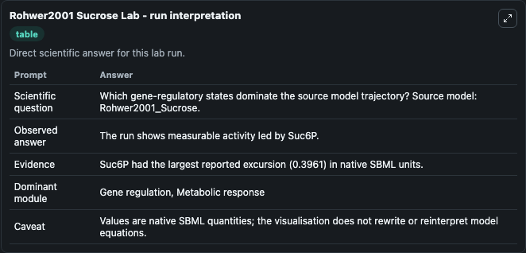
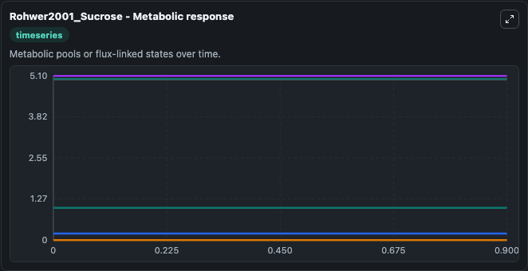
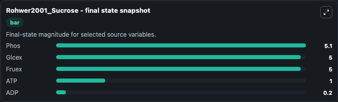

# Rohwer2001 Sucrose

This Biosimulant lab wraps `Rohwer2001 Sucrose` as a runnable systems biology model with a companion visualization module.
SBML Level 2 code generated for the JWS Online project by Jacky Snoep using PySCeS. It can be used to explore the configured dynamics and compare scenario outcomes across configurations.

## What You'll See

The lab asks: Which gene-regulatory states dominate the source model trajectory? Source model: Rohwer2001_Sucrose. It runs for 1.0 time units with a communication step of 0.1. The run uses the model defaults declared by the curated SBML wrapper. The generated visualizations focus on ATP, ADP, Glycolysis, Phos, Glcex, and Fruex, combining trajectory, endpoint-comparison, and summary-table views from one completed dark-mode run.

In this captured run, **ATP** moved from 1.000 to 1.000 across 1.0 simulation windows.


### Output Visualizations



*Summary table for Rohwer2001 Sucrose, reporting the scientific question, observed answer, dominant module, and caveat.*



*Trajectories of ATP, ADP, Glycolysis, Phos, Glcex, and Fruex across the 1.0 simulation. In this run ATP, ADP, Glycolysis, Phos stayed near their initial values — no observable moved appreciably.*



*Endpoint snapshot of the focused observables — final values from the captured run. Top 3 by value: **Phos** = 5.100, **Glcex** = 5.000, **Fruex** = 5.000, with 2 more observables below.*


## Model Context

- Core model: `models/core`
- Visualization model: `models/visualisation`
- Standard: `other`
- Upstream source: `biomodels_ebi:BIOMD0000000023`
- License: `CC0`

## Inputs

| Input | Maps To | Default | Notes |
|---|---|---|---|
| Initial Model State ATP | `systemsbiology_sbml_rohwer2001_sucrose_biomd0000000023_model.initial_model_state_atp` | | Source state initial condition exposed as a model-specific control because no explicit intervention parameter is identifiable. Maps to SBML symbol `ATP`. |
| Initial Model State ADP | `systemsbiology_sbml_rohwer2001_sucrose_biomd0000000023_model.initial_model_state_adp` | | Source state initial condition exposed as a model-specific control because no explicit intervention parameter is identifiable. Maps to SBML symbol `ADP`. |
| Initial Glycolysis | `systemsbiology_sbml_rohwer2001_sucrose_biomd0000000023_model.initial_glycolysis` | | Source state initial condition exposed as a model-specific control because no explicit intervention parameter is identifiable. Maps to SBML symbol `glycolysis`. |
| Initial Phos | `systemsbiology_sbml_rohwer2001_sucrose_biomd0000000023_model.initial_phos` | | Source state initial condition exposed as a model-specific control because no explicit intervention parameter is identifiable. Maps to SBML symbol `phos`. |
| Initial Glcex | `systemsbiology_sbml_rohwer2001_sucrose_biomd0000000023_model.initial_glcex` | | Source state initial condition exposed as a model-specific control because no explicit intervention parameter is identifiable. Maps to SBML symbol `Glcex`. |
| Initial Fruex | `systemsbiology_sbml_rohwer2001_sucrose_biomd0000000023_model.initial_fruex` | | Source state initial condition exposed as a model-specific control because no explicit intervention parameter is identifiable. Maps to SBML symbol `Fruex`. |

## Outputs

| Output | Maps To | Role |
|---|---|---|
| `state` | `systemsbiology_sbml_rohwer2001_sucrose_biomd0000000023_model.state` | Available to the visualization model and downstream workflows. |
| `summary` | `systemsbiology_sbml_rohwer2001_sucrose_biomd0000000023_model.summary` | Available to the visualization model and downstream workflows. |
| `species_labels` | `systemsbiology_sbml_rohwer2001_sucrose_biomd0000000023_model.species_labels` | Available to the visualization model and downstream workflows. |
| `atp` | `systemsbiology_sbml_rohwer2001_sucrose_biomd0000000023_model.atp` | Available to the visualization model and downstream workflows. |
| `adp` | `systemsbiology_sbml_rohwer2001_sucrose_biomd0000000023_model.adp` | Available to the visualization model and downstream workflows. |
| `glycolysis` | `systemsbiology_sbml_rohwer2001_sucrose_biomd0000000023_model.glycolysis` | Available to the visualization model and downstream workflows. |
| `phos` | `systemsbiology_sbml_rohwer2001_sucrose_biomd0000000023_model.phos` | Available to the visualization model and downstream workflows. |
| `glcex` | `systemsbiology_sbml_rohwer2001_sucrose_biomd0000000023_model.glcex` | Available to the visualization model and downstream workflows. |
| `fruex` | `systemsbiology_sbml_rohwer2001_sucrose_biomd0000000023_model.fruex` | Available to the visualization model and downstream workflows. |

## Runtime

- Duration: `1.0`
- Communication step: `0.1`

## Running Locally

```bash
biosimulant labs serve
```
