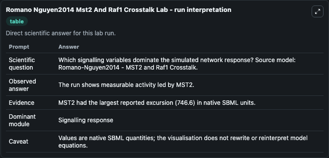
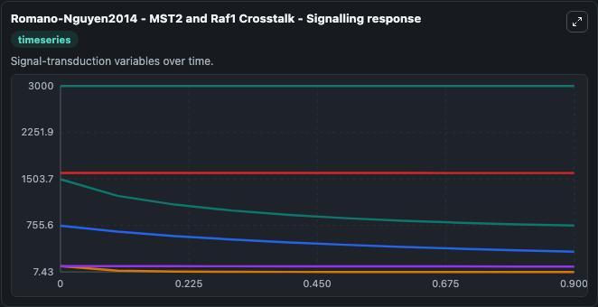
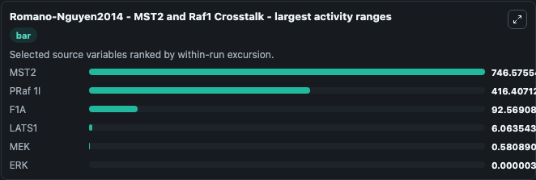
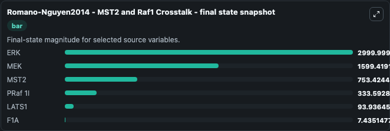
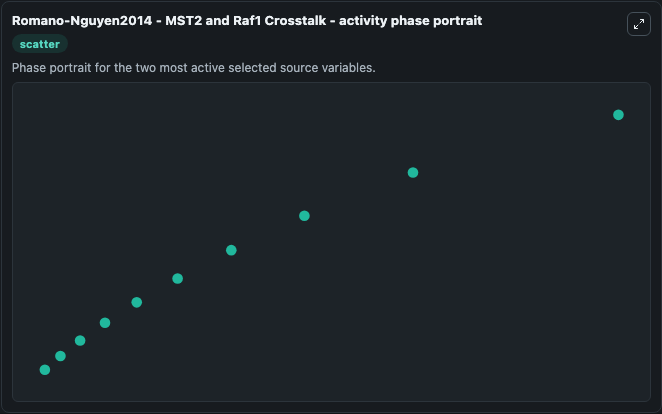

# Romano Nguyen2014 Mst2 And Raf1 Crosstalk

This Biosimulant lab wraps `Romano Nguyen2014 Mst2 And Raf1 Crosstalk` as a runnable systems biology model with a companion visualization module.
Originally created by libAntimony v1.3 (using libSBML 4.1.0-b2). It can be used to explore the configured dynamics and compare scenario outcomes across configurations.

## What You'll See

The lab asks: Which signalling variables dominate the simulated network response? Source model: Romano-Nguyen2014 - MST2 and Raf1 Crosstalk. It runs for 1.0 time units with a communication step of 0.1. The run uses the model defaults declared by the curated SBML wrapper. The generated visualizations focus on ERK, MEK, MST2, PRaf 1I, LATS1, and F1A, combining trajectory, endpoint-comparison, and summary-table views from one completed dark-mode run.

In this captured run, **MST2** moved from 1500.0 to 753.4 across 1.0 simulation windows.


### Output Visualizations



*Summary table for Romano Nguyen2014 Mst2 And Raf1 Crosstalk, reporting the scientific question, observed answer, dominant module, and caveat.*



*Trajectories of MST2, PRaf 1I, F1A, LATS1, MEK, and ERK across the 1.0 simulation. In this run **MST2** fell from 1500.0 to 753.4 — the largest movements among the focused observables.*



*Largest-excursion ranking of the focused observables — the absolute movement magnitude during the run. Top 3: **MST2** = 746.6, **PRaf 1I** = 416.4, **F1A** = 92.569, with 3 more observables below.*



*Endpoint snapshot of the focused observables — final values from the captured run. Top 3 by value: **ERK** = 3000.0, **MEK** = 1599.4, **MST2** = 753.4, with 3 more observables below.*



*Visualization card from the Romano Nguyen2014 Mst2 And Raf1 Crosstalk dark-mode run.*


## Model Context

- Core model: `models/core`
- Visualization model: `models/visualisation`
- Standard: `other`
- Upstream source: `biomodels_ebi:MODEL1506070001`
- License: `CC0`

## Inputs

| Input | Maps To | Default | Notes |
|---|---|---|---|
| Initial Model State ERK | `systemsbiology_sbml_romano_nguyen2014_mst2_and_raf1_crosstalk_model1506070001_model.initial_model_state_erk` | | Source state initial condition exposed as a model-specific control because no explicit intervention parameter is identifiable. Maps to SBML symbol `ERK`. |
| Initial Model State Mek | `systemsbiology_sbml_romano_nguyen2014_mst2_and_raf1_crosstalk_model1506070001_model.initial_model_state_mek` | | Source state initial condition exposed as a model-specific control because no explicit intervention parameter is identifiable. Maps to SBML symbol `MEK`. |
| Initial Mst2 | `systemsbiology_sbml_romano_nguyen2014_mst2_and_raf1_crosstalk_model1506070001_model.initial_mst2` | | Source state initial condition exposed as a model-specific control because no explicit intervention parameter is identifiable. Maps to SBML symbol `MST2`. |
| Initial P RAF 1 I | `systemsbiology_sbml_romano_nguyen2014_mst2_and_raf1_crosstalk_model1506070001_model.initial_p_raf_1_i` | | Source state initial condition exposed as a model-specific control because no explicit intervention parameter is identifiable. Maps to SBML symbol `pRaf_1i`. |
| Initial Lats1 | `systemsbiology_sbml_romano_nguyen2014_mst2_and_raf1_crosstalk_model1506070001_model.initial_lats1` | | Source state initial condition exposed as a model-specific control because no explicit intervention parameter is identifiable. Maps to SBML symbol `LATS1`. |
| Initial F1 A | `systemsbiology_sbml_romano_nguyen2014_mst2_and_raf1_crosstalk_model1506070001_model.initial_f1_a` | | Source state initial condition exposed as a model-specific control because no explicit intervention parameter is identifiable. Maps to SBML symbol `F1A`. |

## Outputs

| Output | Maps To | Role |
|---|---|---|
| `state` | `systemsbiology_sbml_romano_nguyen2014_mst2_and_raf1_crosstalk_model1506070001_model.state` | Available to the visualization model and downstream workflows. |
| `summary` | `systemsbiology_sbml_romano_nguyen2014_mst2_and_raf1_crosstalk_model1506070001_model.summary` | Available to the visualization model and downstream workflows. |
| `species_labels` | `systemsbiology_sbml_romano_nguyen2014_mst2_and_raf1_crosstalk_model1506070001_model.species_labels` | Available to the visualization model and downstream workflows. |
| `erk` | `systemsbiology_sbml_romano_nguyen2014_mst2_and_raf1_crosstalk_model1506070001_model.erk` | Available to the visualization model and downstream workflows. |
| `mek` | `systemsbiology_sbml_romano_nguyen2014_mst2_and_raf1_crosstalk_model1506070001_model.mek` | Available to the visualization model and downstream workflows. |
| `mst2` | `systemsbiology_sbml_romano_nguyen2014_mst2_and_raf1_crosstalk_model1506070001_model.mst2` | Available to the visualization model and downstream workflows. |
| `p_raf_1_i` | `systemsbiology_sbml_romano_nguyen2014_mst2_and_raf1_crosstalk_model1506070001_model.p_raf_1_i` | Available to the visualization model and downstream workflows. |
| `lats1` | `systemsbiology_sbml_romano_nguyen2014_mst2_and_raf1_crosstalk_model1506070001_model.lats1` | Available to the visualization model and downstream workflows. |
| `f1_a` | `systemsbiology_sbml_romano_nguyen2014_mst2_and_raf1_crosstalk_model1506070001_model.f1_a` | Available to the visualization model and downstream workflows. |

## Runtime

- Duration: `1.0`
- Communication step: `0.1`

## Running Locally

```bash
biosimulant labs serve
```
