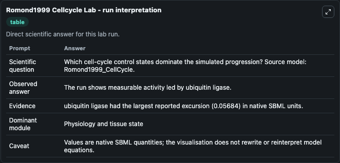
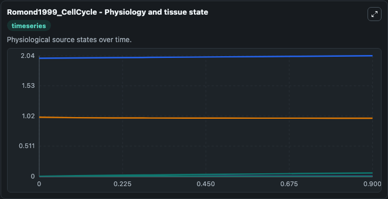
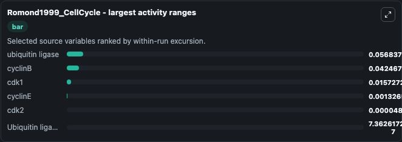
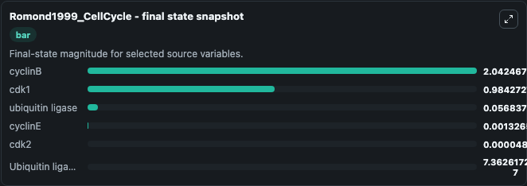
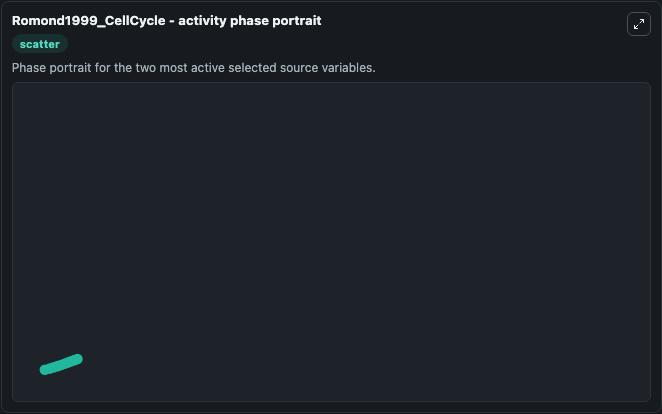

# Romond1999 Cellcycle

This Biosimulant lab wraps `Romond1999 Cellcycle` as a runnable systems biology model with a companion visualization module.
The model reproduces Fig 3 of the paper. It can be used to explore the configured dynamics and compare scenario outcomes across configurations.

## What You'll See

The lab asks: Which cell-cycle control states dominate the simulated progression? Source model: Romond1999_CellCycle. It runs for 1.0 time units with a communication step of 0.1. The run uses the model defaults declared by the curated SBML wrapper. The generated visualizations focus on cyclinB, cdk1, ubiquitin ligase, cyclinE, cdk2, and Ubiquitin ligase 2, combining trajectory, endpoint-comparison, and summary-table views from one completed dark-mode run.

In this captured run, **ubiquitin ligase** moved from 0 to 0.0568 across 1.0 simulation windows.


### Output Visualizations



*Summary table for Romond1999 Cellcycle, reporting the scientific question, observed answer, dominant module, and caveat.*



*Trajectories of ubiquitin ligase, cyclinB, cdk1, cyclinE, cdk2, and Ubiquitin ligase 2 across the 1.0 simulation. In this run **ubiquitin ligase** climbed from 0 to 0.0568 and **cdk1** fell from 1.000 to 0.9843 — the largest movements among the focused observables.*



*Largest-excursion ranking of the focused observables — the absolute movement magnitude during the run. Top 3: **ubiquitin ligase** = 0.0568, **cyclinB** = 0.0425, **cdk1** = 0.0157, with 3 more observables below.*



*Endpoint snapshot of the focused observables — final values from the captured run. Top 3 by value: **cyclinB** = 2.042, **cdk1** = 0.9843, **ubiquitin ligase** = 0.0568, with 3 more observables below.*



*Visualization card from the Romond1999 Cellcycle dark-mode run.*


## Model Context

- Core model: `models/core`
- Visualization model: `models/visualisation`
- Standard: `other`
- Upstream source: `biomodels_ebi:BIOMD0000000207`
- License: `CC0`

## Inputs

| Input | Maps To | Default | Notes |
|---|---|---|---|
| Initial Cyclin B | `systemsbiology_sbml_romond1999_cellcycle_biomd0000000207_model.initial_cyclin_b` | | Source state initial condition exposed as a model-specific control because no explicit intervention parameter is identifiable. Maps to SBML symbol `C1`. |
| Initial Cdk1 | `systemsbiology_sbml_romond1999_cellcycle_biomd0000000207_model.initial_cdk1` | | Source state initial condition exposed as a model-specific control because no explicit intervention parameter is identifiable. Maps to SBML symbol `M1`. |
| Initial Ubiquitin Ligase | `systemsbiology_sbml_romond1999_cellcycle_biomd0000000207_model.initial_ubiquitin_ligase` | | Source state initial condition exposed as a model-specific control because no explicit intervention parameter is identifiable. Maps to SBML symbol `X1`. |
| Initial Cyclin E | `systemsbiology_sbml_romond1999_cellcycle_biomd0000000207_model.initial_cyclin_e` | | Source state initial condition exposed as a model-specific control because no explicit intervention parameter is identifiable. Maps to SBML symbol `C2`. |
| Initial Cdk2 | `systemsbiology_sbml_romond1999_cellcycle_biomd0000000207_model.initial_cdk2` | | Source state initial condition exposed as a model-specific control because no explicit intervention parameter is identifiable. Maps to SBML symbol `M2`. |
| Initial Ubiquitin Ligase 2 | `systemsbiology_sbml_romond1999_cellcycle_biomd0000000207_model.initial_ubiquitin_ligase_2` | | Source state initial condition exposed as a model-specific control because no explicit intervention parameter is identifiable. Maps to SBML symbol `X2`. |

## Outputs

| Output | Maps To | Role |
|---|---|---|
| `state` | `systemsbiology_sbml_romond1999_cellcycle_biomd0000000207_model.state` | Available to the visualization model and downstream workflows. |
| `summary` | `systemsbiology_sbml_romond1999_cellcycle_biomd0000000207_model.summary` | Available to the visualization model and downstream workflows. |
| `species_labels` | `systemsbiology_sbml_romond1999_cellcycle_biomd0000000207_model.species_labels` | Available to the visualization model and downstream workflows. |
| `cyclin_b` | `systemsbiology_sbml_romond1999_cellcycle_biomd0000000207_model.cyclin_b` | Available to the visualization model and downstream workflows. |
| `cdk1` | `systemsbiology_sbml_romond1999_cellcycle_biomd0000000207_model.cdk1` | Available to the visualization model and downstream workflows. |
| `ubiquitin_ligase` | `systemsbiology_sbml_romond1999_cellcycle_biomd0000000207_model.ubiquitin_ligase` | Available to the visualization model and downstream workflows. |
| `cyclin_e` | `systemsbiology_sbml_romond1999_cellcycle_biomd0000000207_model.cyclin_e` | Available to the visualization model and downstream workflows. |
| `cdk2` | `systemsbiology_sbml_romond1999_cellcycle_biomd0000000207_model.cdk2` | Available to the visualization model and downstream workflows. |
| `ubiquitin_ligase_2` | `systemsbiology_sbml_romond1999_cellcycle_biomd0000000207_model.ubiquitin_ligase_2` | Available to the visualization model and downstream workflows. |

## Runtime

- Duration: `1.0`
- Communication step: `0.1`

## Running Locally

```bash
biosimulant labs serve
```
