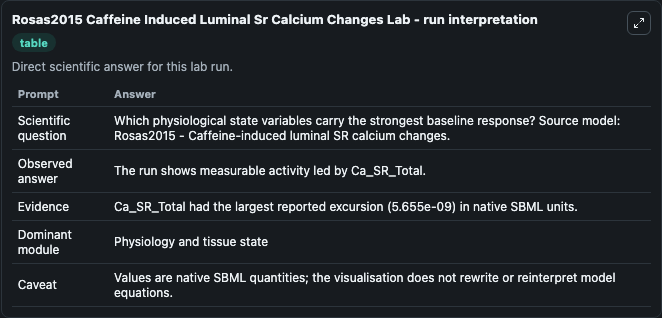
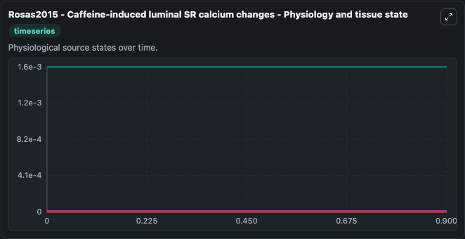
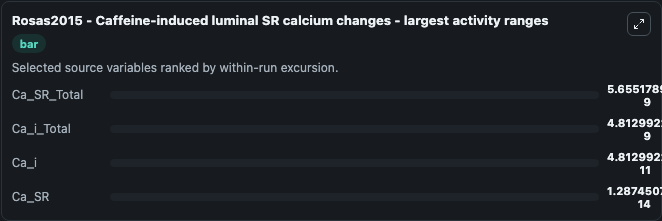
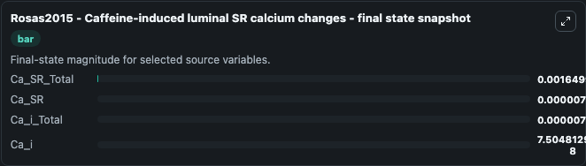
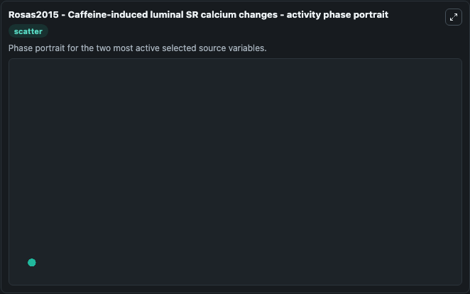

# Rosas2015 Caffeine Induced Luminal Sr Calcium Changes

This Biosimulant lab wraps `Rosas2015 Caffeine Induced Luminal Sr Calcium Changes` as a runnable systems biology model with a companion visualization module.
This SBML model reproduced the calcium release from SR by application of 20 mM or 2mM caffeine, described in the paper. * Ca_i_Total and Ca_SR_Total respectively represent the total calcium concentrat. It can be used to explore the configured dynamics and compare scenario outcomes across configurations.

## What You'll See

The lab asks: Which physiological state variables carry the strongest baseline response? Source model: Rosas2015 - Caffeine-induced luminal SR calcium changes. It runs for 1.0 time units with a communication step of 0.1. The run uses the model defaults declared by the curated SBML wrapper. The generated visualizations focus on Ca_SR_Total, Ca_SR, Ca_i_Total, Ca_i, and caff, combining trajectory, endpoint-comparison, and summary-table views from one completed dark-mode run.

In this captured run, **Ca_SR_Total** moved from 0.00165 to 0.00165 across 1.0 simulation windows.


### Output Visualizations



*Summary table for Rosas2015 Caffeine Induced Luminal Sr Calcium Changes, reporting the scientific question, observed answer, dominant module, and caveat.*



*Trajectories of Ca_SR_Total, Ca_i_Total, Ca_i, Ca_SR, and caff across the 1.0 simulation. In this run **Ca_i_Total** climbed from 7.5e-06 to 7.5e-06 and **Ca_SR_Total** fell from 0.00165 to 0.00165 — the largest movements among the focused observables.*



*Largest-excursion ranking of the focused observables — the absolute movement magnitude during the run. Top 3: **Ca_SR_Total** = 5.66e-09, **Ca_i_Total** = 4.81e-09, **Ca_i** = 4.81e-11, with 1 more observable below.*



*Endpoint snapshot of the focused observables — final values from the captured run. Top 3 by value: **Ca_SR_Total** = 0.00165, **Ca_SR** = 7.87e-06, **Ca_i_Total** = 7.5e-06, with 1 more observable below.*



*Visualization card from the Rosas2015 Caffeine Induced Luminal Sr Calcium Changes dark-mode run.*


## Model Context

- Core model: `models/core`
- Visualization model: `models/visualisation`
- Standard: `other`
- Upstream source: `biomodels_ebi:BIOMD0000000601`
- License: `CC0`

## Inputs

| Input | Maps To | Default | Notes |
|---|---|---|---|
| Initial Ca Sr Total | `systemsbiology_sbml_rosas2015_caffeine_induced_luminal_sr_calcium_ch_biomd0000000601_model.initial_ca_sr_total` | | Source state initial condition exposed as a model-specific control because no explicit intervention parameter is identifiable. Maps to SBML symbol `mwd805cc43_4a96_472f_a894_c119a6aa895f`. |
| Initial Ca Sr | `systemsbiology_sbml_rosas2015_caffeine_induced_luminal_sr_calcium_ch_biomd0000000601_model.initial_ca_sr` | | Source state initial condition exposed as a model-specific control because no explicit intervention parameter is identifiable. Maps to SBML symbol `mw447078ee_8bc8_4358_abcd_ade10dba93b0`. |
| Initial Ca I Total | `systemsbiology_sbml_rosas2015_caffeine_induced_luminal_sr_calcium_ch_biomd0000000601_model.initial_ca_i_total` | | Source state initial condition exposed as a model-specific control because no explicit intervention parameter is identifiable. Maps to SBML symbol `mw40a96ef6_32da_46d1_9712_4f53f60bad43`. |
| Initial Ca I | `systemsbiology_sbml_rosas2015_caffeine_induced_luminal_sr_calcium_ch_biomd0000000601_model.initial_ca_i` | | Source state initial condition exposed as a model-specific control because no explicit intervention parameter is identifiable. Maps to SBML symbol `mwe1a0a651_d2d5_4f75_8d45_9336c60eb9a6`. |
| Initial Caff | `systemsbiology_sbml_rosas2015_caffeine_induced_luminal_sr_calcium_ch_biomd0000000601_model.initial_caff` | | Source state initial condition exposed as a model-specific control because no explicit intervention parameter is identifiable. Maps to SBML symbol `mw168e0d8a_b9f7_4d4c_b437_a81206c5d381`. |

## Outputs

| Output | Maps To | Role |
|---|---|---|
| `state` | `systemsbiology_sbml_rosas2015_caffeine_induced_luminal_sr_calcium_ch_biomd0000000601_model.state` | Available to the visualization model and downstream workflows. |
| `summary` | `systemsbiology_sbml_rosas2015_caffeine_induced_luminal_sr_calcium_ch_biomd0000000601_model.summary` | Available to the visualization model and downstream workflows. |
| `species_labels` | `systemsbiology_sbml_rosas2015_caffeine_induced_luminal_sr_calcium_ch_biomd0000000601_model.species_labels` | Available to the visualization model and downstream workflows. |
| `ca_sr_total` | `systemsbiology_sbml_rosas2015_caffeine_induced_luminal_sr_calcium_ch_biomd0000000601_model.ca_sr_total` | Available to the visualization model and downstream workflows. |
| `ca_sr` | `systemsbiology_sbml_rosas2015_caffeine_induced_luminal_sr_calcium_ch_biomd0000000601_model.ca_sr` | Available to the visualization model and downstream workflows. |
| `ca_i_total` | `systemsbiology_sbml_rosas2015_caffeine_induced_luminal_sr_calcium_ch_biomd0000000601_model.ca_i_total` | Available to the visualization model and downstream workflows. |
| `ca_i` | `systemsbiology_sbml_rosas2015_caffeine_induced_luminal_sr_calcium_ch_biomd0000000601_model.ca_i` | Available to the visualization model and downstream workflows. |
| `caff` | `systemsbiology_sbml_rosas2015_caffeine_induced_luminal_sr_calcium_ch_biomd0000000601_model.caff` | Available to the visualization model and downstream workflows. |

## Runtime

- Duration: `1.0`
- Communication step: `0.1`

## Running Locally

```bash
biosimulant labs serve
```
