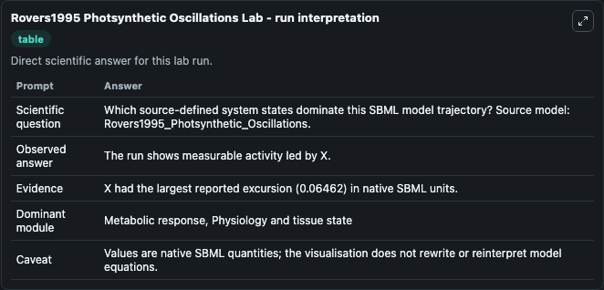
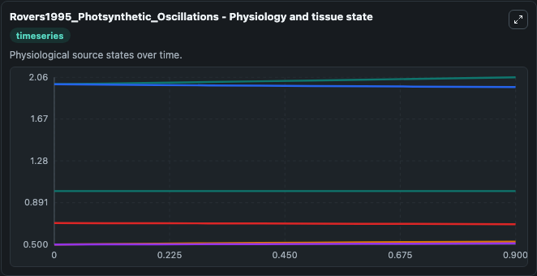
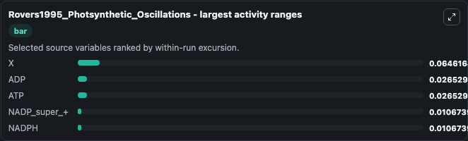
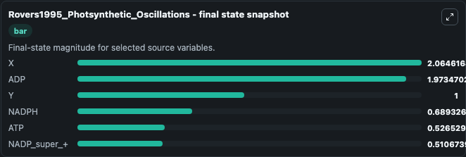
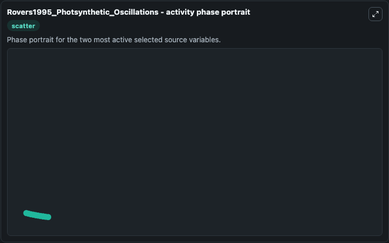

# Rovers1995 Photsynthetic Oscillations

This Biosimulant lab wraps `Rovers1995 Photsynthetic Oscillations` as a runnable systems biology model with a companion visualization module.
This is the model described in the article: Photosynthetic oscillations and the interdependence of photophosphorylation and electron transport as studied by a mathematical model. It can be used to explore the configured dynamics and compare scenario outcomes across configurations.

## What You'll See

The lab asks: Which source-defined system states dominate this SBML model trajectory? Source model: Rovers1995_Photsynthetic_Oscillations. It runs for 1.0 time units with a communication step of 0.1. The run uses the model defaults declared by the curated SBML wrapper. The generated visualizations focus on NADP_super_+, ADP, NADPH, ATP, X, and Y, combining trajectory, endpoint-comparison, and summary-table views from one completed dark-mode run.

In this captured run, **X** moved from 2.000 to 2.065 across 1.0 simulation windows.


### Output Visualizations



*Summary table for Rovers1995 Photsynthetic Oscillations, reporting the scientific question, observed answer, dominant module, and caveat.*



*Trajectories of X, ADP, ATP, NADP_super_+, NADPH, and Y across the 1.0 simulation. In this run **X** climbed from 2.000 to 2.065 and **ADP** fell from 2.000 to 1.973 — the largest movements among the focused observables.*



*Largest-excursion ranking of the focused observables — the absolute movement magnitude during the run. Top 3: **X** = 0.0646, **ADP** = 0.0265, **ATP** = 0.0265, with 2 more observables below.*



*Endpoint snapshot of the focused observables — final values from the captured run. Top 3 by value: **X** = 2.065, **ADP** = 1.973, **Y** = 1.000, with 3 more observables below.*



*Visualization card from the Rovers1995 Photsynthetic Oscillations dark-mode run.*


## Model Context

- Core model: `models/core`
- Visualization model: `models/visualisation`
- Standard: `other`
- Upstream source: `biomodels_ebi:BIOMD0000000292`
- License: `CC0`

## Inputs

| Input | Maps To | Default | Notes |
|---|---|---|---|
| Initial Nadp Super | `systemsbiology_sbml_rovers1995_photsynthetic_oscillations_biomd0000000292_model.initial_nadp_super` | | Source state initial condition exposed as a model-specific control because no explicit intervention parameter is identifiable. Maps to SBML symbol `NADP`. |
| Initial Model State ADP | `systemsbiology_sbml_rovers1995_photsynthetic_oscillations_biomd0000000292_model.initial_model_state_adp` | | Source state initial condition exposed as a model-specific control because no explicit intervention parameter is identifiable. Maps to SBML symbol `ADP`. |
| Initial Nadph | `systemsbiology_sbml_rovers1995_photsynthetic_oscillations_biomd0000000292_model.initial_nadph` | | Source state initial condition exposed as a model-specific control because no explicit intervention parameter is identifiable. Maps to SBML symbol `NADPH`. |
| Initial Model State ATP | `systemsbiology_sbml_rovers1995_photsynthetic_oscillations_biomd0000000292_model.initial_model_state_atp` | | Source state initial condition exposed as a model-specific control because no explicit intervention parameter is identifiable. Maps to SBML symbol `ATP`. |
| Initial Model State X | `systemsbiology_sbml_rovers1995_photsynthetic_oscillations_biomd0000000292_model.initial_model_state_x` | | Source state initial condition exposed as a model-specific control because no explicit intervention parameter is identifiable. Maps to SBML symbol `X`. |
| Initial Model State Y | `systemsbiology_sbml_rovers1995_photsynthetic_oscillations_biomd0000000292_model.initial_model_state_y` | | Source state initial condition exposed as a model-specific control because no explicit intervention parameter is identifiable. Maps to SBML symbol `Y`. |

## Outputs

| Output | Maps To | Role |
|---|---|---|
| `state` | `systemsbiology_sbml_rovers1995_photsynthetic_oscillations_biomd0000000292_model.state` | Available to the visualization model and downstream workflows. |
| `summary` | `systemsbiology_sbml_rovers1995_photsynthetic_oscillations_biomd0000000292_model.summary` | Available to the visualization model and downstream workflows. |
| `species_labels` | `systemsbiology_sbml_rovers1995_photsynthetic_oscillations_biomd0000000292_model.species_labels` | Available to the visualization model and downstream workflows. |
| `nadp_super` | `systemsbiology_sbml_rovers1995_photsynthetic_oscillations_biomd0000000292_model.nadp_super` | Available to the visualization model and downstream workflows. |
| `adp` | `systemsbiology_sbml_rovers1995_photsynthetic_oscillations_biomd0000000292_model.adp` | Available to the visualization model and downstream workflows. |
| `nadph` | `systemsbiology_sbml_rovers1995_photsynthetic_oscillations_biomd0000000292_model.nadph` | Available to the visualization model and downstream workflows. |
| `atp` | `systemsbiology_sbml_rovers1995_photsynthetic_oscillations_biomd0000000292_model.atp` | Available to the visualization model and downstream workflows. |
| `model_state_x` | `systemsbiology_sbml_rovers1995_photsynthetic_oscillations_biomd0000000292_model.model_state_x` | Available to the visualization model and downstream workflows. |
| `model_state_y` | `systemsbiology_sbml_rovers1995_photsynthetic_oscillations_biomd0000000292_model.model_state_y` | Available to the visualization model and downstream workflows. |

## Runtime

- Duration: `1.0`
- Communication step: `0.1`

## Running Locally

```bash
biosimulant labs serve
```
