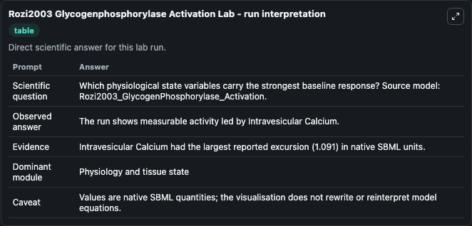
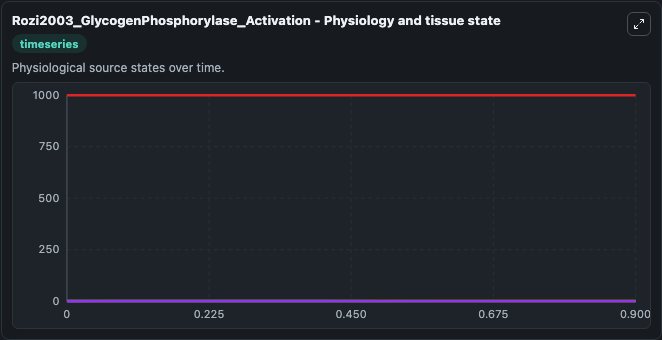
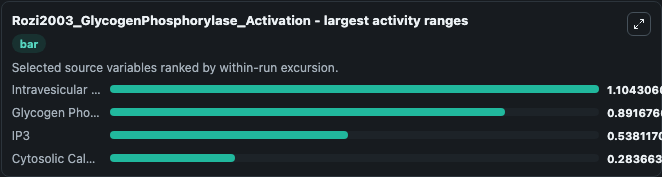
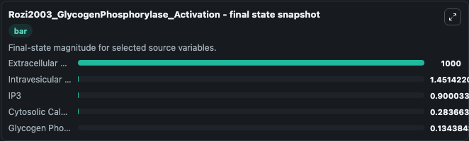
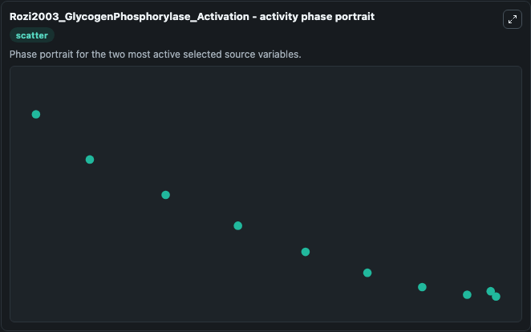

# Rozi2003 Glycogenphosphorylase Activation

This Biosimulant lab wraps `Rozi2003 Glycogenphosphorylase Activation` as a runnable systems biology model with a companion visualization module.
The model reproduces the temporal evolution of Glycogen phosphorylase for a vale of Vm5=30 as depicted in Fig 1a of the paper. It can be used to explore the configured dynamics and compare scenario outcomes across configurations.

## What You'll See

The lab asks: Which physiological state variables carry the strongest baseline response? Source model: Rozi2003_GlycogenPhosphorylase_Activation. It runs for 1.0 time units with a communication step of 0.1. The run uses the model defaults declared by the curated SBML wrapper. The generated visualizations focus on Extracellular Calcium, Glycogen Phosphorylase, IP3, Intravesicular Calcium, and Cytosolic Calcium, combining trajectory, endpoint-comparison, and summary-table views from one completed dark-mode run.

In this captured run, **Intravesicular Calcium** moved from 0.3600 to 1.451 across 1.0 simulation windows.


### Output Visualizations



*Summary table for Rozi2003 Glycogenphosphorylase Activation, reporting the scientific question, observed answer, dominant module, and caveat.*



*Trajectories of Intravesicular Calcium, Glycogen Phosphorylase, IP3, Cytosolic Calcium, and Extracellular Calcium across the 1.0 simulation. In this run **Intravesicular Calcium** climbed from 0.3600 to 1.451 and **Glycogen Phosphorylase** fell from 1.000 to 0.1344 — the largest movements among the focused observables.*



*Largest-excursion ranking of the focused observables — the absolute movement magnitude during the run. Top 3: **Intravesicular Calcium** = 1.104, **Glycogen Phosphorylase** = 0.8917, **IP3** = 0.5381, with 1 more observable below.*



*Endpoint snapshot of the focused observables — final values from the captured run. Top 3 by value: **Extracellular Calcium** = 1000.0, **Intravesicular Calcium** = 1.451, **IP3** = 0.9000, with 2 more observables below.*



*Visualization card from the Rozi2003 Glycogenphosphorylase Activation dark-mode run.*


## Model Context

- Core model: `models/core`
- Visualization model: `models/visualisation`
- Standard: `other`
- Upstream source: `biomodels_ebi:BIOMD0000000100`
- License: `CC0`

## Inputs

| Input | Maps To | Default | Notes |
|---|---|---|---|
| Initial Extracellular Calcium | `systemsbiology_sbml_rozi2003_glycogenphosphorylase_activation_biomd0000000100_model.initial_extracellular_calcium` | | Source state initial condition exposed as a model-specific control because no explicit intervention parameter is identifiable. Maps to SBML symbol `EC`. |
| Initial Glycogen Phosphorylase | `systemsbiology_sbml_rozi2003_glycogenphosphorylase_activation_biomd0000000100_model.initial_glycogen_phosphorylase` | | Source state initial condition exposed as a model-specific control because no explicit intervention parameter is identifiable. Maps to SBML symbol `GP`. |
| Initial Model State IP3 | `systemsbiology_sbml_rozi2003_glycogenphosphorylase_activation_biomd0000000100_model.initial_model_state_ip3` | | Source state initial condition exposed as a model-specific control because no explicit intervention parameter is identifiable. Maps to SBML symbol `A`. |
| Initial Intravesicular Calcium | `systemsbiology_sbml_rozi2003_glycogenphosphorylase_activation_biomd0000000100_model.initial_intravesicular_calcium` | | Source state initial condition exposed as a model-specific control because no explicit intervention parameter is identifiable. Maps to SBML symbol `Y`. |
| Initial Cytosolic Calcium | `systemsbiology_sbml_rozi2003_glycogenphosphorylase_activation_biomd0000000100_model.initial_cytosolic_calcium` | | Source state initial condition exposed as a model-specific control because no explicit intervention parameter is identifiable. Maps to SBML symbol `Z`. |

## Outputs

| Output | Maps To | Role |
|---|---|---|
| `state` | `systemsbiology_sbml_rozi2003_glycogenphosphorylase_activation_biomd0000000100_model.state` | Available to the visualization model and downstream workflows. |
| `summary` | `systemsbiology_sbml_rozi2003_glycogenphosphorylase_activation_biomd0000000100_model.summary` | Available to the visualization model and downstream workflows. |
| `species_labels` | `systemsbiology_sbml_rozi2003_glycogenphosphorylase_activation_biomd0000000100_model.species_labels` | Available to the visualization model and downstream workflows. |
| `extracellular_calcium` | `systemsbiology_sbml_rozi2003_glycogenphosphorylase_activation_biomd0000000100_model.extracellular_calcium` | Available to the visualization model and downstream workflows. |
| `glycogen_phosphorylase` | `systemsbiology_sbml_rozi2003_glycogenphosphorylase_activation_biomd0000000100_model.glycogen_phosphorylase` | Available to the visualization model and downstream workflows. |
| `ip3` | `systemsbiology_sbml_rozi2003_glycogenphosphorylase_activation_biomd0000000100_model.ip3` | Available to the visualization model and downstream workflows. |
| `intravesicular_calcium` | `systemsbiology_sbml_rozi2003_glycogenphosphorylase_activation_biomd0000000100_model.intravesicular_calcium` | Available to the visualization model and downstream workflows. |
| `cytosolic_calcium` | `systemsbiology_sbml_rozi2003_glycogenphosphorylase_activation_biomd0000000100_model.cytosolic_calcium` | Available to the visualization model and downstream workflows. |

## Runtime

- Duration: `1.0`
- Communication step: `0.1`

## Running Locally

```bash
biosimulant labs serve
```
