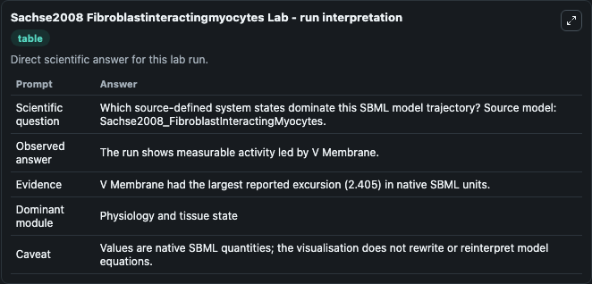
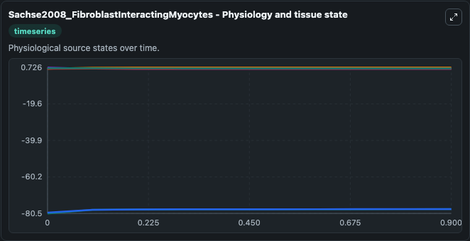
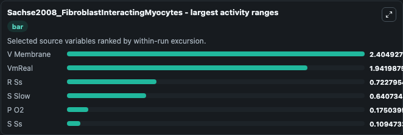
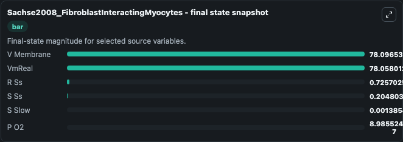
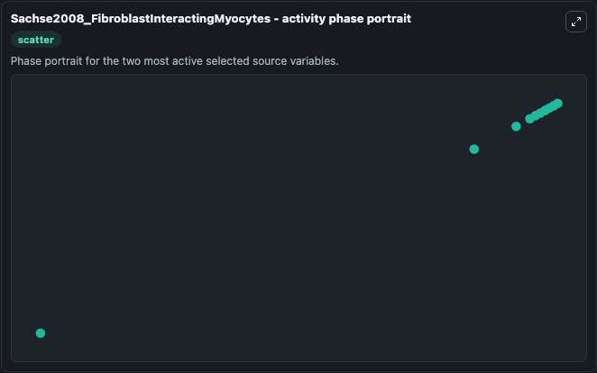

# Sachse2008 Fibroblastinteractingmyocytes

This Biosimulant lab wraps `Sachse2008 Fibroblastinteractingmyocytes` as a runnable systems biology model with a companion visualization module.
This a model from the article: Electrophysiological modeling of fibroblasts and their interaction with myocytes. It can be used to explore the configured dynamics and compare scenario outcomes across configurations.

## What You'll See

The lab asks: Which source-defined system states dominate this SBML model trajectory? Source model: Sachse2008_FibroblastInteractingMyocytes. It runs for 1.0 time units with a communication step of 0.1. The run uses the model defaults declared by the curated SBML wrapper. The generated visualizations focus on VmReal, V Membrane, S Ss, S Slow, R Ss, and P O2, combining trajectory, endpoint-comparison, and summary-table views from one completed dark-mode run.

In this captured run, **V Membrane** moved from -80.501 to -78.097 across 1.0 simulation windows.


### Output Visualizations



*Summary table for Sachse2008 Fibroblastinteractingmyocytes, reporting the scientific question, observed answer, dominant module, and caveat.*



*Trajectories of V Membrane, VmReal, R Ss, S Slow, P O2, and S Ss across the 1.0 simulation. In this run **V Membrane** climbed from -80.501 to -78.097 and **S Slow** fell from 0.6421 to 0.00139 — the largest movements among the focused observables.*



*Largest-excursion ranking of the focused observables — the absolute movement magnitude during the run. Top 3: **V Membrane** = 2.405, **VmReal** = 1.942, **R Ss** = 0.7228, with 3 more observables below.*



*Endpoint snapshot of the focused observables — final values from the captured run. Top 3 by value: **V Membrane** = 78.097, **VmReal** = 78.058, **R Ss** = 0.7257, with 3 more observables below.*



*Visualization card from the Sachse2008 Fibroblastinteractingmyocytes dark-mode run.*


## Model Context

- Core model: `models/core`
- Visualization model: `models/visualisation`
- Standard: `other`
- Upstream source: `biomodels_ebi:MODEL7914759868`
- License: `CC0`

## Inputs

| Input | Maps To | Default | Notes |
|---|---|---|---|
| Initial Vm Real | `systemsbiology_sbml_sachse2008_fibroblastinteractingmyocytes_model7914759868_model.initial_vm_real` | | Source state initial condition exposed as a model-specific control because no explicit intervention parameter is identifiable. Maps to SBML symbol `VmReal`. |
| Initial V Membrane | `systemsbiology_sbml_sachse2008_fibroblastinteractingmyocytes_model7914759868_model.initial_v_membrane` | | Source state initial condition exposed as a model-specific control because no explicit intervention parameter is identifiable. Maps to SBML symbol `V_membrane`. |
| Initial S Ss | `systemsbiology_sbml_sachse2008_fibroblastinteractingmyocytes_model7914759868_model.initial_s_ss` | | Source state initial condition exposed as a model-specific control because no explicit intervention parameter is identifiable. Maps to SBML symbol `s_ss`. |
| Initial S Slow | `systemsbiology_sbml_sachse2008_fibroblastinteractingmyocytes_model7914759868_model.initial_s_slow` | | Source state initial condition exposed as a model-specific control because no explicit intervention parameter is identifiable. Maps to SBML symbol `s_slow`. |
| Initial R Ss | `systemsbiology_sbml_sachse2008_fibroblastinteractingmyocytes_model7914759868_model.initial_r_ss` | | Source state initial condition exposed as a model-specific control because no explicit intervention parameter is identifiable. Maps to SBML symbol `r_ss`. |
| Initial P O2 | `systemsbiology_sbml_sachse2008_fibroblastinteractingmyocytes_model7914759868_model.initial_p_o2` | | Source state initial condition exposed as a model-specific control because no explicit intervention parameter is identifiable. Maps to SBML symbol `P_O2`. |

## Outputs

| Output | Maps To | Role |
|---|---|---|
| `state` | `systemsbiology_sbml_sachse2008_fibroblastinteractingmyocytes_model7914759868_model.state` | Available to the visualization model and downstream workflows. |
| `summary` | `systemsbiology_sbml_sachse2008_fibroblastinteractingmyocytes_model7914759868_model.summary` | Available to the visualization model and downstream workflows. |
| `species_labels` | `systemsbiology_sbml_sachse2008_fibroblastinteractingmyocytes_model7914759868_model.species_labels` | Available to the visualization model and downstream workflows. |
| `vm_real` | `systemsbiology_sbml_sachse2008_fibroblastinteractingmyocytes_model7914759868_model.vm_real` | Available to the visualization model and downstream workflows. |
| `v_membrane` | `systemsbiology_sbml_sachse2008_fibroblastinteractingmyocytes_model7914759868_model.v_membrane` | Available to the visualization model and downstream workflows. |
| `s_ss` | `systemsbiology_sbml_sachse2008_fibroblastinteractingmyocytes_model7914759868_model.s_ss` | Available to the visualization model and downstream workflows. |
| `s_slow` | `systemsbiology_sbml_sachse2008_fibroblastinteractingmyocytes_model7914759868_model.s_slow` | Available to the visualization model and downstream workflows. |
| `r_ss` | `systemsbiology_sbml_sachse2008_fibroblastinteractingmyocytes_model7914759868_model.r_ss` | Available to the visualization model and downstream workflows. |
| `p_o2` | `systemsbiology_sbml_sachse2008_fibroblastinteractingmyocytes_model7914759868_model.p_o2` | Available to the visualization model and downstream workflows. |

## Runtime

- Duration: `1.0`
- Communication step: `0.1`

## Running Locally

```bash
biosimulant labs serve
```
